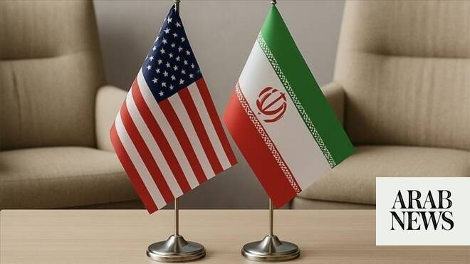

# US and Iran close to signing peace deal: Axios

Source: https://www.arabnews.com/node/2646877/middle-east
Captured source: https://www.arabnews.com/node/2646877/middle-east
Published: 2026-06-12T09:29:42+03:00
Modified: 2026-06-12T10:25:03+03:00
Author: Arab News

## Summary

DUBAI: A report from Axios said that US and Iran are close to signing a memorandum of understanding, which particularly calls for the immediate reopening of the Strait of Hormuz without tolls. The MoU also says that Iran will receive sanctions relief based on compliance, Axios said, quoting a diplomat from one of the mediating countries and a US official. The MOU would extend

## Image

## Video Or Embed URLs

- https://static.addtoany.com/menu/sm.25.html
- about:blank
- https://imasdk.googleapis.com/js/core/bridge3.770.1_en.html
- https://www.google.com/recaptcha/api2/aframe
- https://sync.teads.tv/iframe?pid=253554&gdprIab=%7B%22type%22%3A%22AddEventListenerDoesNotApply%22%2C%22reason%22%3A0%2C%22status%22%3A0%2C%22consent%22%3A%22%22%2C%22apiVersion%22%3A2%2C%22cmpId%22%3A300%7D&fromFormat=true&env=js-web&auctid=c97e85a7-670d-4534-b2ab-a84dadca277a&vid=d16525b4-68c7-4940-991f-acfb30b71add&us_privacy=1---&1781265782391=
- https://cm.g.doubleclick.net/partnerpixels?gdpr=0&us_privacy=1---&gpp_sid=-1&url=https%3A%2F%2Fwww.arabnews.com%2Fnode%2F2646877%2Fmiddle-east

## Text

https://arab.news/yj73z

MoU calls for the immediate reopening of the Strait of Hormuz without tolls

DUBAI: A report from Axios said that US and Iran are close to signing a memorandum of understanding, which particularly calls for the immediate reopening of the Strait of Hormuz without tolls.

The MoU also says that Iran will receive sanctions relief based on compliance, Axios said, quoting a diplomat from one of the mediating countries and a US official.

The MOU would extend the ceasefire for 60 days, including in Lebanon, during which time nuclear negotiations would be held. The text establishes a framework for Iran’s enriched uranium stockpile, but any concrete action on its nuclear program requires a second, comprehensive agreement.

“The US and Iran have agreed on the text of a deal,” a diplomat from one of the mediating countries told Axios, but acknowledged the deal still needed a final sign-off.

“As of Thursday evening, the deal had been approved on the Iranian side at high levels but likely not by Supreme Leader Mojtaba Khamenei,” the two sources said. US President Donald Trump earlier claimed an agreement could be signed within days as talks with Iran had been “brought to the highest level of Iranian leadership and approved.”

The US leader said he had “canceled the scheduled strikes and bombings against Iran this evening” after threatening to hit Iran “VERY HARD TONIGHT” to “assume total control” of Iran’s oil and gas industries, including the key Kharg Island, in the “not too distant future.”

However, Iran’s foreign ministry spokesman Esmaeil Baqaei said on Friday Tehran “had not reached a final conclusion on the agreement.”

He added that “most of the text of the agreement was finalized, but the problem began when the US side made new demands and changed its positions.”

Axios, quoting the diplomat, said: “The White House has thought a deal was close several times over the past two months, only for talks to fall through.”

A senior US official said Trump agreed that one of the options for resolving the issue could be down-blending Iran’s highly enriched uranium inside the country under the supervision of UN inspectors, Axios added.

Iran has insisted that it must receive some money immediately upon signing any initial deal, while the US has said it would be released in tranches based on compliance, according to the report.

If agreed on, the deal mediated by Qatar and Pakistan will be called the Islamabad agreement.

“We are working with the parties to put the final touches on the deal and set a date for the signing ceremony,” the diplomat from one of the mediating countries said.
