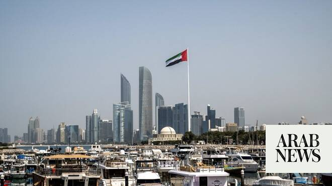

# UAE denies media reports alleging transfer of funds to Iran

Source: https://www.arabnews.com/node/2646984/middle-east
Captured source: https://www.arabnews.com/node/2646984/middle-east
Published: 2026-06-13T01:03:53+03:00
Modified: 2026-06-13T01:04:07+03:00
Author: WAM

## Summary

ABU DHABI: The UAE has categorically denied reports published by certain international media outlets alleging the transfer of funds from the UAE to the Iran, including allegations concerning $3 billion. In a statement, the Ministry of Foreign Affairs affirmed that these allegations are entirely false and unfounded, stressing that no frozen Iranian funds have been released,

## Image

## Video Or Embed URLs

- https://a7e8f3363db863fb1e0aa84a0386dd09.safeframe.googlesyndication.com/safeframe/1-0-45/html/container.html
- https://imasdk.googleapis.com/js/core/bridge3.770.1_en.html
- https://static.addtoany.com/menu/sm.25.html
- about:blank
- https://www.google.com/recaptcha/api2/aframe
- https://sync.teads.tv/wigo-no-slot
- https://cm.g.doubleclick.net/partnerpixels?gdpr=0&us_privacy=1---&gpp_sid=-1&url=https%3A%2F%2Fwww.arabnews.com%2Fnode%2F2646984%2Fmiddle-east

## Text

https://arab.news/bev2x

ABU DHABI: The UAE has categorically denied reports published by certain international media outlets alleging the transfer of funds from the UAE to the Iran, including allegations concerning $3 billion. In a statement, the Ministry of Foreign Affairs affirmed that these allegations are entirely false and unfounded, stressing that no frozen Iranian funds have been released, transferred, or facilitated through the UAE. The Ministry also called on media outlets to exercise accuracy, rely on official sources, and refrain from publishing or circulating unverified information and unfounded allegations.
