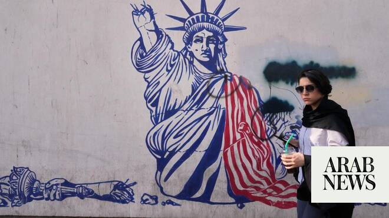

# US says downed multiple Iran drones as both insist deal closer

Source: https://www.arabnews.com/node/2646994/middle-east
Captured source: https://www.arabnews.com/node/2646994/middle-east
Published: 2026-06-13T02:52:46+03:00
Modified: 2026-06-13T08:26:22+03:00
Author: Agencies

## Summary

DUBAI/WASHINGTON/TEHRAN: The United States said it downed multiple Iranian drones targeting commercial ships in the Strait of Hormuz early Saturday, hours after both sides said a deal to end the Middle East war was closer than ever. The interception came after weeks of halting talks between Tehran and Washington, mediated by Pakistan, that have been marked by threats and

## Image

## Video Or Embed URLs

- https://static.addtoany.com/menu/sm.25.html
- about:blank
- https://www.google.com/recaptcha/api2/aframe
- https://imasdk.googleapis.com/js/core/bridge3.770.1_en.html
- https://cm.g.doubleclick.net/partnerpixels?gdpr=0&us_privacy=1---&gpp_sid=-1&url=https%3A%2F%2Fwww.arabnews.com%2Fnode%2F2646994%2Fmiddle-east

## Text

https://arab.news/yzp2w

Foreign Minister Araqchi says conflict strengthened deterrence as talks continue

Aragchi says Iran will control Strait of Hormuz with Oman, nuclear issues to be addressed later

DUBAI/WASHINGTON/TEHRAN: The United States said it downed multiple Iranian drones targeting commercial ships in the Strait of Hormuz early Saturday, hours after both sides said a deal to end the Middle East war was closer than ever. The interception came after weeks of halting talks between Tehran and Washington, mediated by Pakistan, that have been marked by threats and exchanges of fire despite a fragile truce agreed in April. US Central Command (CENTCOM), which oversees operations in the region, posted on X that Iran had “launched multiple one-way attack drones in an attempt to strike commercial ships transiting the Strait of Hormuz.” “US forces have downed all of them in recent hours as traffic flow through the strait continues unimpeded,” it said. CENTCOM added that the Strait of Hormuz — a key maritime trade route for oil and gas from the Gulf — “remains open for transit,” despite an Iranian enforced blockade since the start of the war. Disagreements between the two sides have persisted, with Iranian state media publishing a breakdown of what was purportedly on the table that was at odds with Washington’s account. “The Islamabad Memorandum of Understanding has never been closer,” Iran’s foreign minister, Abbas Araghchi, wrote in a social media post, referring to the Pakistani capital that hosted previous US-Iran talks. Trump — who on Friday morning accused the Iranians of negotiating in bad faith and misrepresenting the terms that had been agreed — posted a screenshot of Araghchi’s message on his own feed just hours later. Araghchi provided some details on the agreement in an interview with state television, saying it calls for the lifting of the US naval blockade of Iran’s ports and unspecified changes to the administration of the Strait of Hormuz. He also said the only way to deal with the country’s enriched uranium — which Washington alleges is part of a nuclear weapons program — “is to dilute it inside Iran.”

Araqchi outlines Iran’s position

Araqchi said the proposed arrangement would provide for the reopening of the Strait of Hormuz and the lifting of the US naval blockade on Iranian ports.

He added that Iran, together with Oman, would retain control over traffic through the waterway, which before the conflict handled roughly one-fifth of global oil and gas shipments.

“Our sword will always hang over the Strait of Hormuz,” Araqchi said.

On Iran’s nuclear program, Araqchi rejected suggestions that Tehran would dismantle its nuclear infrastructure and said Iran’s preferred solution for its stockpile of highly enriched uranium was to dilute the material rather than surrender it.

“For Tehran, the only preferred solution for its highly enriched uranium stockpile is down-blending the material,” he said.

Araqchi also suggested that any eventual agreement could help end the conflict in Lebanon and lead to an Israeli withdrawal from occupied areas, although Israeli officials have publicly rejected such suggestions.

US blamed for making strait unsafe

Iranian Foreign Ministry spokesman Esmail Baqaei said Washington’s military actions had made the Strait of Hormuz “unprecedentedly unsafe,” Fars News Agency reported on Friday.

According to Baqaei, Iran’s General Staff of the Armed Forces had determined that safe passage through the waterway could no longer be guaranteed and had closed the strait to maritime traffic.

He blamed what he described as US attacks on Iranian facilities in the country’s southern regions for the deterioration in security conditions and said Iran’s armed forces had warned vessels to exercise extreme caution.

Baqaei also said Iran had not reached a final conclusion regarding any war-ending agreement with Washington, adding that Iranian officials remained wary because of what he described as repeated shifts in US positions during negotiations.

IRGC says Iran stronger than ever

In a separate statement marking the anniversary of Operation True Promise 3 and the conflict launched by the US and Israel in February, the Islamic Revolutionary Guard Corps (IRGC) said Iran had emerged “stronger and more capable than ever.”

The IRGC said the country was at its highest level of military readiness and deterrence, maintained comprehensive intelligence awareness of adversary activities and stood ready to deliver an immediate and severe response to any future aggression.

According to the statement, lessons from recent conflicts had strengthened Iran’s military capabilities and shifted the regional balance in Tehran’s favor.

The IRGC also defended Iran’s closure of the Strait of Hormuz, arguing that regional instability stemmed from US actions, and warned that any threat to the strategic waterway would carry serious consequences.

Markets watch negotiations

News of progress toward a possible agreement helped push oil prices lower, with Brent crude falling more than 3% at one point as traders weighed the prospect of the Strait of Hormuz eventually reopening to commercial traffic.

US officials have said discussions remain focused on securing freedom of navigation through the strait and addressing Iran’s nuclear activities through follow-on negotiations.

However, significant differences appear to remain over the future of Iran’s uranium stockpile, sanctions relief and the broader terms of any final settlement, while Tehran continues to insist that no comprehensive agreement has yet been finalized.
