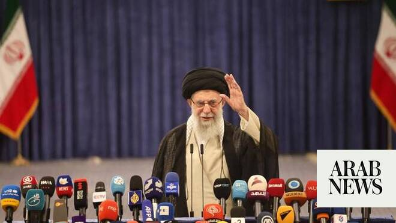

# Funeral for Iran’s late Supreme Leader Khamenei to begin July 4, burial set for July 9

Source: https://www.arabnews.com/node/2647020/middle-east
Captured source: https://www.arabnews.com/node/2647020/middle-east
Published: 2026-06-13T13:56:23+03:00
Modified: 2026-06-13T18:07:11+03:00
Author: Reuters

## Summary

DUBAI: The ‌funeral for Iran’s late Supreme Leader Ayatollah Ali Khamenei will begin in Tehran on July 4 and conclude with his burial in his hometown, the northeastern holy city of Mashhad, on July 9, state media reported on Saturday. Khamenei was killed on the first day of Israeli and US airstrikes against Iran on February 28. The 86-year-old cleric had been at the helm of

## Image

## Video Or Embed URLs

- https://bdef9f3d8a2834f420bfd382aa558087.safeframe.googlesyndication.com/safeframe/1-0-45/html/container.html
- https://static.addtoany.com/menu/sm.25.html
- about:blank
- https://imasdk.googleapis.com/js/core/bridge3.770.1_en.html
- https://www.google.com/recaptcha/api2/aframe
- https://sync.teads.tv/wigo-no-slot
- https://cm.g.doubleclick.net/partnerpixels?gdpr=0&us_privacy=1---&gpp_sid=-1&url=https%3A%2F%2Fwww.arabnews.com%2Fnode%2F2647020%2Fmiddle-east

## Text

https://arab.news/bpc6w

The funeral arrangements will include ‌ceremonies ⁠on July 7 in ⁠the holy city of Qom

Islamic law requires the deceased to be buried as soon as possible

DUBAI: The ‌funeral for Iran’s late Supreme Leader Ayatollah Ali Khamenei will begin in Tehran on July 4 and conclude with his burial in his hometown, the northeastern holy city of Mashhad, on July 9, state media reported on Saturday. Khamenei was killed on the first day of Israeli and US airstrikes against Iran on February 28. The 86-year-old cleric had been at the helm of the Islamic Republic ‌for 36 ‌years. The funeral arrangements will include ‌ceremonies ⁠on July 7 in ⁠the holy city of Qom, south of Tehran, media said. Islamic law requires the deceased to be buried as soon as possible, and ideally within 24 hours of death, but exceptions are allowed, for example in time of war. During his ⁠rule, Khamenei built Iran into a ‌powerful anti-US force, spreading ‌its military sway across the Middle East through proxy forces ‌such as Hezbollah in Lebanon, while using an ‌iron fist to crush outbreaks of unrest at home. Khamenei remained a strong critic of the United States throughout his rule, while successive US administrations tried unsuccessfully ‌to resolve a dispute with Iran over its nuclear program. The airstrike that killed ⁠him pulverised ⁠his central Tehran compound. His 56-year-old son Mojtaba, who also lost his wife in the airstrike and was himself injured, succeeded his father as Supreme Leader. Pakistan’s Prime Minister Shehbaz Sharif said on Saturday that Iran and the United States had agreed on a framework for a peace deal after more than three months of war and are expected to sign the initial deal in the next 24 hours.
