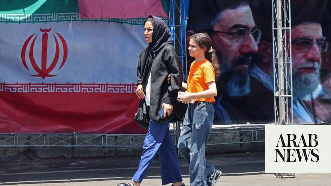

# Iran says funeral for late Supreme Leader Khamenei to begin July 4, burial set for July 9

Source: https://www.arabnews.com/node/2647020/middle-east
Captured source: https://www.arabnews.com/node/2647020/middle-east
Published: 2026-06-13T13:56:23+03:00
Modified: 2026-06-13T13:57:17+03:00
Author: Reuters

## Summary

DUBAI: Funeral for Iran's ​late Supreme Leader Ali Khamenei will begin in Tehran on July ‌4 and ‌conclude with ​his ‌burial ⁠in ​the northeastern ⁠city of Mashhad on July 9, state media reported ⁠on Saturday. Khamenei, ‌was ‌killed ​in ‌Israeli and ‌U.S. strikes on Iran in February. His death ‌marked the end of more ⁠than ⁠three decades at the helm of the Islamic Republic.

## Image

## Video Or Embed URLs

- https://static.addtoany.com/menu/sm.25.html
- about:blank
- https://imasdk.googleapis.com/js/core/bridge3.770.1_en.html
- https://www.google.com/recaptcha/api2/aframe
- https://sync.teads.tv/wigo-no-slot
- https://cm.g.doubleclick.net/partnerpixels?gdpr=0&us_privacy=1---&gpp_sid=-1&url=https%3A%2F%2Fwww.arabnews.com%2Fnode%2F2647020%2Fmiddle-east

## Text

https://arab.news/bpc6w

DUBAI: Funeral for Iran's ​late Supreme Leader Ali Khamenei will begin in Tehran on July ‌4 and ‌conclude with ​his ‌burial ⁠in ​the northeastern ⁠city of Mashhad on July 9, state media reported ⁠on Saturday. Khamenei, ‌was ‌killed ​in ‌Israeli and ‌U.S. strikes on Iran in February. His death ‌marked the end of more ⁠than ⁠three decades at the helm of the Islamic Republic.
