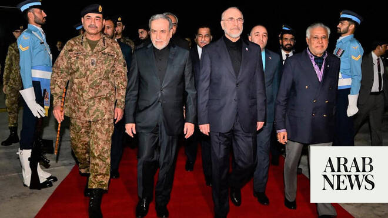

# Dozens protest peace deal outside Iran foreign ministry: media

Source: https://www.arabnews.com/node/2647082/middle-east
Captured source: https://www.arabnews.com/node/2647082/middle-east
Published: 2026-06-14T03:21:11+03:00
Modified: 2026-06-14T03:30:55+03:00
Author: AFP

## Summary

PARIS: Dozens protested Saturday outside a foreign ministry office in Iran’s northeastern city of Mashhad, chanting slogans against top diplomat Abbas Araghchi after a televised interview in which he discussed signing a peace deal with the US. In a video shared by Fars news agency, women in black chadors chanted “death to dishonorable Araghchi, the infiltrator” in front of the

## Image

## Video Or Embed URLs

- https://static.addtoany.com/menu/sm.25.html
- about:blank
- https://imasdk.googleapis.com/js/core/bridge3.770.1_en.html
- https://www.google.com/recaptcha/api2/aframe
- https://sync.teads.tv/wigo-no-slot
- https://cm.g.doubleclick.net/partnerpixels?gdpr=0&us_privacy=1---&gpp_sid=-1&url=https%3A%2F%2Fwww.arabnews.com%2Fnode%2F2647082%2Fmiddle-east

## Text

https://arab.news/2yygx

Protesters fault Iranian negotiators for making too many concessions to secure the deal

Seek resignation of Parliament Speaker Mohammad Bagher Ghalibaf and FM Abbas Araghchi

PARIS: Dozens protested Saturday outside a foreign ministry office in Iran’s northeastern city of Mashhad, chanting slogans against top diplomat Abbas Araghchi after a televised interview in which he discussed signing a peace deal with the US. In a video shared by Fars news agency, women in black chadors chanted “death to dishonorable Araghchi, the infiltrator” in front of the building, while waving red and black flags. The protest comes as the peace deal touted by US President Donald Trump and mediator Pakistan faces opposition from hard-line Iranian figures. They argue that it does not serve Iran’s interests and would deprive Tehran of leverage over the Strait of Hormuz. They also accuse Iranian negotiators of having made too many concessions to secure the deal. In an interview with state television Friday, Araghchi had said the deal on the table called for the lifting of the US naval blockade on Iranian ports, imposed in response to Iran’s own blockade in the Strait of Hormuz. “The administration of Strait of Hormuz will no longer be the same as before,” he added, calling the waterway one of Iran’s “main instruments of deterrence.” Other videos on social media that AFP could not independently verify showed people in front of the foreign ministry building in Tehran chanting “Araghchi, resign” and “Ghalibaf, resign,” in reference to parliament speaker and chief negotiator Mohammad Bagher Ghalibaf. Trump and Pakistan on Saturday said the deal to end the war could be signed as early as Sunday, though Tehran was more circumspect regarding the timing.
