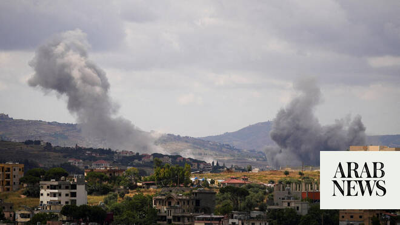

# Israel army issues evacuation order for 29 south Lebanon villages

Source: https://www.arabnews.com/node/2647106/middle-east
Captured source: https://www.arabnews.com/node/2647106/middle-east
Published: 2026-06-14T10:27:07+03:00
Modified: 2026-06-14T11:08:29+03:00
Author: AFP

## Summary

JERUSALEM: The Israeli military on Sunday issued evacuation warnings for residents of 29 villages in southern Lebanon ahead of planned strikes, despite a ceasefire intended to halt the war with Lebanese militant group Hezbollah. The military's Arabic-language spokesman, Colonel Avichay Adraee, issued two successive warnings -- first for 13 villages, then for 16 more, with the

## Image

## Video Or Embed URLs

- https://static.addtoany.com/menu/sm.25.html
- about:blank
- https://imasdk.googleapis.com/js/core/bridge3.770.1_en.html
- https://www.google.com/recaptcha/api2/aframe
- https://sync.teads.tv/wigo-no-slot
- https://cm.g.doubleclick.net/partnerpixels?gdpr=0&us_privacy=1---&gpp_sid=-1&url=https%3A%2F%2Fwww.arabnews.com%2Fnode%2F2647106%2Fmiddle-east

## Text

https://arab.news/r87ww

JERUSALEM: The Israeli military on Sunday issued evacuation warnings for residents of 29 villages in southern Lebanon ahead of planned strikes, despite a ceasefire intended to halt the war with Lebanese militant group Hezbollah. The military's Arabic-language spokesman, Colonel Avichay Adraee, issued two successive warnings -- first for 13 villages, then for 16 more, with the second targeting communities north of the Zahrani river.

The military also said two drones, suspected to have been launched by Hezbollah from Lebanon, struck northern Israel on Sunday but caused no casualties. “Two impacts of suspicious aerial targets in Israeli territory were identified near the Israel-Lebanon border. No injuries were reported,” the military said. In the wake of the strikes, two far-right Israeli ministers called for retaliatory strikes on Beirut’s southern suburbs, a Hezbollah stronghold known as Dahiyeh. “The shooting at northern communities is a test of the Dahiyeh Doctrine that the prime minister declared. I call on him to implement it decisively and firmly, and to bring down buildings in Dahiyeh,” Finance Minister Bezalel Smotrich said on X. “For every drone — a missile; for every violation — fire; for every UAV — Dahiyeh must tremble,” wrote National Security Minister Itamar Ben Gvir on X. Israeli officials including Prime Minister Benjamin Netanyahu have previously warned that Israel would strike Dahiyeh should the Iran-backed Hezbollah group target northern Israeli communities, a position they say has the backing of Washington.
