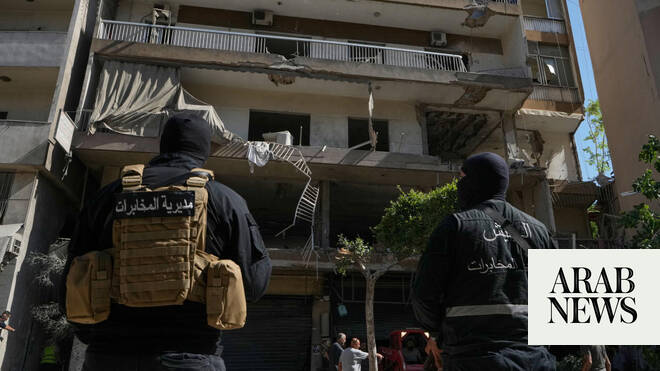

# Trump says Iran deal in ‘a few hours,’ blames Israel for delay: Axios

Source: https://www.arabnews.com/node/2647144/middle-east
Captured source: https://www.arabnews.com/node/2647144/middle-east
Published: 2026-06-14T18:38:03+03:00
Modified: 2026-06-14T22:00:39+03:00
Author: AFP

## Summary

WASHINGTON: US President Donald Trump said Sunday that a peace deal with Iran was still on track to be signed within hours, despite an Israeli strike on Beirut that he said had delayed the plan. “It shook it up. It delayed the signing by a few hours. It was supposed to be now. Now it is scheduled for a few hours from now,” Trump said in a phone call to the Axios news outlet.

## Image

## Video Or Embed URLs

- https://454808ca8b83e53c718bb5f2dd89bc78.safeframe.googlesyndication.com/safeframe/1-0-45/html/container.html
- blob:https://www.arabnews.com/bb725d0f-0561-4cfd-be99-e261b1e97f0f
- https://imasdk.googleapis.com/js/core/bridge3.771.2_en.html
- https://static.addtoany.com/menu/sm.25.html
- about:blank
- https://cm.g.doubleclick.net/partnerpixels?gdpr=0&us_privacy=1---&gpp_sid=-1&url=https%3A%2F%2Fwww.arabnews.com%2Fnode%2F2647144%2Fmiddle-east

## Text

https://arab.news/bb6t4

Using a string of expletives, Trump told Axios he raged at Netanyahu after Israel struck Beirut’s southern suburbs on Sunday, killing three people

WASHINGTON: US President Donald Trump said Sunday that a peace deal with Iran was still on track to be signed within hours, despite an Israeli strike on Beirut that he said had delayed the plan. “It shook it up. It delayed the signing by a few hours. It was supposed to be now. Now it is scheduled for a few hours from now,” Trump said in a phone call to the Axios news outlet. Trump fumed at Israeli Prime Minister Benjamin Netanyahu over the attack on Beirut, saying, “it is so bad — I couldn’t believe it. An hour before we are supposed to sign the deal.” Using a string of expletives, Trump told Axios he raged at Netanyahu after Israel struck Beirut’s southern suburbs on Sunday, killing three people, in response to what it said was Hezbollah fire at northern Israel. “Why did Bibi (Netanyahu) have to do a f***ing attack?” Trump told Axios. “I was so pissed off. I let him know. He has no f***ing judgment. I let him know that.” Tehran insists that any agreement to halt the war must include the parallel conflict in Lebanon, where Israel has been pursuing a campaign against the Iran-backed movement Hezbollah.

Earlier, Trump said an Israeli strike on Beirut “should not have happened” after it triggered a strong protest from Iran, casting doubt on the US president’s pledge that a peace deal would be signed Sunday. The attack does not appear to have entirely dashed hopes for an accord, however, with both sides signalling channels of dialogue were still open, and Trump maintaining a deal was still “close.”

Trump — who over weeks of negotiations has repeatedly declared an accord with Iran was all but concluded — said after the attack that a deal was still at hand, urging those involved not to “blow it.” “We are very close to a Deal that will bring peace to the region, including to Lebanon, and all sides should stand down,” Trump said on social media. “This morning’s attack on Beirut should not have happened, particularly on a special day,” he added, possibly a reference to his hopes of a signing on Sunday, his 80th birthday. But after days of momentum building toward a deal, Sunday’s strike in Beirut’s southern suburbs — a Hezbollah stronghold — prompted Iran’s chief negotiator to question the point of continuing peace talks. The attack “showed that the United States either lacks the will to implement its commitments or lacks the ability to do so,” Iranian parliament speaker Mohammad Bagher Ghalibaf said on X. “If you do not have the will or the ability to fulfil your commitments, then there is no point in talking about continuing down this path,” he added. The last time Israel hit the Beirut suburbs, it sparked one of the strongest jolts yet to an April ceasefire, with Iran firing off a retaliatory missile barrage and Israel responding with strikes. Iranian Brig. Gen. Mohammad Jafar Asadi said Sunday that the latest Israeli attack “will not go unanswered.” Israel’s military, meanwhile, said it was “preparing for potential fire toward the territory of the state of Israel in the coming hours.”

In a sign that a diplomatic off-ramp was still available, Iran’s president said Sunday that the country’s highest security body supported negotiations despite criticism from hard-liners. “The Supreme National Security Council has concluded that the path of dialogue should be pursued,” President Masoud Pezeshkian said, pointedly adding that the council was in charge of “decisions regarding war and negotiations.” US Defense Secretary Pete Hegseth said he did not expect the Israeli attack to “disrupt” the progress toward a deal. “From all I know, we are on track,” he said. “It is not a matter of if. It is a matter of when.” A delegation from mediator Qatar was in Tehran on Sunday “to help facilitate the finalization of the agreement,” a diplomat with knowledge of the situation told AFP. Iran’s Fars news agency, citing “a source close to Iran’s negotiating team,” reported that Iran was conveying its detailed position to the Qatari team, though the timeline for sealing a deal remained an open question. “Even if all of Iran’s views are incorporated, no agreement will be signed within the timeframe announced by Trump,” the source was quoted as saying before the Israeli strike.

The warring parties have released conflicting information about the contents of the deal, as each seeks to show it emerged from the war with the upper hand. Tehran has insisted it will maintain control over the vital Strait of Hormuz, but the US has repeatedly said this would be unacceptable. Since imposing a blockade on the strait early in the war, Iran has demanded vessels obtain permission before transiting the waterway, and has established a new body to oversee it and collect tolls. The US has responded with its own blockade of Iranian ports. Iran’s Foreign Minister Abbas Araghchi had said on Friday that the deal on the table called for the lifting of the US blockade. Another key sticking point in the talks has been the fate of Iran’s nuclear program, particularly its stockpile of highly enriched uranium — believed to have been buried by US strikes last year. Iran has long insisted its nuclear program is peaceful, but Western governments suspect it of seeking a bomb. Araghchi on Friday said the only way to deal with Iran’s enriched uranium “is to dilute it inside Iran.” Trump, who has justified the war as necessary to prevent Iran from obtaining nuclear weapons, previously said the US would remove and destroy the uranium. On Saturday, he said: “When all is calm, we will go in and get the Nuclear Dust... and downblend and destroy it, whether in Iran or the United States.”
