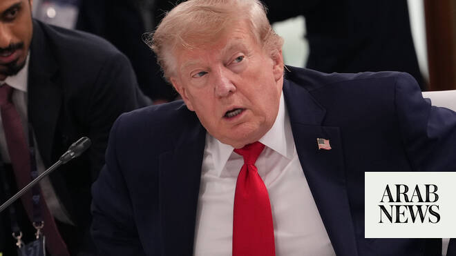

# Trump: Memo states clearly Iran will not have a nuclear weapon

Source: https://www.arabnews.com/node/2647272/middle-east
Captured source: https://www.arabnews.com/node/2647272/middle-east
Published: 2026-06-16T12:34:28+03:00
Modified: 2026-06-16T23:40:49+03:00
Author: Agencies

## Summary

TEHRAN/EVIAN: US ​President Donald Trump on Tuesday told reporters at the G7 meetings in France that the memorandum of understanding ‌with Iran ‌states clearly that ​Iran ‌will ⁠not ​have a ⁠nuclear weapon. Trump said that he will release the text of the US-Iran memorandum in ⁠a formal setting. ‌The ‌president also ​said he ‌likes the idea of ‌sending the Iran deal to Congress

## Image

## Video Or Embed URLs

- https://824d79d534721e777b6de59f5c4e79c2.safeframe.googlesyndication.com/safeframe/1-0-45/html/container.html
- blob:https://www.arabnews.com/d4dc4a19-1cc1-439c-8be1-d3b0fe79cd8d
- https://imasdk.googleapis.com/js/core/bridge3.771.2_en.html
- about:blank
- https://static.addtoany.com/menu/sm.25.html
- https://ep2.adtrafficquality.google/sodar/sodar2/254/runner.html
- https://www.google.com/recaptcha/api2/aframe
- https://cm.g.doubleclick.net/partnerpixels?gdpr=0&us_privacy=1---&gpp_sid=-1&url=https%3A%2F%2Fwww.arabnews.com%2Fnode%2F2647272%2Fmiddle-east

## Text

https://arab.news/mdw4f

Iran’s top envoy says talks with the US on a final agreement covering Tehran’s nuclear program will likely begin on Friday

US Vice President JD Vance said ‌President ⁠Donald Trump may decide to ⁠release Washington’s agreement with ⁠Tehran before Friday

TEHRAN/EVIAN: US ​President Donald Trump on Tuesday told reporters at the G7 meetings in France that the memorandum of understanding ‌with Iran ‌states clearly that ​Iran ‌will ⁠not ​have a ⁠nuclear weapon.

Trump said that he will release the text of the US-Iran memorandum in ⁠a formal setting. ‌The ‌president also ​said he ‌likes the idea of ‌sending the Iran deal to Congress for review, a request by ‌some Republican lawmakers. “I think it’s going ⁠to ⁠go pretty quickly,” Trump told reporters about the next phase of negotiations with Iran.

Trump said earlier on Tuesday that the Iran deal was going ‌to a second ‌stage, ​and ‌that ⁠the ​US would ⁠not be investing any money in Iran.

“We have our ⁠deal done ‌with ‌Iran, ​and ‌it should ‌be successful, it goes to a second stage, ‌which I think would be actually ⁠easier,” ⁠said Trump, speaking to reporters at the G7 summit in France.

Iran’s Foreign Minister Abbas Araghchi said on Tuesday that talks with the US on a final agreement covering Tehran’s nuclear program will likely begin on Friday.

“Likely on Friday, at a location to be determined … a new round of negotiations between Iran and the United States to reach a final agreement will begin,” Araghchi said in a briefing with foreign diplomats broadcast on state television.

US Vice ​President JD Vance told Fox News on ‌Monday ‌that Trump may decide to ⁠release Washington’s agreement with ⁠Tehran before Friday.

The ‌agreement, ‌which ​was ‌electronically ‌signed by leaders in the US ‌and Iran, is expected ⁠to ⁠be signed in person on Friday. Trump on Monday said an agreement with ​Iran has been signed and that the text of the deal would be released sometime after a formal signing on Friday, adding that the Strait of Hormuz would also be fully open.

“The deal’s all signed. ⁠And the strait is ‌already partially opened, ‌as you know,” Trump ​told reporters shortly ‌after arriving in Evian, France.

“On Friday, ‌it’ll be completely open.”

Iran’s top negotiator Mohammad Baqer ​Qalibaf will be present for the signing of an interim agreement to ‌end ‌the ​war ‌with ⁠the ​US, an ⁠Iranian deputy foreign minister said on Tuesday, according to Tasnim ⁠news agency.

Majid Takht-Ravanchi ‌said it ‌remained ​unclear ‌where exactly the ‌signing would take place and in what ‌format it would be conducted.

Vance on Monday said the agreement had been signed digitally on Sunday and that no funds ‌were released.

Asked when the text of the memorandum of ⁠understanding ⁠would be made public, Trump said: “Probably pretty soon. I would say after sometime after Friday … I think sometime in the very near future.”

Trump said any sanctions relief for Tehran was “really a behavioral thing. If they do what they’re supposed to do, that starts taking effect.”

Vance said that no funds would be released to Iran in exchange for signing an agreement to ​halt the war and open the Strait of Hormuz and that text of the framework deal would be shared this week.

In an interview on ABC’s “Good Morning America” program, Vance said signing the memorandum of understanding with Iran would not trigger the release of frozen assets.

Vance said the agreement was already signed digitally on Sunday and no funds were released.

“There’s been no money released, and that won’t change,” ‌he said.

Vance said ‌Iran would receive money only if it took ​verified steps ‌to ⁠eliminate ​its stockpile ⁠of highly enriched uranium.

“If we see the Iranians making, for example, taking action to eliminate their stockpile of enriched material, then yes, sanctions relief will follow. If we see the Iranians taking action to allow the kind of verification regime that we need to see to know that they’re not going to build a nuclear weapon, yes, sanctions relief will follow,” he said.

“If they don’t ⁠do the right things, if they don’t allow the verification ‌regime, they’re never going to have ‌the money to rebuild their nuclear program to begin ​with.”

In an interview on CNBC on ‌Monday, Vance also said the United States expects the economically vital waterway ‌would be open without tolls.

“Our expectation is that the Strait is going to be opened in a toll-free way for the long-term,” he said.

“That’s the sort of thing that we’re going to figure out in these technical negotiations. You know that there ‌are a lot of very important details to figure out that we’re actually going to sit at the table ⁠and discuss together ⁠and figure out a path forward.”

The US and Iran said they had agreed terms to end their war and reopen the strait, news that brought relief to markets, although the pact may hinge on an end to hostilities in Lebanon and defers talks on Tehran’s nuclear program.

While still a framework, the deal marked the biggest breakthrough toward resolving the conflict that has killed thousands and upended energy markets since it began with joint US-Israeli strikes on Iran in February.
