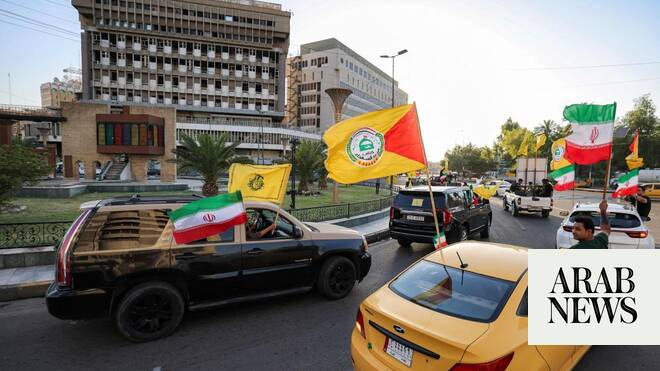

# Iran deal includes $300 billion fund, more than half of which already committed, source says

Source: https://www.arabnews.com/node/2647494/middle-east
Captured source: https://www.arabnews.com/node/2647494/middle-east
Published: 2026-06-17T07:53:04+03:00
Modified: 2026-06-17T07:54:54+03:00
Author: Reuters

## Summary

DUBAI: A $300 billion private fund designed to trigger investment into Iran is outlined in the US-Iran framework agreement and more than half that sum has already been committed, a source with direct knowledge of the deal told Reuters. The fund is designed to give both sides an economic incentive to conclude a final deal to end the war, said the source, who spoke on condition

## Image

## Video Or Embed URLs

- https://static.addtoany.com/menu/sm.25.html
- about:blank
- https://imasdk.googleapis.com/js/core/bridge3.771.2_en.html
- https://www.google.com/recaptcha/api2/aframe
- https://sync.teads.tv/wigo-no-slot
- https://cm.g.doubleclick.net/partnerpixels?gdpr=0&us_privacy=1---&gpp_sid=-1&url=https%3A%2F%2Fwww.arabnews.com%2Fnode%2F2647494%2Fmiddle-east

## Text

https://arab.news/wx9dn

The fund is designed to give both sides an economic incentive to conclude a final deal to end the war

US and Iranian officials said on Sunday they had agreed on a framework to end their war

DUBAI: A $300 billion private fund designed to trigger investment into Iran is outlined in the US-Iran framework agreement and more than half that sum has already been committed, a source with direct knowledge of the deal told Reuters. The fund is designed to give both sides an economic incentive to conclude a final deal to end the war, said the source, who spoke on condition of anonymity because the plan has not yet been announced as Washington and Tehran prepare to sign on Friday. The fund’s existence has been previously reported but Reuters is revealing for the first time that more than half of the amount has already been committed and that it will be comprised entirely of private-sector funds. US and Iranian officials said on Sunday they had agreed on a framework to end their war, which ‌began when US ‌and Israeli forces attacked Iran on February 28, halt the US blockade of Iran and reopen ‌the ⁠Strait of Hormuz, ⁠a key supply route for global oil and gas. The new fund is a private investment vehicle, not a reconstruction or reparations program and will not include any government money or grants, the source said, adding that companies based in the US, the Gulf Arab states, Asia, South America and Africa have agreed to commit financing. Investments pledged span energy, logistics, manufacturing and transport, the source said. A senior Iranian source told Reuters that Tehran had originally sought $400 billion as compensation for war damages from the US but Washington had said it would not provide it. The idea for the fund, which is to be named the Reconstruction and Development Fund, then emerged. The mechanism envisages regional countries contributing in various ⁠ways, the Iranian source said. These include securing loans, establishing credit lines or directly financing ‌the reconstruction of sites damaged in the war, including facilities such as the Mobarakeh ‌Steel complex, refineries, airports and, more broadly, infrastructure affected by the conflict. Iran, one of the Middle East’s largest economies, has attracted almost no significant ‌foreign direct investment in the past four decades, frozen out of global capital markets by successive waves of US and international ‌sanctions. The country has the world’s second-largest proven natural gas reserves and the fourth-largest proven oil reserves. It also has a young, educated population of more than 92 million people, a diversified industrial base and significant untapped potential in sectors ranging from petrochemicals and mining to tourism and agriculture. The investment fund is entirely separate from a parallel negotiating track over the lifting of US sanctions and the release of Iranian sovereign assets frozen abroad, ‌the source with knowledge of the deal said, describing the two as distinct financial mechanisms with different purposes and timelines. The fund will not be created or become operational until a final ⁠and satisfactory deal is concluded. ⁠The memorandum of understanding, once signed, is intended to structure the process over the next 60 days. “It’ll only be created once the final deal is signed,” the source said. “During these 60 days the fund administrators will work with Iranians and investors to plan and scope projects.” Iran’s foreign ministry and Pakistan’s foreign ministry, which helped mediate the investment fund deal, did not immediately respond to requests for comment. A White House spokeswoman pointed to a CBS interview with Vice President JD Vance on Monday in which he said that Iran could gain access to a $300 billion reconstruction fund backed by Gulf states if it complies with an agreement with Washington, including dismantling its nuclear program, eliminating its stockpile of enriched material, and accepting a stringent inspection and enforcement regime. The source would not say how the fund will be administered or by whom, noting that key details were still to be worked out. The source named companies from South Korea, Japan, Singapore, Malaysia and the United States among those that had made commitments, but declined to provide a comprehensive list. The 60-day memorandum is a framework, not a final agreement, and US and Iranian negotiators are expected to work across multiple tracks during that period covering nuclear, sanctions and regional security issues.
