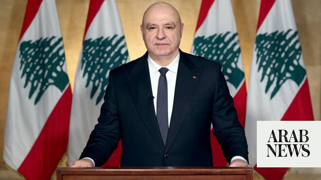

# Lebanon’s Aoun says Israel talks independent of US-Iran deal

Source: https://www.arabnews.com/node/2647552/middle-east
Captured source: https://www.arabnews.com/node/2647552/middle-east
Published: 2026-06-17T15:27:43+03:00
Modified: 2026-06-17T22:58:58+03:00
Author: AFP

## Summary

BEIRUT: Lebanese President Joseph Aoun said Wednesday that his country’s negotiations with Israel in Washington were independent of the US-Iran deal to bring an end to the Middle East conflict. Lebanon and Israel have been holding direct talks in Washington since April, seeking to end the hostilities between Israel and Hezbollah and separate their conflict from the wider

## Image

## Video Or Embed URLs

- https://d6196009f678a09e4ed352a65af8675c.safeframe.googlesyndication.com/safeframe/1-0-45/html/container.html
- https://platform.twitter.com/embed/Tweet.html?creatorScreenName=Arab_News&creatorUserId=69172612&dnt=false&embedId=twitter-widget-0&features=eyJ0ZndfdGltZWxpbmVfbGlzdCI6eyJidWNrZXQiOltdLCJ2ZXJzaW9uIjpudWxsfSwidGZ3X2ZvbGxvd2VyX2NvdW50X3N1bnNldCI6eyJidWNrZXQiOnRydWUsInZlcnNpb24iOm51bGx9LCJ0ZndfdHdlZXRfZWRpdF9iYWNrZW5kIjp7ImJ1Y2tldCI6Im9uIiwidmVyc2lvbiI6bnVsbH0sInRmd19yZWZzcmNfc2Vzc2lvbiI6eyJidWNrZXQiOiJvbiIsInZlcnNpb24iOm51bGx9LCJ0ZndfZm9zbnJfc29mdF9pbnRlcnZlbnRpb25zX2VuYWJsZWQiOnsiYnVja2V0Ijoib24iLCJ2ZXJzaW9uIjpudWxsfSwidGZ3X21peGVkX21lZGlhXzE1ODk3Ijp7ImJ1Y2tldCI6InRyZWF0bWVudCIsInZlcnNpb24iOm51bGx9LCJ0ZndfZXhwZXJpbWVudHNfY29va2llX2V4cGlyYXRpb24iOnsiYnVja2V0IjoxMjA5NjAwLCJ2ZXJzaW9uIjpudWxsfSwidGZ3X3Nob3dfYmlyZHdhdGNoX3Bpdm90c19lbmFibGVkIjp7ImJ1Y2tldCI6Im9uIiwidmVyc2lvbiI6bnVsbH0sInRmd19kdXBsaWNhdGVfc2NyaWJlc190b19zZXR0aW5ncyI6eyJidWNrZXQiOiJvbiIsInZlcnNpb24iOm51bGx9LCJ0ZndfdXNlX3Byb2ZpbGVfaW1hZ2Vfc2hhcGVfZW5hYmxlZCI6eyJidWNrZXQiOiJvbiIsInZlcnNpb24iOm51bGx9LCJ0ZndfdmlkZW9faGxzX2R5bmFtaWNfbWFuaWZlc3RzXzE1MDgyIjp7ImJ1Y2tldCI6InRydWVfYml0cmF0ZSIsInZlcnNpb24iOm51bGx9LCJ0ZndfbGVnYWN5X3RpbWVsaW5lX3N1bnNldCI6eyJidWNrZXQiOnRydWUsInZlcnNpb24iOm51bGx9LCJ0ZndfdHdlZXRfZWRpdF9mcm9udGVuZCI6eyJidWNrZXQiOiJvbiIsInZlcnNpb24iOm51bGx9fQ%3D%3D&frame=false&hideCard=false&hideThread=false&id=2067219473380122726&lang=en&origin=https%3A%2F%2Fwww.arabnews.com%2Fnode%2F2647552%2Fmiddle-east&sessionId=4975421c7ac571b1a29f9e34b0329af986fb97a3&siteScreenName=Arab_News&siteUserId=69172612&theme=light&widgetsVersion=6a3ad42b224df%3A1778106238597&width=550px
- https://static.addtoany.com/menu/sm.25.html
- https://platform.twitter.com/widgets/widget_iframe.1227a5674072e080ffb1ba14ac0c1079.html?origin=https%3A%2F%2Fwww.arabnews.com
- about:blank
- https://imasdk.googleapis.com/js/core/bridge3.771.2_en.html
- https://www.google.com/recaptcha/api2/aframe
- https://sync.teads.tv/wigo-no-slot
- https://cm.g.doubleclick.net/partnerpixels?gdpr=0&us_privacy=1---&gpp_sid=-1&url=https%3A%2F%2Fwww.arabnews.com%2Fnode%2F2647552%2Fmiddle-east

## Text

https://arab.news/6v5um

Aoun says the Lebanese state alone was leading the negotiations and remained sovereign in its decision-making

Lebanon and Israel have been holding direct talks in Washington since April

BEIRUT: Lebanese President Joseph Aoun said Wednesday that his country’s negotiations with Israel in Washington were independent of the US-Iran deal to bring an end to the Middle East conflict. Lebanon and Israel have been holding direct talks in Washington since April, seeking to end the hostilities between Israel and Hezbollah and separate their conflict from the wider regional war. But the announcement on Monday of the US-Iran deal, which Iran and mediator Pakistan say includes Lebanon, has reshuffled the cards.

“The assurances we have received, and what we insist on, is that Lebanon’s path in the negotiations is independent, though we are certainly for a ceasefire and for any country that helps us, including Iran,” Aoun said, according to a statement from his office. But “interference in Lebanese affairs is not permitted,” he added. The president expressed hope that next week’s fifth round of talks “will be more positive, particularly considering the US administration’s great interest in Lebanon.” “The Lebanese state is sovereign in its decision-making, and for the first time, it is the one conducting the negotiations, and nobody is negotiating for us,” he said. “I reassure the Lebanese that nobody is tying us to any other country, and any settlement will be through us, not at our expense,” he added. Hezbollah on Monday thanked its backer Tehran for insisting Lebanon be included in the agreement with Washington, despite Beirut’s efforts through the talks to achieve a ceasefire and a full withdrawal of Israeli forces. Hezbollah rejects the authorities’ direct negotiations with Israel and a Lebanese government decision to disarm it. The militant group drew Lebanon into the Middle East war on March 2 with rocket fire at Israel to avenge the killing of Iran’s supreme leader in US-Israeli strikes days earlier. Israel responded with a massive campaign of airstrikes and a ground invasion that Lebanese authorities say has killed more than 3,800 people. While violence has declined in Lebanon after the US-Iran deal was announced, Israeli strikes on the south have killed at least five people since then, according to state media, which also reported Israeli raids on several south Lebanon areas on Wednesday.
