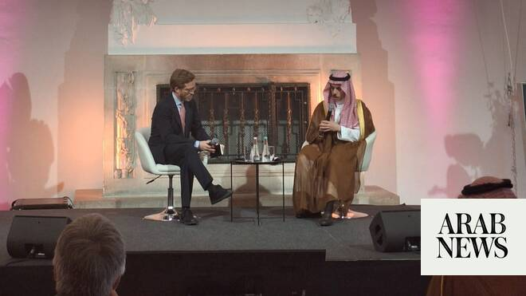

# Saudi FM says Iran’s attacks on the GCC resulted in a significant loss of trust in Tehran

Source: https://www.arabnews.com/node/2647639/saudi-arabia
Captured source: https://www.arabnews.com/node/2647639/saudi-arabia
Published: 2026-06-18T08:08:12+03:00
Modified: 2026-06-18T10:39:07+03:00
Author: Arab News

## Summary

DUBAI: Saudi Arabia’s Foreign Minister Prince Faisal bin Farhan has voiced cautious optimism over a newly reached memorandum of understanding between the US and Iran aimed at ending the conflict and opening the door to broader diplomatic progress in the region. Speaking at a session hosted by the European Council on Foreign Relations in Vienna on Wednesday, Prince Faisal

## Image

## Video Or Embed URLs

- blob:https://www.arabnews.com/e6eaf8e2-f311-4a77-a535-4102ff98e33d
- https://imasdk.googleapis.com/js/core/bridge3.772.0_en.html
- https://static.addtoany.com/menu/sm.25.html
- about:blank
- https://www.google.com/recaptcha/api2/aframe
- https://cm.g.doubleclick.net/partnerpixels?gdpr=0&us_privacy=1---&gpp_sid=-1&url=https%3A%2F%2Fwww.arabnews.com%2Fnode%2F2647639%2Fsaudi-arabia

## Text

https://arab.news/z37qr

Speaking at a session hosted by the European Council on Foreign Relations in Vienna, Prince Faisal described the agreement as “incredibly important”

The minister acknowledged that trust has been significantly damaged following recent Iranian attacks on Gulf countries

DUBAI: Saudi Arabia’s Foreign Minister Prince Faisal bin Farhan has voiced cautious optimism over a newly reached memorandum of understanding between the US and Iran aimed at ending the conflict and opening the door to broader diplomatic progress in the region.

Speaking at a session hosted by the European Council on Foreign Relations in Vienna on Wednesday, Prince Faisal described the agreement as “incredibly important” and a potentially pivotal step toward resolving long-standing disputes, particularly the nuclear issue.

He expressed hope that both Washington and Tehran are genuinely committed to diplomacy after a prolonged period of tensions.

“I am optimistic that there is real intent on both sides to give diplomacy a chance,” he said, while commending US leadership for bringing negotiations to this stage.

However, the Saudi minister stressed that the durability of any agreement would depend heavily on the fine details, especially the establishment of a robust, long-term verification regime.

“The detail will matter,” he said. “How we will have a long-term sustainable verification regime is what will matter the most.”

Prince Faisal underscored the need to address wider security concerns alongside the nuclear file, including freedom of navigation in the Strait of Hormuz.

He rejected suggestions of new arrangements or fees for maritime traffic through the strategic waterway. “The management of the strait was working fine before the conflict. There were no issues. Ships were navigating freely,” he said.

“Why should we now, as a result of a conflict, accept some novel arrangement that is going to be imposed on it?” he added.

Iran-Saudi reproachment

On Saudi Arabia-Iran relations, the minister acknowledged that trust has been significantly damaged following Tehran’s attacks on Gulf countries, reversing earlier progress made after a Beijing-brokered understanding.

While Riyadh had begun cautiously reopening dialogue and exploring economic cooperation, those efforts have now stalled.

“Before we can look at economic cooperation, there must first be a rebuilding of trust,” he said.

Asked about reports of a proposed $300 billion reconstruction or investment fund for Iran, Prince Faisal said he had no information about the fund and therefore could not comment on its specifics.

“First of all, I have no details on this fund. I have no information or insight into the concept behind it, so I can’t comment on it specifically,” he said.

Asked about Saudi Arabia’s role in the diplomatic efforts, Prince Faisal said the Kingdom had acted mainly as a supporter rather than a mediator.

“We were supporters and we were helpful behind the scenes in trying to encourage both parties to give primary focus to the diplomatic track,” he said.

Prince Faisal stressed the importance of ensuring that Iran’s civilian nuclear program poses no threat to neighboring countries.

“Ensuring that there is a civilian nuclear program in Iran that is not a risk to its neighbors is critically important,” he said.

“I’m certainly going to be very vocal in advocating for ensuring that whatever agreement is reached is a solid agreement that has the necessary safeguards and the necessary verification mechanisms.”

Regional issues need to be solved

However, the minister warned that negotiations should not be limited to the nuclear file. He said lessons from the 2015 nuclear agreement showed that broader regional concerns must also be addressed.

“One of the lessons that we learned from the JCPOA (Joint Comprehensive Plan of Action), which also ignored the regional context completely, is that if we don’t address the issues that concern the region, the risk is always that any agreement on the nuclear issue becomes less secure,” he said.

The minister said progress on regional issues would help build confidence and improve prospects for future sanctions relief.

Beyond Iran, the minister highlighted the centrality of the Palestinian issue to long-term regional stability. He warned that relying solely on military solutions, particularly in Gaza, would not yield lasting peace, calling instead for a political process involving all parties, including Israel and the Palestinians.

“For Israel to insist solely on the military approach in the long term will be very detrimental to Israel’s interest,” he said.

“The idea that a purely military approach is viable in the long term is completely incorrect and is not going to be in the interest of anyone.”

Prince Faisal said the biggest obstacle remained the absence of a political track. He said both Israel and Hamas must fulfill their commitments and move toward a political process.

“There is a need for both sides to live up to their commitments. Right now, both sides are not living up to the commitments,” he said.

He reaffirmed Europe’s continued relevance in regional diplomacy, particularly in areas including sanctions policy and maritime security, noting that “Europe has a role to play.”
