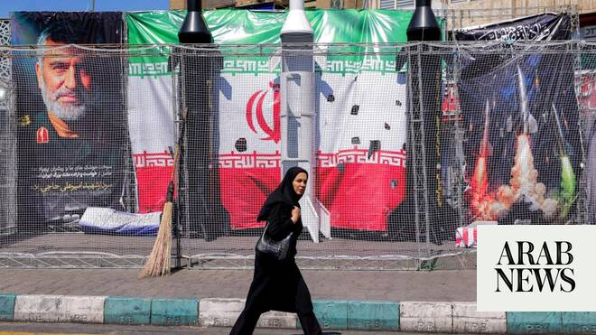

# Iran says missile program not part of talks with US

Source: https://www.arabnews.com/node/2647661/middle-east
Captured source: https://www.arabnews.com/node/2647661/middle-east
Published: 2026-06-18T12:04:42+03:00
Modified: 2026-06-18T12:07:52+03:00
Author: AFP

## Summary

TEHRAN: Iran said on Thursday that its missile program would not be part of future negotiations with the United States, after the two sides agreed a framework deal for ending their war. US President Donald Trump and Iranian President Masoud Pezeshkian signed a memorandum of understanding early Thursday, ending a regional war that erupted on February 28 with US-Israeli strikes.

## Image

## Video Or Embed URLs

- https://static.addtoany.com/menu/sm.25.html
- about:blank
- https://imasdk.googleapis.com/js/core/bridge3.771.2_en.html
- https://www.google.com/recaptcha/api2/aframe
- https://sync.teads.tv/wigo-no-slot
- https://cm.g.doubleclick.net/partnerpixels?gdpr=0&us_privacy=1---&gpp_sid=-1&url=https%3A%2F%2Fwww.arabnews.com%2Fnode%2F2647661%2Fmiddle-east

## Text

https://arab.news/46r8w

Foreign ministry spokesman: ‘Iran’s defense capability will not be discussed in any way, in any process or with any party’

During the nearly 40-day war, Iran’s missile infrastructure came under heavy US-Israeli bombardment

TEHRAN: Iran said on Thursday that its missile program would not be part of future negotiations with the United States, after the two sides agreed a framework deal for ending their war. US President Donald Trump and Iranian President Masoud Pezeshkian signed a memorandum of understanding early Thursday, ending a regional war that erupted on February 28 with US-Israeli strikes. The agreement lays the groundwork for detailed negotiations on Iran’s nuclear program and sanctions relief for Tehran. There is no mention in the deal of Iran’s missile program, a longstanding concern for Washington and its ally Israel. “Our missiles do not like at all to be talked about by anyone,” foreign ministry spokesman Esmaeil Baqaei said in an interview with Iranian state television. “Iranian missiles are only for firing, not for negotiations. Iran’s defense capability will not be discussed in any way, in any process or with any party.” During the nearly 40-day war, Iran’s missile infrastructure came under heavy US-Israeli bombardment, but Tehran continued to respond with missile and drone attacks across the region. Before the war, US Secretary of State Marco Rubio had warned that Iran would need to negotiate over its ballistic missile arsenal, which Washington views as a threat to Israel and US military bases in the region. Iran has repeatedly refused to discuss what it describes as its defensive capabilities. On Wednesday, Trump appeared to soften his position, saying it would be “unfair” for Iran not to have missiles. “I’m saying that if other countries have them, it’s a little bit unfair for them not to have some,” Trump said. “A ballistic missile is not the same thing as what we are talking about when we talk nuclear.”
