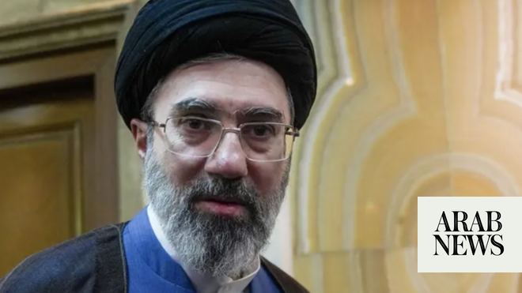

# Iran’s supreme leader Khamenei says approved US deal despite having ‘different view’

Source: https://www.arabnews.com/node/2647739/middle-east
Captured source: https://www.arabnews.com/node/2647739/middle-east
Published: 2026-06-18T21:20:37+03:00
Modified: 2026-06-18T21:20:48+03:00
Author: AFP

## Summary

TEHRAN: Iran’s supreme leader Ayatollah Mojtaba Khamenei said on Thursday that he had approved a deal with the United States to end the Middle East war despite having a “different view,” without elaborating.

## Image

## Video Or Embed URLs

- https://4bc4dde2fb440f8689eb63ec6c8f8b69.safeframe.googlesyndication.com/safeframe/1-0-45/html/container.html
- https://static.addtoany.com/menu/sm.25.html
- about:blank
- https://www.google.com/recaptcha/api2/aframe
- https://imasdk.googleapis.com/js/core/bridge3.772.0_en.html
- https://cm.g.doubleclick.net/partnerpixels?gdpr=0&us_privacy=1---&gpp_sid=-1&url=https%3A%2F%2Fwww.arabnews.com%2Fnode%2F2647739%2Fmiddle-east

## Text

https://arab.news/87dnc

Khamenei has not been seen in public since he took office in March following the killing of his father and predecessor Ayatollah Ali Khamenei

TEHRAN: Iran’s supreme leader Ayatollah Mojtaba Khamenei said on Thursday that he had approved a deal with the United States to end the Middle East war despite having a “different view,” without elaborating.

“In principle, I had a different view (about the memorandum of understanding), but I issued my permission due to the commitment that the honorable (Iranian) president, as the chairman of the Supreme National Security Council, gave me on behalf of himself and other members to protect the rights of the Iranian nation and the Resistance Front,” Khamenei said in message read on state television

Khamenei has not been seen in public since he took office in March following the killing of his father and predecessor Ayatollah Ali Khamenei in the US-Israeli strikes on Iran on February 28 that sparked the regional war.

The message was his first reaction to the Iran-US deal to end the conflict that was signed by US Donald Trump and Iranian President Masoud Pezeshkian.

Khamenei said Trump had “used all kinds of levers” to secure the deal “out of desperation.”

In his message, Khamenei noted that he received assurances from Pezeshkian about the deal and that it would not be accepted “if the American side wants to make excessive demands.”

“It is obvious that the face-to-face negotiations that will be held in the future will not mean accepting the enemy’s point of view,” he added.
