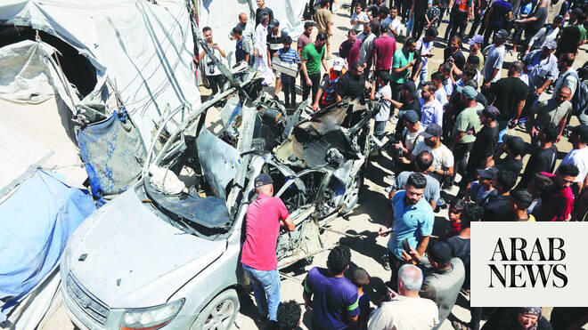

# Israeli minister says ‘all of Lebanon must burn’ after four soldiers killed

Source: https://www.arabnews.com/node/2647756/middle-east
Captured source: https://www.arabnews.com/node/2647756/middle-east
Published: 2026-06-19T09:10:55+03:00
Modified: 2026-06-19T12:40:18+03:00
Author: AFP

## Summary

JERUSALEM: Far-right Israeli National Security Minister Itamar Ben Gvir said Friday that “all of Lebanon must burn” after Israel’s military announced the deaths of four soldiers there. “With all due respect to the Americans, Israel must make it clear to the entire world that the blood of our sons and the security of our citizens are not up for bargaining. All of Lebanon must

## Image

## Video Or Embed URLs

- https://030f422d4e8e7eebb2ad36d46acf242b.safeframe.googlesyndication.com/safeframe/1-0-45/html/container.html
- blob:https://www.arabnews.com/7f3b4c28-bd78-42f1-b5b3-a8003616a268
- https://imasdk.googleapis.com/js/core/bridge3.772.0_en.html
- https://static.addtoany.com/menu/sm.25.html
- about:blank
- https://ep2.adtrafficquality.google/sodar/sodar2/254/runner.html
- https://www.google.com/recaptcha/api2/aframe
- https://cm.g.doubleclick.net/partnerpixels?gdpr=0&us_privacy=1---&gpp_sid=-1&url=https%3A%2F%2Fwww.arabnews.com%2Fnode%2F2647756%2Fmiddle-east

## Text

https://arab.news/2kymk

Violence continues in besieged enclave despite new ceasefire push by mediators

JERUSALEM: Far-right Israeli National Security Minister Itamar Ben Gvir said Friday that “all of Lebanon must burn” after Israel’s military announced the deaths of four soldiers there.

“With all due respect to the Americans, Israel must make it clear to the entire world that the blood of our sons and the security of our citizens are not up for bargaining. All of Lebanon must burn,” Ben Gvir said in a statement.

Israel’s military said Friday it was striking Hezbollah targets in parts of southern Lebanon, despite a peace deal in the Middle East war that includes Lebanon.

“During the night, the army struck and continues to strike Hezbollah terrorists and infrastructure in several areas in southern Lebanon,” the military said in a statement.

“These strikes come after repeated violations of the ceasefire by the terrorist organization Hezbollah,” it added.

Earlier on Friday Hezbollah its fighters destroyed three Israeli tanks and that clashes were ongoing, a day after Lebanese state media reported that Israeli strikes in the south had killed 16 people.

The fighting comes despite the United States and Iran signing an agreement to end the Middle East war on all fronts, including in Lebanon.

Hezbollah, an Iran-backed militant group, said its fighters had targeted “three Merkava tanks with guided missiles, which led to their destruction.”

The group said Israeli forces “consisting of an armored platoon and an infantry platoon (tried) to infiltrate toward the northern side of the Ali Al-Taher hills” — a strategic site overlooking the key town of Nabatieh.

“The clashes are still ongoing,” Hezbollah said in the statement released in the early hours of Friday.

Hezbollah drew Lebanon into the Middle East war in early March by attacking Israel to avenge the killing of Iran’s supreme leader at the start of the US-Israeli military campaign.

Israel retaliated with broad strikes across Lebanon and by launching a ground invasion in the south, which borders Israel and has long been under Hezbollah’s sway.

The hostilities have continued despite the US-Iran agreement.

On Thursday, Hezbollah said it had been fighting Israeli forces attempting to advance from the town of Arnoun toward the outskirts of Kfar Tibnit, near Nabatieh.

Lebanon’s official National News Agency also reported a drone strike targeting a car in the Kfar Tibnit area, killing two people.

In the neighboring village of Zebdine, another drone killed one more person, the agency said.

UN Secretary General Antonio Guterres’ spokesman, Stephane Dujarric, said that peacekeepers in Lebanon had also reported exchanges of fire on Thursday.
