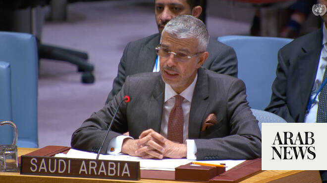

# Saudi envoy tells UN Security Council two-state solution only path to lasting Mideast peace

Source: https://www.arabnews.com/node/2647768/middle-east
Captured source: https://www.arabnews.com/node/2647768/middle-east
Published: 2026-06-19T03:55:03+03:00
Modified: 2026-06-19T03:55:03+03:00
Author: Ephrem Kossaify

## Summary

NEW YORK: The Saudi permanent representative to the UN told the Security Council on Thursday that the Palestinian issue remains at the heart of the Middle East conflict, warning that genuine peace cannot be achieved without ending Israel’s occupation. Speaking on behalf of the Arab Group at a council meeting on Gaza, Abdulaziz Alwasil said lasting peace requires that

## Image

## Video Or Embed URLs

- about:blank
- https://static.addtoany.com/menu/sm.25.html
- https://imasdk.googleapis.com/js/core/bridge3.772.0_en.html
- https://www.google.com/recaptcha/api2/aframe
- https://cm.g.doubleclick.net/partnerpixels?gdpr=0&us_privacy=1---&gpp_sid=-1&url=https%3A%2F%2Fwww.arabnews.com%2Fnode%2F2647768%2Fmiddle-east

## Text

https://arab.news/v27mu

Abdulaziz Alwasil: Palestinians must be able to exercise their ‘legitimate and inalienable rights’

He voices ‘extreme concern’ over Israeli violations that threaten regional, international stability

NEW YORK: The Saudi permanent representative to the UN told the Security Council on Thursday that the Palestinian issue remains at the heart of the Middle East conflict, warning that genuine peace cannot be achieved without ending Israel’s occupation.

Speaking on behalf of the Arab Group at a council meeting on Gaza, Abdulaziz Alwasil said lasting peace requires that Palestinians exercise their “legitimate and inalienable rights,” foremost an independent state on the 1967 borders with East Jerusalem as its capital.

He voiced “extreme concern” over continuing Israeli violations in the Occupied Territories, citing the targeting of civilians, settlement expansion, land confiscation, home demolitions, displacement and annexation, warning that these threaten regional and international stability.

The Arab Group rejected all Israeli measures aimed at entrenching the occupation or imposing sovereignty over Palestinian territory, calling them “null and void” and a clear violation of international law and the UN Charter.

The group welcomed international efforts toward a permanent ceasefire in Gaza, and called for building on them toward a comprehensive plan ending the conflict, protecting civilians and launching a credible political track toward a two-state solution.

The group condemned continued “massacres” against Palestinians and demanded immediate, sustained humanitarian access throughout Gaza, rejecting any use of aid as political pressure, which it called collective punishment. It urged greater international support for relief efforts and unimpeded UN agency access.

Alwasil condemned Israeli moves to annex parts of Gaza and displace residents, calling this a violation of US President Donald Trump’s plan.

The group reaffirmed Jerusalem’s status as part of the Occupied Territories since 1967, rejecting attempts to alter its demographic or legal character, and called for preserving the status quo at holy sites.

Alwasil urged the Security Council to fulfill its UN Charter responsibilities and the international community to end the occupation and uphold Palestinian rights.
