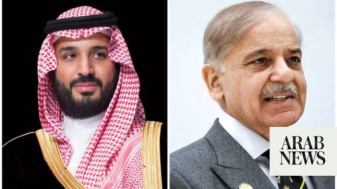

# In call with Pakistan PM, Saudi crown prince welcomes US-Iran deal

Source: https://www.arabnews.com/node/2647869/saudi-arabia
Captured source: https://www.arabnews.com/node/2647869/saudi-arabia
Published: 2026-06-19T22:00:34+03:00
Modified: 2026-06-19T22:10:16+03:00
Author: Arab News

## Summary

RIYADH: Saudi Arabia’s Crown Prince Mohammed bin Salman and Pakistan’s Prime Minister Shehbaz Sharif spoke on the phone on Friday, the Saudi Press Agency reported. During the call, the crown prince welcomed the agreement between the United States and Iran to end military operations and commended Pakistan’s mediation efforts, SPA added. He also reiterated the Kingdom’s hope

## Image

## Video Or Embed URLs

- https://platform.twitter.com/embed/Tweet.html?creatorScreenName=Arab_News&creatorUserId=69172612&dnt=false&embedId=twitter-widget-0&features=eyJ0ZndfdGltZWxpbmVfbGlzdCI6eyJidWNrZXQiOltdLCJ2ZXJzaW9uIjpudWxsfSwidGZ3X2ZvbGxvd2VyX2NvdW50X3N1bnNldCI6eyJidWNrZXQiOnRydWUsInZlcnNpb24iOm51bGx9LCJ0ZndfdHdlZXRfZWRpdF9iYWNrZW5kIjp7ImJ1Y2tldCI6Im9uIiwidmVyc2lvbiI6bnVsbH0sInRmd19yZWZzcmNfc2Vzc2lvbiI6eyJidWNrZXQiOiJvbiIsInZlcnNpb24iOm51bGx9LCJ0ZndfZm9zbnJfc29mdF9pbnRlcnZlbnRpb25zX2VuYWJsZWQiOnsiYnVja2V0Ijoib24iLCJ2ZXJzaW9uIjpudWxsfSwidGZ3X21peGVkX21lZGlhXzE1ODk3Ijp7ImJ1Y2tldCI6InRyZWF0bWVudCIsInZlcnNpb24iOm51bGx9LCJ0ZndfZXhwZXJpbWVudHNfY29va2llX2V4cGlyYXRpb24iOnsiYnVja2V0IjoxMjA5NjAwLCJ2ZXJzaW9uIjpudWxsfSwidGZ3X3Nob3dfYmlyZHdhdGNoX3Bpdm90c19lbmFibGVkIjp7ImJ1Y2tldCI6Im9uIiwidmVyc2lvbiI6bnVsbH0sInRmd19kdXBsaWNhdGVfc2NyaWJlc190b19zZXR0aW5ncyI6eyJidWNrZXQiOiJvbiIsInZlcnNpb24iOm51bGx9LCJ0ZndfdXNlX3Byb2ZpbGVfaW1hZ2Vfc2hhcGVfZW5hYmxlZCI6eyJidWNrZXQiOiJvbiIsInZlcnNpb24iOm51bGx9LCJ0ZndfdmlkZW9faGxzX2R5bmFtaWNfbWFuaWZlc3RzXzE1MDgyIjp7ImJ1Y2tldCI6InRydWVfYml0cmF0ZSIsInZlcnNpb24iOm51bGx9LCJ0ZndfbGVnYWN5X3RpbWVsaW5lX3N1bnNldCI6eyJidWNrZXQiOnRydWUsInZlcnNpb24iOm51bGx9LCJ0ZndfdHdlZXRfZWRpdF9mcm9udGVuZCI6eyJidWNrZXQiOiJvbiIsInZlcnNpb24iOm51bGx9fQ%3D%3D&frame=false&hideCard=false&hideThread=false&id=2067999417366712792&lang=en&origin=https%3A%2F%2Fwww.arabnews.com%2Fnode%2F2647869%2Fsaudi-arabia&sessionId=949d557e63dcbdd95ed051de0bd5adbbd24c0c8d&siteScreenName=Arab_News&siteUserId=69172612&theme=light&widgetsVersion=6a3ad42b224df%3A1778106238597&width=600px
- https://static.addtoany.com/menu/sm.25.html
- https://platform.twitter.com/widgets/widget_iframe.1227a5674072e080ffb1ba14ac0c1079.html?origin=https%3A%2F%2Fwww.arabnews.com
- about:blank
- https://imasdk.googleapis.com/js/core/bridge3.772.0_en.html
- https://www.google.com/recaptcha/api2/aframe
- https://cm.g.doubleclick.net/partnerpixels?gdpr=0&us_privacy=1---&gpp_sid=-1&url=https%3A%2F%2Fwww.arabnews.com%2Fnode%2F2647869%2Fsaudi-arabia

## Text

https://arab.news/rk7xp

Sharif thanked Prince Mohammed and the Saudi leadership for Riyadh’s “unwavering commitment” to peace in the region

Prince Mohammed reiterated Kingdom’s hope deal would lead to permanent agreement that strengthens regional security and stability

RIYADH: Saudi Arabia’s Crown Prince Mohammed bin Salman and Pakistan’s Prime Minister Shehbaz Sharif spoke on the phone on Friday, the Saudi Press Agency reported.

During the call, the crown prince welcomed the agreement between the United States and Iran to end military operations and commended Pakistan’s mediation efforts, SPA added.

He also reiterated the Kingdom’s hope that the deal would lead to a permanent agreement that strengthens security and stability in the region.

The two sides also reviewed bilateral relations and discussed ways to enhance cooperation.

Sharif thanked Prince Mohammed and the Saudi leadership for Riyadh’s “unwavering commitment” to peace in the region.

In a post on X, Sharif said the crown prince’s “wise leadership and the Kingdom’s unwavering commitment to regional peace and stability remained vital guiding forces throughout this crisis.”

The Pakistani premier said the two leaders agreed that the next phase of negotiations needed to continue to be guided by a “firm commitment to dialogue, diplomacy, and vigilance against any attempt to undermine the peace process.”

He continued: “I also expressed complete satisfaction at the excellent state of Pakistan–Saudi Arabia relations and looked forward to further strengthening our economic partnership under the visionary leadership of His Royal Highness Crown Prince Mohammed bin Salman.”
