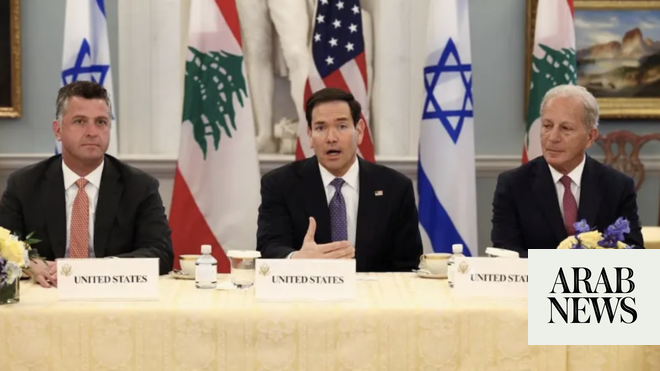

# Lebanon’s Aoun tells Rubio ‘comprehensive ceasefire’ essential ahead of talks next week

Source: https://www.arabnews.com/node/2647870/middle-east
Captured source: https://www.arabnews.com/node/2647870/middle-east
Published: 2026-06-19T22:06:39+03:00
Modified: 2026-06-19T22:18:14+03:00
Author: AFP

## Summary

BEIRUT: Lebanese President Joseph Aoun told US Secretary of State Marco Rubio in a call Friday that a comprehensive ceasefire must be secured in order for talks with Israel to progress. The State Department, meanwhile, announced the resumption of negotiations in Washington from June 23 to 25. These discussions will provide an opportunity to “make progress toward a lasting

## Image

## Video Or Embed URLs

- https://static.addtoany.com/menu/sm.25.html
- about:blank
- https://www.google.com/recaptcha/api2/aframe
- https://imasdk.googleapis.com/js/core/bridge3.772.0_en.html
- https://cm.g.doubleclick.net/partnerpixels?gdpr=0&us_privacy=1---&gpp_sid=-1&url=https%3A%2F%2Fwww.arabnews.com%2Fnode%2F2647870%2Fmiddle-east

## Text

https://arab.news/64hc4

State Department announced resumption of negotiations in Washington from June 23 to 25

Rubio reaffirmed Washington’s support for Lebanon’s efforts to extend state authority across all its territory

BEIRUT: Lebanese President Joseph Aoun told US Secretary of State Marco Rubio in a call Friday that a comprehensive ceasefire must be secured in order for talks with Israel to progress.

The State Department, meanwhile, announced the resumption of negotiations in Washington from June 23 to 25.

These discussions will provide an opportunity to “make progress toward a lasting peace,” department spokesman Tommy Pigott said in a statement.

Rubio reaffirmed Washington’s support for Lebanon’s efforts to extend state authority across all its territory, according to a readout of the call.

Rubio also expressed support for Lebanon’s legitimate institutions, “including security and military ones, foremost among them the Lebanese Armed Forces,” Aoun’s office said.

The Lebanese presidency said Aoun thanked Rubio for US support but stressed “the need for Israeli attacks on Lebanese territory to cease through the achievement of a comprehensive ceasefire, which Lebanon considers a fundamental basis for advancing the Lebanese-US-Israeli negotiations scheduled to take place in Washington next week.”

Rubio, according to the statement, insisted on the importance of Lebanon carrying through on its efforts to disarm the Hezbollah armed group, which is fighting Israel in the south of the country.

“They discussed the next round of negotiations, scheduled for June 23 to 25 in Washington, where the two sovereign governments will make progress toward a lasting peace,” Pigott said.

“Secretary Rubio reiterated the need to disarm Hezbollah and to re-establish control over all Lebanese territory,” he said.

Israel’s ambassador to the United States, Yechiel Leiter, insisted in a social media post that Israel was committed to an immediate ceasefire in Lebanon, but only “if Hezbollah honors the agreement and ceases its hostilities.”
