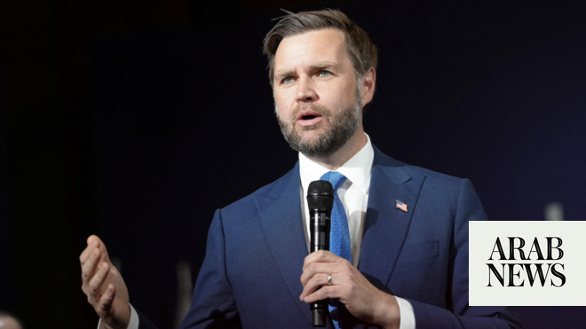

# US, Iran engaged in Switzerland talks as Trump threatens Tehran over proxy support

Source: https://www.arabnews.com/node/2647989/middle-east
Captured source: https://www.arabnews.com/node/2647989/middle-east
Published: 2026-06-21T04:06:42+03:00
Modified: 2026-06-21T22:28:31+03:00
Author: Agencies

## Summary

OBBUERGEN, Switzerland: US Vice President JD Vance and senior Iranian officials formally launched negotiations on Sunday over Tehran’s nuclear program, building out the fragile interim deal to end the war in Iran and keeping the Strait of Hormuz open. The framework was signed last week, and now top American and Iranian negotiators are in a 60-day sprint to reach an agreement

## Image

## Video Or Embed URLs

- blob:https://www.arabnews.com/13dffc6a-cc37-4979-b5b4-ad4abfaf70b5
- https://imasdk.googleapis.com/js/core/bridge3.772.0_en.html
- about:blank
- https://static.addtoany.com/menu/sm.25.html
- https://www.google.com/recaptcha/api2/aframe
- https://cm.g.doubleclick.net/partnerpixels?gdpr=0&us_privacy=1---&gpp_sid=-1&url=https%3A%2F%2Fwww.arabnews.com%2Fnode%2F2647989%2Fmiddle-east

## Text

https://arab.news/mxc8g

US says shipping continues despite Iran’s claim of closing vital oil route

Iran warns would not enter into talks on broader agreement unless war in Lebanon ends

Trump threatened to strike Iran if it did not “immediately stop” Hezbollah in Lebanon

OBBUERGEN, Switzerland: US Vice President JD Vance and senior Iranian officials formally launched negotiations on Sunday over Tehran’s nuclear program, building out the fragile interim deal to end the war in Iran and keeping the Strait of Hormuz open.

The framework was signed last week, and now top American and Iranian negotiators are in a 60-day sprint to reach an agreement on the technical details that hold massive implications for the world economy and global security.

Yet only days after signing the agreement, it is being stress-tested after fighting escalated in Lebanon between Israel and the Iranian-backed militant group Hezbollah — and by the subsequent announcement by Iran’s military that it had again closed the vital waterway that transits one-fifth of the world’s traded oil and natural gas.

A renewed ceasefire in Lebanon, brokered on Saturday, appeared to be holding up.

“The question before us now is how much more can we accomplish together? Can we turn over a new leaf?” Vance said in brief comments as the talks, dubbed the “Lake Lucerne Summit,” got underway.

“This is a historic meeting,” Vance said in the negotiation room, set up with for the US team on one side and for the Iranian delegation on the other.

“Can we change relations in the Middle East permanently, or do we go back to doing things the old way, which is not our preference, but is certainly very much something that can happen,” he added.

Iranian Foreign Minister Abbas Araghchi briefly appeared in the same room as Vance before the US vice president offered his remarks in front of the media.

Yet, as the meeting was happening, US President Donald Trump threatened in an online post to strike Iran if it did not “immediately stop their highly paid PROXIES in Lebanon from causing trouble,” making reference to Hezbollah.

State media in Iran earlier said the Iranian delegation stepped away from the talks in protest at the comments, but diplomats told AFP the Iranians “remains engaged” and had not expressed a desire to leave.

Separate meetings kick off first

Vance first sat down for talks with Pakistani Prime Minister Shehbaz Sharif and Staff Field Marshall Asim Munir, who has served as a key intermediary between Washington and Tehran throughout the conflict.

“What’s up, man! Good to see you,” Vance said as he warmly greeted Munir, who serves as Pakistan’s army chief.

Sharif met separately with Iranian Parliament Speaker Mohammad Bagher Qalibaf, who is leading Tehran’s delegation, and Foreign Minister Abbas Araghchi.

Mediators from Qatar were also on hand at the mountainside resort near Lake Lucerne.

Rafael Grossi, chief of the UN nuclear watchdog, the International Atomic Energy Agency, met with Swiss Foreign Minister Ignazio Cassis on the sidelines of the gathering. The agency had monitored the 2015 nuclear deal negotiated between the US and Iran under the Democratic Obama administration. Trump, a Republican, withdrew the US from the agreement in 2018.

Iran’s main focus during the negotiations will be the ongoing war between Israel and Lebanon, Iranian Foreign Ministry spokesman Esmail Baghaei told Iran’s state news agency.

Iran is insisting that the deal’s implementation start with the part of the deal that calls for a cessation of all wars, including between Israel and Hezbollah. Baghaei said the US “has been unable or unwilling” to hold Israel to the ceasefire.

Iranian officials held their own meetings with Pakistani and Qatari mediators before a planned four-way meeting that would include the US negotiating team.

Iranian state television said on Sunday that delegations from Iran, Qatar and the US were held a meeting in Switzerland to discuss a ceasefire in Lebanon and Iran’s frozen assets.

“A tripartite meeting involving Iran, the United States and Qatar on the subjects of a comprehensive ceasefire in Lebanon and Iran’s blocked assets is currently being held at the negotiation venue,” state broadcaster IRIB said in a report.

“The Zionist regime continues to violate its commitment in Lebanon, this issue will be the main topic of discussion in today’s talks,” foreign ministry spokesman Esmaeil Baqaei said in a video shared by IRNA state news agency.

Iran is cautiously approaching the negotiations given its previous experience with the US negotiations on the nuclear issue, which twice in the past year have been interrupted by massive strikes against the country. “The implementation of any document is more important than its signing,” Baghaei said Sunday.

But Iran’s president added that Iran will maintain its right to a nuclear program.

“What is certain is that we will never back down from the right to enrich uranium, and the other side is also forced to accept it,” Iranian President Masoud Pezeshkian said on Sunday, according to Iran’s state media.

A delayed meeting is now back

Vance had originally been slated to be on the ground at the Bürgenstock resort near Lucerne on Friday, but his departure from the United States was delayed after fighting escalated in Lebanon and Iranian officials canceled plans to attend the talks.

US Central Command disputed Iran’s claim that it had once again shuttered the strait and said US forces continued to monitor the situation to ensure traffic continues to flow through the waterway. Vance has said that millions of barrels of oil have moved through the strait in recent days.

Vance departed the US just after Iranian state TV said Iran’s negotiators had arrived in Switzerland.

The vice president was joined by special envoy Steve Witkoff and Jared Kushner, President Donald Trump’s son-in-law, for Sunday’s talks. Witkoff and Kushner were on the ground in Switzerland ahead of Vance to begin sifting through the technical details of the nuclear talks.

Vance and his wife, second lady Usha Vance, arrived at Emmen Air Base outside Lucerne just before 6 a.m. local time, according to his office.

While Vance said he planned to be in Switzerland for just “a day or two,” leaving much of the detailed negotiations to be spearheaded by Witkoff and Kushner, his role in the talks has heightened scrutiny of the vice president at a time when he’s actively considering a 2028 presidential campaign.

The deal has stirred much controversy

Trump and Vance have come under searing criticism from parts of their own party for the deal, with Republican hard-liners unfavorably likening it to a nuclear agreement signed by the Obama administration that Trump and the GOP have insisted did nothing to actually terminate Iran’s nuclear program.

The agreement signed by Trump and Iranian President Pezeshkian immediately allows Tehran to sell its oil freely and paves the way for Iran to tap into billions of dollars in assets that are currently frozen. It also calls for Iran to dilute its stockpile of highly enriched uranium, believed to be buried under nuclear sites that were targeted in US strikes last summer.

The agreement says commercial vessels can pass through the Strait of Hormuz for 60 days without a charge, but does not preclude future fees imposed by Iran. Trump made his own threat on Saturday to levy US tolls on the strait if there is no deal with Iran in 60 days, insisting in a social media post that the money would be for “services rendered as the Guardian Angel to the countries of the Middle East.”

The Trump administration has been working to reassure global markets that the Iran war has been merely a blip on oil prices, as Americans have complained the conflict resulted in hiking gasoline prices ahead of peak summer travel months. After the White House announced the deal a week ago, oil futures dropped almost 8 percent — and markets are expected to closely track the progress of talks when they open for trading on Sunday evening.

Further complicating matters, neither Israel nor Hezbollah is a signatory to the deal between the US and Iran, and Israeli Prime Minister Benjamin Netanyahu has vowed to keep his forces in southern Lebanon until any threat to Israel is eliminated. Hezbollah has refused to halt its attacks unless Israel commits to withdrawing from Lebanon.

Fighting between Israel and Hezbollah in the initial days after the agreement between the US and Iran killed 47 people in Lebanon, as well as five Israeli soldiers.
