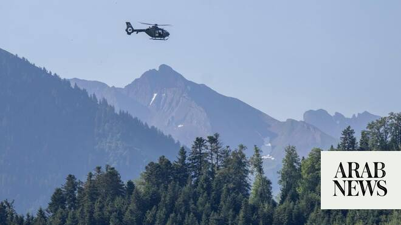

# Iran says Lebanon conflict ‘main topic’ in US talks

Source: https://www.arabnews.com/node/2648009/middle-east
Captured source: https://www.arabnews.com/node/2648009/middle-east
Published: 2026-06-21T12:42:55+03:00
Modified: 2026-06-21T12:44:22+03:00
Author: AFP

## Summary

TEHRAN: Iran said on Sunday that the ongoing conflict in Lebanon between Israel and militant group Hezbollah will top the agenda in talks with the United States in Switzerland, as well as issues such as frozen Iranian funds and the sale of the country’s oil. “The Zionist regime continues to violate its commitment in Lebanon, this issue will be the main topic of discussion in

## Image

## Video Or Embed URLs

- https://static.addtoany.com/menu/sm.25.html
- about:blank
- https://imasdk.googleapis.com/js/core/bridge3.772.0_en.html
- https://www.google.com/recaptcha/api2/aframe
- https://sync.teads.tv/wigo-no-slot
- https://cm.g.doubleclick.net/partnerpixels?gdpr=0&us_privacy=1---&gpp_sid=-1&url=https%3A%2F%2Fwww.arabnews.com%2Fnode%2F2648009%2Fmiddle-east

## Text

https://arab.news/p2rex

TEHRAN: Iran said on Sunday that the ongoing conflict in Lebanon between Israel and militant group Hezbollah will top the agenda in talks with the United States in Switzerland, as well as issues such as frozen Iranian funds and the sale of the country’s oil. “The Zionist regime continues to violate its commitment in Lebanon, this issue will be the main topic of discussion in today’s talks,” foreign ministry spokesman Esmaeil Baqaei said in a video shared by IRNA state news agency. Tehran said on Thursday it had signed a deal with Washington to end months of hostilities that began on February 28 following US-Israeli attacks on Iran. Under the agreement, the Israel-Hezbollah conflict in Lebanon was also due to stop. Iran’s military announced on Saturday that it has closed the Strait of Hormuz again over ongoing Israeli attacks in Lebanon. But there were no reports of fresh strikes in Lebanon after Saturday evening and Baqaei said since Saturday “a fragile cessation (in Lebanon) has been established.” He added that Tehran would also pursue the issue of its frozen and inaccessible funds during the talks. “The issue of making available Iran’s frozen or restricted assets, as well as the discussion related to issuing the necessary licenses for the sale of Iranian oil, will also be on the agenda,” he said from Switzerland. Iran has not officially disclosed the value of its frozen assets, though media reports have estimated them at more than $100 billion, largely frozen since the 1979 Islamic Revolution that toppled the US-backed shah. According to Baqaei, the Iranian delegation will meet the US delegation in a “quadrilateral meeting” that will also include mediators Pakistan and Qatar.
