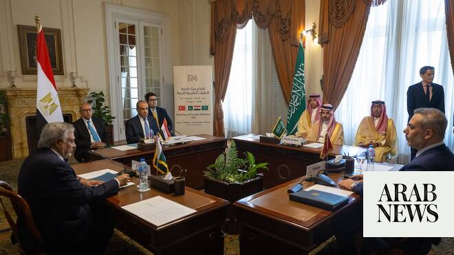

# Saudi Arabia, Egypt, Pakistan and Turkiye back US-Iran talks at Cairo meeting

Source: https://www.arabnews.com/node/2648038/saudi-arabia
Captured source: https://www.arabnews.com/node/2648038/saudi-arabia
Published: 2026-06-21T17:58:38+03:00
Modified: 2026-06-21T18:32:05+03:00
Author: Arab News

## Summary

CAIRO: Foreign ministers from Saudi Arabia, Egypt, Pakistan and Turkiye reaffirmed their support for negotiations between the US and Iran during a meeting in Cairo on Sunday aimed at addressing regional tensions and promoting diplomatic efforts. Saudi Foreign Minister Prince Faisal bin Farhan joined Pakistani Deputy Prime Minister and Foreign Minister Mohammad Ishaq Dar,

## Image

## Video Or Embed URLs

- https://d4d4d04ca838aef64d531b60988ea291.safeframe.googlesyndication.com/safeframe/1-0-45/html/container.html
- https://static.addtoany.com/menu/sm.25.html
- about:blank
- https://imasdk.googleapis.com/js/core/bridge3.772.0_en.html
- https://www.google.com/recaptcha/api2/aframe
- https://cm.g.doubleclick.net/partnerpixels?gdpr=0&us_privacy=1---&gpp_sid=-1&url=https%3A%2F%2Fwww.arabnews.com%2Fnode%2F2648038%2Fsaudi-arabia

## Text

https://arab.news/p4gfk

Saudi Foreign Minister Prince Faisal bin Farhan joined his counterparts in welcoming US-Iran talks in Switzerland

CAIRO: Foreign ministers from Saudi Arabia, Egypt, Pakistan and Turkiye reaffirmed their support for negotiations between the US and Iran during a meeting in Cairo on Sunday aimed at addressing regional tensions and promoting diplomatic efforts.

Saudi Foreign Minister Prince Faisal bin Farhan joined Pakistani Deputy Prime Minister and Foreign Minister Mohammad Ishaq Dar, Egyptian Foreign Minister Badr Abdelatty and Turkish Foreign Minister Hakan Fidan for the fourth meeting of the four-country consultation mechanism.

According to the Saudi Foreign Ministry, the ministers reviewed the latest regional developments and efforts to reduce tensions, including Pakistan’s mediation role following the memorandum of understanding signed between Washington and Tehran.

The ministers also discussed Israel’s military escalation in Lebanon and highlighted the importance of intensifying coordination and consultation to support diplomatic efforts aimed at containing the crisis and preventing further instability.

In a joint statement issued after the meeting, the four countries expressed their full support for the US-Iran negotiations and highlighted the importance of ensuring the success of the talks.

The ministers said progress in the negotiations would contribute to strengthening regional security and stability, while helping to reduce tensions across the Middle East.

They also emphasized the need to continue pursuing diplomatic solutions to regional conflicts and to work collectively to mitigate the repercussions of crises.

Later, the ministers were received by Egyptian President Abdel Fattah El-Sisi who welcomed the convening of the meeting and said that recent regional developments have highlighted the pivotal role of the Kingdom, Egypt, Pakistan and Turkiye as key pillars of regional stability and security.

He commended the intensive coordination among the four countries over the recent period and underscored the importance of continuing efforts to support the implementation of the US-Iran memorandum of understanding and ensuring the success of the negotiation process between the two sides.
