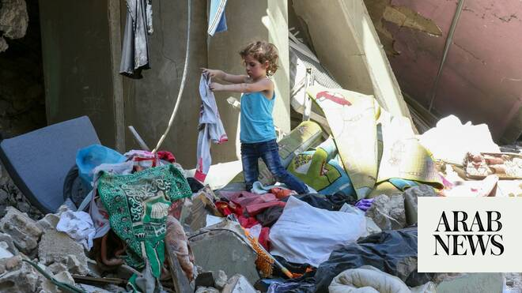

# Mediators announce a new de-conflicting mechanism aimed at containing violence in Lebanon

Source: https://www.arabnews.com/node/2648091/middle-east
Captured source: https://www.arabnews.com/node/2648091/middle-east
Published: 2026-06-22T08:21:11+03:00
Modified: 2026-06-22T13:33:27+03:00
Author: AFP

## Summary

BURGENSTOCK: Iran and the United States agreed Monday to set up communications lines to end fighting in Lebanon, mediators said, after their first round of talks in Switzerland toward ending the war in the Middle East.

## Image

## Video Or Embed URLs

- https://static.addtoany.com/menu/sm.25.html
- about:blank
- https://imasdk.googleapis.com/js/core/bridge3.772.0_en.html
- https://www.google.com/recaptcha/api2/aframe
- https://cm.g.doubleclick.net/partnerpixels?gdpr=0&us_privacy=1---&gpp_sid=-1&url=https%3A%2F%2Fwww.arabnews.com%2Fnode%2F2648091%2Fmiddle-east

## Text

https://arab.news/pgrfv

President Aoun receives call from Qatari PM, US VP JD Vance and Jared Kushner

Israeli Foreign Minister says country has no ambitions in Lebanon

BURGENSTOCK: Iran and the United States agreed Monday to set up communications lines to end fighting in Lebanon, mediators said, after their first round of talks in Switzerland toward ending the war in the Middle East. Mediators Pakistan and Qatar said the talks took place in “a positive and constructive atmosphere.” “Encouraging progress has been made including the creation of a mechanism for further technical talks,” they said, detailing a contact channel set up to “avoid incidents and miscommunication” at the Strait of Hormuz.” A “de-confliction cell,” between the parties and the Lebanese authorities has also been set up to prevent fighting from erupting again, they said. Lebanon had been pitched into the conflict as Iran-allied Hezbollah attacked Israel over the war on Iran, prompting the Israelis’ bombardment of the neighboring country. After a series of false starts, Washington and Tehran finally signed a memorandum of understanding toward ending the conflict that included a provision to end fighting in Lebanon between Israel and Hezbollah. “Tireless Pakistani and Qatari mediation has delivered major progress to end Lebanon War,” Iran’s Foreign Minister Abbas Araghchi wrote on X after the talks in Switzerland. “Oil and petrochem exports are waived, blockade lifted, some frozen assets released, and major reconstruction & development plan launched for Iran. 1st real test: Lebanon deconfliction cell,” he wrote. The development came after a shaky start to the negotiations, with the Islamic Republic’s delegation walking out in response to US President Donald Trump’s threats to strike Iran over its support for Hezbollah Sunday.

Lebanese President discusses ceasefire in calls

President General Joseph Aoun received a phone call from US Vice President JD Vance, Senior Advisor to the US President Jared Kushner, and the Qatari Prime Minister Sheikh Mohammed Al Thani. The discussion focused on consolidating the ceasefire in Lebanon, halting the Israeli military escalation, and the steps that must be taken in this regard, including the possibility of forming a cell for this purpose.

In a meeting with a delegation from the League of Greek Catholics, Aoun reiterated the country's welcome of any assistance to end the war, saying the right to differ is “sacred” but disagreement between the Lebanese is not permitted in the current circumstances. Aoun also stressed the sovereignty of Lebanon saying no one is to negotiate on its behalf.

Israel says it has no ambitions in Lebanon

Israeli Foreignh Minister Gideon Sar said Israel will respect the ceasefire in Lebanon as long as it won’t be breached by Hezbollah in a call with his New Zealand counterpart, Winston Peters. Gideon said the country does not have territorial ambitions in Lebanon, “but it will not withdraw from the security zone and expose our citizens to Hezbollah’s attacks and possible invasion, Lebanon’s sovereignty has been breached for decades to this very day by Iran’s indirect occupation by Hezbollah” adding it’s the interest of both Lebanon and Israel that Hezbollah’s terror state will be dismantled.
