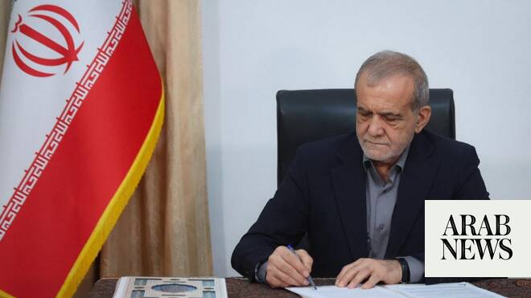

# Iran president to visit Pakistan on Tuesday: state media

Source: https://www.arabnews.com/node/2648136/middle-east
Captured source: https://www.arabnews.com/node/2648136/middle-east
Published: 2026-06-22T14:30:01+03:00
Modified: 2026-06-22T19:31:35+03:00
Author: Reuters

## Summary

TEHRAN: Iranian President Masoud Pezeshkian will travel to Pakistan on Tuesday, state media reported, following talks between Tehran and Washington in Switzerland which were mediated by Islamabad. Expressing appreciation to Pakistani Prime Minister Shehbaz Sharif for “his mediation between Iran and the United States” is among the objectives of the visit, Habibollah Abbasi,

## Image

## Video Or Embed URLs

- about:blank
- https://static.addtoany.com/menu/sm.25.html
- https://imasdk.googleapis.com/js/core/bridge3.773.0_en.html
- https://sync.teads.tv/wigo-no-slot
- https://www.google.com/recaptcha/api2/aframe
- https://cm.g.doubleclick.net/partnerpixels?gdpr=0&us_privacy=1---&gpp_sid=-1&url=https%3A%2F%2Fwww.arabnews.com%2Fnode%2F2648136%2Fmiddle-east

## Text

https://arab.news/ysepy

Thanking Pakistani PM Sharif for his mediation efforts in US-Iran talks main purpose of visit: president’s office

TEHRAN: Iranian President Masoud Pezeshkian will travel to Pakistan on Tuesday, state media reported, following talks between Tehran and Washington in Switzerland which were mediated by Islamabad.

Expressing appreciation to Pakistani Prime Minister Shehbaz Sharif for “his mediation between Iran and the United States” is among the objectives of the visit, Habibollah Abbasi, director of public relations at the president’s office, said, according to the IRNA state news agency.

Pezeshkian’s visit would come after Iran’s senior envoys held a marathon negotiating session with the US in Switzerland.

Mediators Pakistan and Qatar said the negotiators reached agreement on a “roadmap towards reaching a final deal within 60 days,” with technical talks to continue for the rest of the week at the Swiss resort.

Meanwhile, Iran’s top negotiator ​Mohammad Baqer Qalibaf is on his way to Oman ‌to ‌discuss ​joint ‌efforts ⁠to “consolidate” ​Iranian arrangements ⁠for managing shipping in the Strait of ⁠Hormuz, according ‌to ‌a ​statement ‌on ‌his Telegram channel on Monday. The Iranian delegation to Oman ‌also includes Foreign Minister ⁠Abbas Araqchi, the ⁠statement said.
