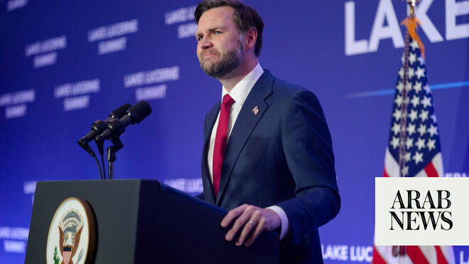

# Vance says US-Iran talks lay ‘good foundation’ for final peace deal

Source: https://www.arabnews.com/node/2648153/middle-east
Captured source: https://www.arabnews.com/node/2648153/middle-east
Published: 2026-06-22T17:16:55+03:00
Modified: 2026-06-22T19:49:42+03:00
Author: Reuters

## Summary

BUERGENSTOCK, Switzerland, June 22 : US Vice President JD Vance said on Monday talks with Iranian officials in Switzerland had laid ​a “good foundation” for a final peace deal, despite tensions over the Strait of Hormuz and Lebanon. The two sides, trying to build on an interim deal signed last week, agreed to a roadmap toward a permanent agreement within 60 days at the talks

## Image

## Video Or Embed URLs

- https://1b1652436532083d82a9c28780a4486e.safeframe.googlesyndication.com/safeframe/1-0-45/html/container.html
- blob:https://www.arabnews.com/c5a68afa-367c-4a4f-a1d7-9240cce92fad
- https://imasdk.googleapis.com/js/core/bridge3.773.0_en.html
- about:blank
- https://static.addtoany.com/menu/sm.25.html
- https://www.google.com/recaptcha/api2/aframe
- https://cm.g.doubleclick.net/partnerpixels?gdpr=0&us_privacy=1---&gpp_sid=-1&url=https%3A%2F%2Fwww.arabnews.com%2Fnode%2F2648153%2Fmiddle-east

## Text

https://arab.news/n8t66

High-level talks ended early on Monday, technical meetings to continue this week

Violence in Lebanon has abated since late on Saturday

Oil prices resume drop after progress on talks reported

BUERGENSTOCK, Switzerland, June 22 : US Vice President JD Vance said on Monday talks with Iranian officials in Switzerland had laid ​a “good foundation” for a final peace deal, despite tensions over the Strait of Hormuz and Lebanon.

The two sides, trying to build on an interim deal signed last week, agreed to a roadmap toward a permanent agreement within 60 days at the talks in the Qatari-owned Swiss mountain resort of Buergenstock, mediators Pakistan and Qatar said.

They also agreed on a mechanism to end fighting in Lebanon between US ally Israel and Iran-aligned Hezbollah, and opened a communications line to help ensure safe passage for commercial ships through the strait, a vital global oil supply route.

VANCE DELIVERS UPBEAT ASSESSMENT

Vance said Tehran had agreed to allow in nuclear inspectors, and to establish mechanisms to handle its assets frozen abroad and manage ceasefires.

“We laid a very good foundation for a successful final deal,” he told reporters after taking part in the talks. Since the US bombed Iran’s nuclear facilities in June last year, Iran has let the International ‌Atomic Energy Agency inspect ‌only facilities that were not attacked in those strikes. The IAEA halted inspections altogether after the ​US-Israeli strikes ‌that began ⁠the ​war ⁠with Iran on February 28 and they have not resumed since. Vance played down tensions over a threat on Sunday by US President Donald Trump to restart the war after Iran again closed the Strait of Hormuz, citing Washington’s failure to halt the fighting in Lebanon.

“There was a little bit of threatening, there was a little bit of whining, but at the end of the day the talks continued and we made great progress,” Vance said.

Iranian Foreign Minister Abbas Araqchi said on social media that Tehran had secured waivers for oil and petrochemical exports, the release of some of its frozen assets abroad and the launch of a reconstruction and development plan for Iran.

Vance said White House envoy Jared Kushner, Trump’s son-in-law, had come up with a process where the US and Qatar would have control over Iranian ⁠funds when they are unfrozen that would allow the money to be spent on US corn, soy and wheat. Following ‌on from last week’s interim deal, or memorandum of understanding, the US Treasury Department issued a ‌general license for Iran on Monday authorizing the production, delivery and sale of crude oil and ​petrochemical and petroleum products of Iranian-origin through August 21.

Technical talks ‌were due to continue for the rest of this week, and Pakistani Prime Minister Shehbaz Sharif wrote on X that the first round of ‌talks had “concluded successfully.”

“The discussions were held in a positive and constructive atmosphere and yielded encouraging progress,” he said. Oil prices had risen sharply when Tehran started blockading the Strait of Hormuz, prompting a US blockade of Iranian ports, but fell after the interim deal to their lowest since the war began.

Oil prices dipped further after Monday’s joint statement by Qatar and Pakistan, with worries about a supply shortage in global markets easing and global benchmark Brent crude trading below $80 per barrel.

Before Sunday’s talks officially began, Fox News ‌quoted Trump as saying he had told Iranian officials “you won’t have a country” if they tried to close the strait again.

Iran’s semi-official Tasnim news agency, citing an informed source, said that after Trump’s threats became public, ⁠the Iranian delegation refused to return to ⁠the room where talks were held, though messages were traded via the mediators.

The MOU calls for reopening the Strait of Hormuz and ending all hostilities, including in Lebanon, where violence continued after a ceasefire was declared on Friday.

Accusing the US of failing to meet its commitment to halt fighting in Lebanon, Iran said at the weekend that it had again stopped maritime traffic through the strait. But ship tracking data showed two crude tankers with just under 2 million barrels of oil had sailed through the strait on Monday, in a sign that traffic is picking up again, even though the sailings through Hormuz are still a fraction of the average daily crossings of 125 vessels before the Iran war began.

VIOLENCE IN LEBANON ABATES

Thousands of people have been killed in the US-Israeli war against Iran, mostly in Iran and Lebanon, where Hezbollah opened fire in support of Iran on March 2.

The violence in Lebanon has abated since late on Saturday, with security sources saying Israel’s last airstrike was on Saturday evening.

Reflecting reduced tensions, the Israeli military lifted safety restrictions in eight communities near the Lebanese border beginning at 6 a.m. (0300 GMT) on Monday.

Lebanese President Joseph Aoun discussed efforts to maintain the ceasefire and halt Israeli military escalation ​during a phone call with Vance, Qatar’s prime minister and Kushner, ​the Lebanese presidency said.

Israeli President Isaac Herzog said Israel was not opposed to a diplomatic end to the Iran war, but any agreement must ensure Tehran cannot use funds it receives as part of the deal for military purposes or to support regional proxies.
