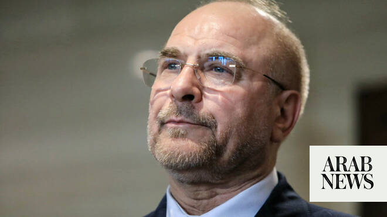

# Iran chief negotiator says Hormuz will be administered by Tehran: state media

Source: https://www.arabnews.com/node/2648197/middle-east
Captured source: https://www.arabnews.com/node/2648197/middle-east
Published: 2026-06-23T05:04:04+03:00
Modified: 2026-06-23T04:57:26+03:00
Author: AFP

## Summary

TEHRAN: Iran’s chief negotiator Mohammad Bagher Ghalibaf said that the Strait of Hormuz will be administered by Tehran, state media reported on Tuesday, following talks pushing to end the US-Israeli war on the Islamic republic. Iran and the United States agreed on Monday to set up communication lines to keep the vital shipping route open and end fighting in Lebanon, mediators

## Image

## Video Or Embed URLs

- about:blank
- https://static.addtoany.com/menu/sm.25.html
- https://imasdk.googleapis.com/js/core/bridge3.773.0_en.html
- https://sync.teads.tv/wigo-no-slot
- https://www.google.com/recaptcha/api2/aframe
- https://cm.g.doubleclick.net/partnerpixels?gdpr=0&us_privacy=1---&gpp_sid=-1&url=https%3A%2F%2Fwww.arabnews.com%2Fnode%2F2648197%2Fmiddle-east

## Text

The United States temporarily suspended sanctions on Iranian oil on Monday after Vice President JD Vance said Tehran would allow UN nuclear inspectors to return to the country, following the talks

As part of the deal, Tehran is also set to get some form of sanctions relief from Washington, as well as the unfreezing of assets

TEHRAN: Iran’s chief negotiator Mohammad Bagher Ghalibaf said that the Strait of Hormuz will be administered by Tehran, state media reported on Tuesday, following talks pushing to end the US-Israeli war on the Islamic republic. Iran and the United States agreed on Monday to set up communication lines to keep the vital shipping route open and end fighting in Lebanon, mediators said, after their first round of talks in Switzerland toward ending the conflict that has engulfed the Middle East. “The Strait of Hormuz will never return to its pre-war conditions and will be administered by the Islamic Republic of Iran, in accordance with international law,” Ghalibaf said on his return from the talks, according to IRNA. In a video posted to Ghalibaf’s Telegram account, he said the talks at the luxury Swiss resort of Burgenstock produced “good achievements.” “In my view, this trip had good achievements, especially regarding the discussion of the Strait, the Lebanon discussions, the question of oil waiver, and the matter of releasing the frozen funds,” he said. The United States temporarily suspended sanctions on Iranian oil on Monday after Vice President JD Vance said Tehran would allow UN nuclear inspectors to return to the country, following the talks. As part of the deal, Tehran is also set to get some form of sanctions relief from Washington, as well as the unfreezing of assets. “Of course, we believe we are still at the beginning of this work and must continue our efforts,” Ghalibaf added in the video. Iranian state media reported that Ghalibaf made a stop in Oman, which shares the Strait of Hormuz. The waterway, which Iran closed at the start of the war, reopened last week, after Washington and Tehran reached an agreement. But Tehran announced on Saturday it had closed the strait again in response to Israeli attacks in Lebanon. Since then, Tehran and Washington have agreed to establish a line of communication “to avoid incidents and miscommunication with the aim of safe passage for commercial vessels” through the waterway, according to Qatari and Pakistani mediators. Maritime traffic in the strait continued to flow on Monday at a faster pace than before the US-Iranian agreement on talks to end the war, according to tracking firms.
