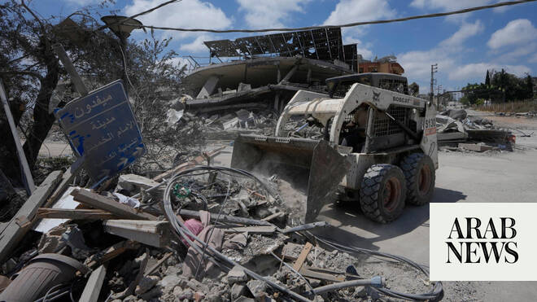

# Israeli gunfire kills two people in south Lebanon, civil defense says

Source: https://www.arabnews.com/node/2648245/middle-east
Captured source: https://www.arabnews.com/node/2648245/middle-east
Published: 2026-06-23T12:42:51+03:00
Modified: 2026-06-23T14:07:06+03:00
Author: Arab News

## Summary

BEIRUT/JERUSALEM: Israeli gunfire killed two people in southern Lebanon on Tuesday, Lebanon’s Civil Defense and state media said, the first reported fatalities resulting from Israeli fire in Lebanon ​in three days. A ceasefire between Iran-backed Hezbollah and Israeli forces in southern Lebanon has largely held since Sunday, the longest lull yet in the war that spilled over

## Image

## Video Or Embed URLs

- https://static.addtoany.com/menu/sm.25.html
- about:blank
- https://imasdk.googleapis.com/js/core/bridge3.773.0_en.html
- https://sync.teads.tv/wigo-no-slot
- https://www.google.com/recaptcha/api2/aframe
- https://cm.g.doubleclick.net/partnerpixels?gdpr=0&us_privacy=1---&gpp_sid=-1&url=https%3A%2F%2Fwww.arabnews.com%2Fnode%2F2648245%2Fmiddle-east

## Text

https://arab.news/5wqkp

Israeli soldiers opened fire at a group of people near a bulldozer clearing a road in the Al-Deir neighborhood of Nabatieh Al-Fawqa in southern Lebanon

BEIRUT/JERUSALEM: Israeli gunfire killed two people in southern Lebanon on Tuesday, Lebanon’s Civil Defense and state media said, the first reported fatalities resulting from Israeli fire in Lebanon ​in three days. A ceasefire between Iran-backed Hezbollah and Israeli forces in southern Lebanon has largely held since Sunday, the longest lull yet in the war that spilled over from the conflict between the United States and Iran. Hezbollah decried what it called a “blatant violation” of the ceasefire in Lebanon on Tuesday, after state media there reported two people killed by Israeli gunfire in the country’s south. “The Islamic Resistance warns that what the enemy has committed constitutes a blatant violation of the ceasefire, which the Resistance has adhered to up to this point,” the group said in a statement. Israeli soldiers opened fire at a group of people near a bulldozer clearing a road in the Al-Deir neighborhood of Nabatieh Al-Fawqa in southern Lebanon, Lebanon’s state news agency NNA reported. The Israeli military said it “struck armed terrorists who posed an immediate threat” to soldiers in the Ali Al-Taher ‌ridge area of the ‌south, within an area of south Lebanon where ​Israeli forces ‌have ⁠declared a “security ​zone.” It ⁠wasn’t immediately clear if this was the same incident. Iran insisted Israel cease fire in Lebanon as part of an interim agreement with the United States signed last week. Asked about the latest incident, Iran’s ambassador to the United Nations in Geneva, Ali Bahreini, told reporters that any violation of the memorandum of understanding in Lebanon would create challenges for peace talks. “Lebanon is an unquestionable part of the agreement, and whatever happens in Lebanon affects ⁠the whole process, and it is the United States which ‌should use all its leverage against Israel to make ‌it to stop attacks against Lebanon,” he said. A ​joint statement issued on Monday at ‌the end of US-Iranian talks mediated by Pakistan and Qatar in Switzerland said the parties ‌had agreed to create “a de-confliction cell” to ensure adherence to the termination of hostilities in Lebanon. Israeli forces remain deployed deep inside southern Lebanon, having invaded during their offensive against Hezbollah. The latest round of hostilities began on March 2, when Hezbollah opened fire at Israel in support ‌of Tehran, two days into the US-Israeli war on Iran. Israeli attacks in Lebanon have killed more than 4,100 people, including 773 ⁠women, children and ⁠health care workers, according to the Lebanese health ministry. The toll does not say how many combatants are among the dead. Israeli attacks have forced some 1.2 million people from their homes in Lebanon, according to Lebanese authorities. Israel’s death toll from this round of hostilities with Hezbollah includes at least 32 soldiers and four Israeli civilians. At Iran’s insistence, the interim deal signed with the United States last week requires Washington, Tehran, and their allies to declare an immediate and permanent termination of military operations on all fronts, including Lebanon. Israeli Prime Minister Benjamin Netanyahu said on Monday that troops had full freedom of action to thwart any Hezbollah direct or emerging threat against them or Israeli ​citizens, and would remain in Lebanon for “as ​long as is necessary.”
