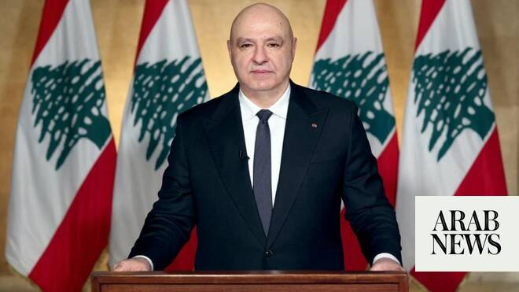

# Lebanon president rejects Israeli occupation, foreign interference as Washington talks begin

Source: https://www.arabnews.com/node/2648289/middle-east
Captured source: https://www.arabnews.com/node/2648289/middle-east
Published: 2026-06-23T17:15:31+03:00
Modified: 2026-06-23T19:04:53+03:00
Author: AFP

## Summary

BEIRUT: Lebanese President Joseph Aoun on Tuesday rejected Israel’s occupation of south Lebanon and other foreign interference, alluding to Iran, as a fifth round of Israel-Lebanon talks began in Washington. “We accept nothing less than an end to the Israeli occupation and at the same time, the fall of foreign tutelage, because our only option is our national sovereignty and

## Image

## Video Or Embed URLs

- https://static.addtoany.com/menu/sm.25.html
- about:blank
- https://imasdk.googleapis.com/js/core/bridge3.773.0_en.html
- https://sync.teads.tv/wigo-no-slot
- https://www.google.com/recaptcha/api2/aframe
- https://cm.g.doubleclick.net/partnerpixels?gdpr=0&us_privacy=1---&gpp_sid=-1&url=https%3A%2F%2Fwww.arabnews.com%2Fnode%2F2648289%2Fmiddle-east

## Text

https://arab.news/62hpb

Aoun expressed hope that the new round of talks would be “decisive along the path of achieving what we seek for the good of our nation and people”

BEIRUT: Lebanese President Joseph Aoun on Tuesday rejected Israel’s occupation of south Lebanon and other foreign interference, alluding to Iran, as a fifth round of Israel-Lebanon talks began in Washington.

“We accept nothing less than an end to the Israeli occupation and at the same time, the fall of foreign tutelage, because our only option is our national sovereignty and our sole wager is on the Lebanese state,” Aoun said, according to his office.

He also expressed hope that the new round of talks would be “decisive along the path of achieving what we seek for the good of our nation and people,” namely “the full restoration of Lebanon’s sovereignty over every grain of its soil.”

Later on Tuesday, US Vice President JD ​Vance and Secretary of State Marco Rubio told Aoun ‌in a ‌call ⁠that ​the US ⁠was following up on understandings reached in Switzerland, including plans ⁠to consolidate a ‌ceasefire ‌in ​Lebanon. The ‌statement added that ⁠arrangements ⁠for a mechanism to firm up the ceasefire and monitor its implementation were still being discussed.
