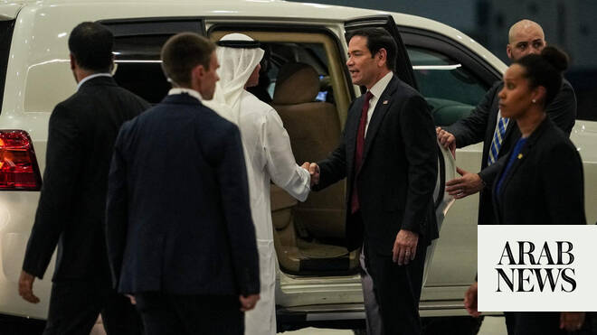

# Rubio commits to UAE security, discusses Iran-US deal with Emirati leader

Source: https://www.arabnews.com/node/2648315/middle-east
Captured source: https://www.arabnews.com/node/2648315/middle-east
Published: 2026-06-24T14:34:57+03:00
Modified: 2026-06-24T15:04:50+03:00
Author: AFP

## Summary

ABU DHABI: US Secretary of State Marco Rubio discussed the US-Iran deal with UAE President Mohamed bin Zayed on Wednesday, renewing Washington’s commitment to the country’s security as he embarks on a tour of the Gulf. Rubio is seeking to reassure close US allies — who were hit hard by Iran during the Middle East war — about the memorandum of understanding with Tehran, which

## Image

## Video Or Embed URLs

- blob:https://www.arabnews.com/5e50138f-8377-4db1-8a1e-513bbc9d48f5
- https://imasdk.googleapis.com/js/core/bridge3.773.0_en.html
- about:blank
- https://static.addtoany.com/menu/sm.25.html
- https://www.google.com/recaptcha/api2/aframe
- https://cm.g.doubleclick.net/partnerpixels?gdpr=0&us_privacy=1---&gpp_sid=-1&url=https%3A%2F%2Fwww.arabnews.com%2Fnode%2F2648315%2Fmiddle-east

## Text

https://arab.news/vbmpf

Secretary of State begins tour of Gulf countries in first visit to the region by a senior US official since the Iran deal was signed

Rubio will attend a meeting of the Gulf Cooperation Council in Bahrain on Thursday

ABU DHABI: US Secretary of State Marco Rubio discussed the US-Iran deal with UAE President Mohamed bin Zayed on Wednesday, renewing Washington’s commitment to the country’s security as he embarks on a tour of the Gulf. Rubio is seeking to reassure close US allies — who were hit hard by Iran during the Middle East war — about the memorandum of understanding with Tehran, which fails to address some of the Gulf’s long-standing concerns about its missile program and proxies. “They discussed President Trump’s memorandum of understanding with Iran, efforts to secure full and safe transit through the Strait of Hormuz, and the importance of peace and stability in the region,” his spokesperson Tommy Pigott said.

Rubio also “thanked the UAE for their leadership and unparallelled support, praised their courage and resilience in the face of Iran’s attacks, and reaffirmed the US commitment to the security of the Emirates,” Pigott added. The secretary of state arrived in Abu Dhabi on Tuesday evening and held closed-door talks with Sheikh Mohamed the following day, then set off for Kuwait. After that he will travel on to Bahrain, where he will attend a Gulf Cooperation Council meeting on Thursday.

He insisted that no country is allowed to impose tolls on the Strait of Hormuz after Oman and Iran, which border the waterway, said they were considering charging “costs” for ships navigating the key conduit for Gulf oil and gas. “It’s an international waterway. No country is allowed to charge tolls or fees on an international waterway. That’s existing international law,” he said as he arrived in the United Arab Emirates capital.

Rubio’s trip is the first by a senior US official to the Middle East since the Iran agreement was signed last week. The energy-rich Gulf, home to several American military bases, bore the brunt of Iran’s attacks in retaliation for US-Israeli strikes that sparked the war on February 28. The UAE was targeted by more than 2,800 missiles and drones — more than any other country in the region — while Kuwait and Bahrain were also badly hit relative to their small size. During the war, the UAE doubled down on its alliance with the US and repeatedly said Iran’s missile program and proxies should be dealt with. Regional leaders have long maintained close ties with President Donald Trump and have pledged to invest billions of dollars in the US economy. But experts say that they have grown wary of an unreliable US partner that left them badly exposed during Iran’s attacks.
