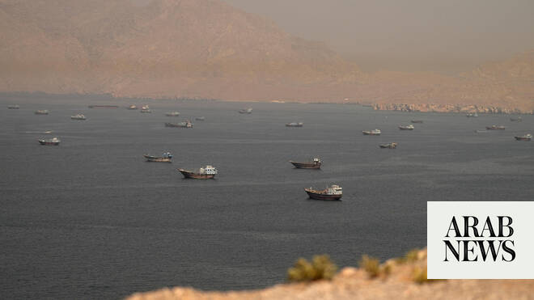

# Oman opens temporary Strait of Hormuz shipping routes, says no tolls will be charged

Source: https://www.arabnews.com/node/2648390/middle-east
Captured source: https://www.arabnews.com/node/2648390/middle-east
Published: 2026-06-24T11:21:12+03:00
Modified: 2026-06-24T11:21:58+03:00
Author: Reuters

## Summary

Oman said it would keep the Strait of Hormuz open to shipping without imposing any tolls and had designated two temporary routes north and south of the existing shipping lane to facilitate the safe passage of vessels departing the region. In coordination with the International Maritime Organization, Oman established temporary maritime corridors to help ships leave the area

## Image

## Video Or Embed URLs

- https://static.addtoany.com/menu/sm.25.html
- about:blank
- https://imasdk.googleapis.com/js/core/bridge3.773.0_en.html
- https://www.google.com/recaptcha/api2/aframe
- https://sync.teads.tv/wigo-no-slot
- https://cm.g.doubleclick.net/partnerpixels?gdpr=0&us_privacy=1---&gpp_sid=-1&url=https%3A%2F%2Fwww.arabnews.com%2Fnode%2F2648390%2Fmiddle-east

## Text

https://arab.news/ztd9z

‌Oman designated temporary routes north and south of existing shipping lanes for vessels leaving the region

Vessels will depart in groups under a phased IMO plan, with individual routing instructions

Oman said it would keep the Strait of Hormuz open to shipping without imposing any tolls and had designated two temporary routes north and south of the existing shipping lane to facilitate the safe passage of vessels departing the region. In coordination with the International Maritime Organization, Oman established temporary maritime corridors to help ships leave the area safely amid heightened security risks. The Strait of Hormuz, a vital route for ‌roughly a fifth ‌of global oil and liquefied natural gas supplies before the ‌war, has ⁠been heavily disrupted ⁠since the United States and Israel launched a war against Iran on February 28, curbing commercial shipping and rattling global energy markets. In a notice to mariners, Oman said the existing Traffic Separation Scheme in the strategic waterway was currently unsafe for use and that vessels departing through the strait could instead use temporary routes located to the north and south of the existing shipping lanes. The scheme, adopted by the United Nations’ shipping agency ⁠in 1968, established routing lanes through Iranian and Omani waters in ‌the strait. The Gulf Arab state said the measures ‌reflected its responsibilities toward the strait, its importance to the global economy and its commitment to ‌international law and freedom of navigation, citing understandings reached between the United States and ‌Iran. Oman said navigational safety remained the overriding priority and that a gradual, controlled movement of vessel traffic was required because of an elevated risk of collisions. Under a phased plan developed by the IMO in coordination with Omani authorities, vessels will be grouped and contacted individually with instructions on ‌when they may depart and which route they should follow. Ships will be directed to a designated waiting area in international ⁠waters before being ⁠cleared to proceed. Vessels using Oman’s eastbound route will be required to maintain communications with coastal authorities and comply with all navigational instructions. Oman said shipowners and masters remained responsible for conducting independent risk assessments before voyages. Vessels were instructed to keep their Automatic Identification System activated during transit and to report any navigational hazards to the Oman Maritime Security Center. Oman’s statement said that no tolls would be imposed on vessels transiting the Strait of Hormuz, in line with the outcome of recent talks between the United States and Iran. Iran and Oman began discussions on the future administration of navigation and maritime services in the waterway on Tuesday. While the interim US-Iran agreement provides for commercial vessels to transit without charge for 60 days, the talks are expected to address longer-term arrangements, including any costs associated with maritime services after that period ends.
