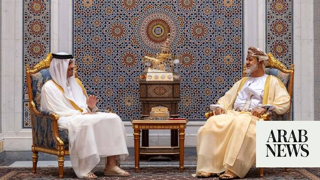

# Iran-Gulf-Iraq talks to focus on future Hormuz operations

Source: https://www.arabnews.com/node/2648427/middle-east
Captured source: https://www.arabnews.com/node/2648427/middle-east
Published: 2026-06-24T15:40:35+03:00
Modified: 2026-06-24T16:10:53+03:00
Author: Reuters

## Summary

LONDON/DUBAI: Qatari ‌Prime Minister Sheikh Mohammed bin Abdulrahman Al-Thani visited Muscat on Wednesday for talks with Oman on initiating negotiations involving Iran, Iraq and Gulf Arab states on the Strait of Hormuz, a diplomat briefed on the talks told Reuters. The discussions are separate from US-Iran peace talks and de-mining arrangements. Gulf states are expected to

## Image

## Video Or Embed URLs

- https://static.addtoany.com/menu/sm.25.html
- about:blank
- https://www.google.com/recaptcha/api2/aframe
- https://imasdk.googleapis.com/js/core/bridge3.773.0_en.html
- https://cm.g.doubleclick.net/partnerpixels?gdpr=0&us_privacy=1---&gpp_sid=-1&url=https%3A%2F%2Fwww.arabnews.com%2Fnode%2F2648427%2Fmiddle-east

## Text

https://arab.news/5k6fa

Gulf states expected to push for no tolls

Separate plans for Riyadh-based regional reconciliation talks underway

Earlier Wednesday, Oman designated temporary routes for Hormuz transit

LONDON/DUBAI: Qatari ‌Prime Minister Sheikh Mohammed bin Abdulrahman Al-Thani visited Muscat on Wednesday for talks with Oman on initiating negotiations involving Iran, Iraq and Gulf Arab states on the Strait of Hormuz, a diplomat briefed on the talks told Reuters.

The discussions are separate from US-Iran peace talks and de-mining arrangements. Gulf states are expected to push for no transit fees, while Iran could propose environmental, navigation and security fees, the diplomat said.

The Strait of Hormuz, a vital route for roughly a fifth of global oil and liquefied natural gas supplies, has been heavily disrupted since the United States and Israel launched a war against Iran on February 28, curbing commercial shipping and rattling global energy markets.

The move appears to implement a provision of the memorandum of understanding signed last week that calls for Iran to hold talks with Oman and other Gulf states and Iraq on the future management of navigation and maritime services in the strait.

The diplomat added that Pakistan was the proposed mediator for these talks.

Separately, there are plans for regional reconciliation talks to be held in Riyadh between Iran, Gulf Arab states and possibly other regional countries, he said.
