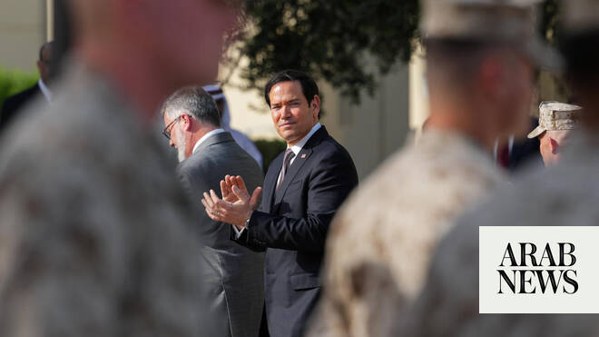

# Rubio arrives in Kuwait, reopens US embassy after Iranian attack

Source: https://www.arabnews.com/node/2648443/middle-east
Captured source: https://www.arabnews.com/node/2648443/middle-east
Published: 2026-06-24T17:38:40+03:00
Modified: 2026-06-24T18:18:19+03:00
Author: Reuters

## Summary

KUWAIT CITY: US Secretary of State Marco Rubio attended a ceremonial flag-raising at the US Embassy in Kuwait on Wednesday as the facility resumed operations. The embassy suspended services in March amid attacks from Iran during the conflict with the US and Israel. The embassy will immediately resume emergency services for American ⁠citizens while other ‌services ‌will ​be

## Image

## Video Or Embed URLs

- blob:https://www.arabnews.com/c593c4f1-6849-44dc-89cd-4a633c831946
- https://imasdk.googleapis.com/js/core/bridge3.773.0_en.html
- https://static.addtoany.com/menu/sm.25.html
- about:blank
- https://sync.teads.tv/wigo-no-slot
- https://www.google.com/recaptcha/api2/aframe
- https://cm.g.doubleclick.net/partnerpixels?gdpr=0&us_privacy=1---&gpp_sid=-1&url=https%3A%2F%2Fwww.arabnews.com%2Fnode%2F2648443%2Fmiddle-east

## Text

https://arab.news/zukdh

US Embassy in Kuwait suspended services in March amid attacks from Iran

Rubio is traveling through the Gulf on a three-nation tour to discuss the US-Iran agreement

KUWAIT CITY: US Secretary of State Marco Rubio attended a ceremonial flag-raising at the US Embassy in Kuwait on Wednesday as the facility resumed operations. The embassy suspended services in March amid attacks from Iran during the conflict with the US and Israel. The embassy will immediately resume emergency services for American ⁠citizens while other ‌services ‌will ​be ‌phased in, a State ⁠Department spokesperson said. The State Department shut down embassy operations in Kuwait ‌and Saudi Arabia in March after ⁠Iranian ⁠drones fired at the missions following US-Israeli strikes on Iran. Rubio is traveling through the Gulf on a three-nation tour that started in the UAE on Tuesday. His visit to the region is the first by an American official since the US and Iran signed an agreement last week to end the conflict and reopen the Strait of Hormuz.
