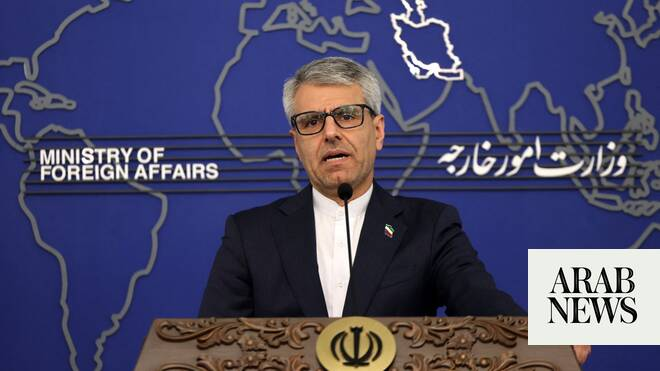

# Iran slams NATO chief’s comments on US support in war

Source: https://www.arabnews.com/node/2648506/middle-east
Captured source: https://www.arabnews.com/node/2648506/middle-east
Published: 2026-06-25T07:29:55+03:00
Modified: 2026-06-25T07:34:18+03:00
Author: AFP

## Summary

TEHRAN: Tehran accused NATO on Thursday of “complicity” in the US-Israeli war against Iran, after the bloc’s chief noted its support for the United States in the conflict. Responding to US President Donald Trump’s criticism of allies for not supporting the war, NATO boss Mark Rutte told Fox News that hundreds of American planes launched from bases in Italy. Trump’s second term

## Image

## Video Or Embed URLs

- https://e8bd459fc7c698998e33d2f9eb08a13e.safeframe.googlesyndication.com/safeframe/1-0-45/html/container.html
- https://static.addtoany.com/menu/sm.25.html
- about:blank
- https://imasdk.googleapis.com/js/core/bridge3.773.0_en.html
- https://www.google.com/recaptcha/api2/aframe
- https://sync.teads.tv/wigo-no-slot
- https://cm.g.doubleclick.net/partnerpixels?gdpr=0&us_privacy=1---&gpp_sid=-1&url=https%3A%2F%2Fwww.arabnews.com%2Fnode%2F2648506%2Fmiddle-east

## Text

https://arab.news/b6ae8

Iran’s foreign ministry spokesman Esmaeil Baqaei condemned the NATO chief’s admission of “active complicity” in the “unlawful war”

TEHRAN: Tehran accused NATO on Thursday of “complicity” in the US-Israeli war against Iran, after the bloc’s chief noted its support for the United States in the conflict. Responding to US President Donald Trump’s criticism of allies for not supporting the war, NATO boss Mark Rutte told Fox News that hundreds of American planes launched from bases in Italy. Trump’s second term has been marked by tensions with NATO allies, who have voiced skepticism over the need for the conflict in the Middle East. “Country after country, ally after ally after ally, have made their bases available for Epic Fury,” Rutte told US TV channel Fox News, referring to the US military operation in Iran. “Five hundred US planes took off from US bases in Italy to support Epic Fury,” he said, referring the US name for the operation against Iran. Trump had told Rutte on Wednesday he was “let down” by members of the alliance who did not back his war against Iran. Rutte also told Fox News that Romania “cut down on commercial air flights and airplanes because they had to use the airports for the tanker facilities” during the Iran war. Iran’s foreign ministry spokesman Esmaeil Baqaei condemned the NATO chief’s admission of “active complicity” in the “unlawful war.” “This is a clear and damning admission of NATO’s active complicity in an unlawful war of aggression against a sovereign UN Member State,” Baqaei wrote on X. He accused NATO of “a flagrant violation of peremptory norms of international law and the core principles of the UN Charter.” Italy was quick to distance itself from Rutte’s words, which the defense ministry said gave “a completely misleading message by confusing the type of flights that were authorized.” It said Italy had allowed only “technical and logistical” US flights during Epic Fury under existing agreements with the United States.
