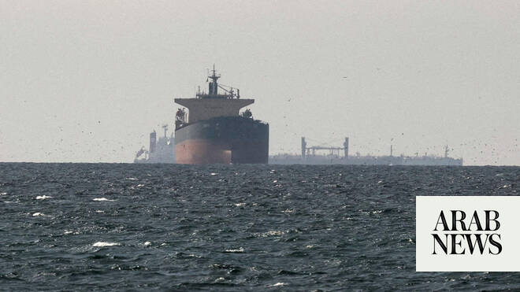

# Strait of Hormuz ship evacuation halted after vessel attack

Source: https://www.arabnews.com/node/2648597/middle-east
Captured source: https://www.arabnews.com/node/2648597/middle-east
Published: 2026-06-25T22:35:04+03:00
Modified: 2026-06-25T23:16:46+03:00
Author: AP

## Summary

DUBAI: A United Nations agency paused the evacuation of ships through the Strait of Hormuz on Thursday after the British military said a vessel was hit by a projectile off the coast of Oman following the passage of several tankers that used a route backed by the UN The head of the International Maritime Organization said the plan to move stranded ships out of the Arabian Gulf

## Image

## Video Or Embed URLs

- https://14e9d560a3b18808bb7cb2cc4c8e6169.safeframe.googlesyndication.com/safeframe/1-0-45/html/container.html
- https://static.addtoany.com/menu/sm.25.html
- about:blank
- https://www.google.com/recaptcha/api2/aframe
- https://imasdk.googleapis.com/js/core/bridge3.773.0_en.html
- https://sync.teads.tv/wigo-no-slot
- https://cm.g.doubleclick.net/partnerpixels?gdpr=0&us_privacy=1---&gpp_sid=-1&url=https%3A%2F%2Fwww.arabnews.com%2Fnode%2F2648597%2Fmiddle-east

## Text

https://arab.news/2ny2d

UN maritime agency says the plan to move stranded ships through the strait will be on hold until the agency can confirm safety guarantees

Iranian authority says transit outside its own designated routes “will not be covered by the guarantee of safe passage”

DUBAI: A United Nations agency paused the evacuation of ships through the Strait of Hormuz on Thursday after the British military said a vessel was hit by a projectile off the coast of Oman following the passage of several tankers that used a route backed by the UN The head of the International Maritime Organization said the plan to move stranded ships out of the Arabian Gulf through the strait will be on hold until the agency can confirm safety guarantees for the ships on the evacuation list and in the region. It was unclear who launched the projectile or the type of vessel that was targeted. The report of a strike came hours after Iran threatened vessels to stop using the route through the strait without Tehran’s permission. The vessel that was attacked was not part of the evacuation effort, said Arsenio Dominguez, the UN agency’s secretary-general. Following reports of the attack, Iran’s Arabian Gulf Strait Authority — a new government agency Iran established to control shipping in the strait — wrote on X that transit outside its own designated routes “will not be covered by the guarantee of safe passage.” The United Kingdom Maritime Trade Operations center said the vessel sustained damage, but it reported no injuries or environmental effects from the attack off the coast of Oman. The opening of an alternative passage through the vital waterway would relieve pressure on the world economy and remove Iran’s main source of leverage in ongoing peace talks with the United States. US Secretary of State Marco Rubio, on a visit to the Gulf to reassure American allies, said Washington was committed to the new route and ensuring that ships are able to transit the strait. “If that stops, then we’re going to have a problem,” Rubio said earlier Thursday. Traffic through the strait increased in recent days but was still well below prewar levels. Oil on Thursday briefly dipped below its last prewar price of just under $73 per barrel, a sign that the market believes the situation is improving. The US and Iran are still debating terms of an interim peace deal, including issues such as getting ships through the narrow mouth of the Arabian Gulf and addressing the future of Iran’s stockpile of highly enriched uranium. Under the memorandum of understanding signed last week, the US and Iran have 60 days to iron out the details. Oil tankers, led by the Stoic Warrior vessel, sailed along the United Arab Emirates and then Oman early Thursday, passing by Oman’s Musandam Peninsula fairly close to the shore. The route was laid out by Oman and the International Maritime Organization. North of the route is a corridor in the center of the strait where ships moved freely before the war, transporting about a fifth of all the world’s oil and natural gas. Iran said it mined that passage after the US and Israel attacked it on Feb. 28. At least one mine has been sighted there. Though some ships had been getting out of the strait, with US military support, the UN agency’s effort was the latest to free trapped vessels. The shipping company Maersk said its container ship, the Maersk Baltimore, and another chartered vessel made it out on Thursday. Last week, 125 vessels crossed the strait, up from 33 the week before, according to marine data and analysis firm Lloyd’s List Intelligence. According to S&P Global, Wednesday saw 78 transits, the most since the war began, but still below the daily prewar average of 130 or more. Iran says the new shipping route is ‘unacceptable’ The naval arm of the Revolutionary Guard issued a warning Thursday against using the new route. In a statement carried by Iran’s state-run IRNA news agency, naval officials said the route was established without notice or coordination with Iran, calling it “unacceptable and completely dangerous.” “The only authorized route for passing through the Strait of Hormuz is the one declared by the Islamic Republic of Iran,” the Iranian force said. “Vessel traffic outside these routes is extremely dangerous and prohibited.” “Violators will be dealt with,” it added, without elaborating. On Wednesday, the Guard threatened one tanker over the radio, with a soldier warning, “You are in range of my missiles and maybe (I) fire on you,” according to the private security firm Ambrey.
