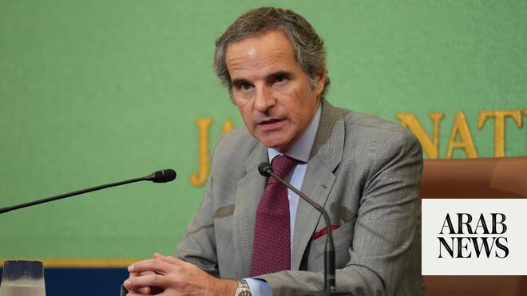

# “Very strong” nuclear verification needed in Iran after war: IAEA head

Source: https://www.arabnews.com/node/2648632/middle-east
Captured source: https://www.arabnews.com/node/2648632/middle-east
Published: 2026-06-26T08:11:37+03:00
Modified: 2026-06-26T11:10:21+03:00
Author: AFP

## Summary

TOKYO: “Very strong” verification is needed in Iran following the Middle East conflict to ensure that it does not develop nuclear weapons, the UN atomic watchdog chief said on Friday. International Atomic Energy Agency (IAEA) head Rafael Grossi’s remarks come as the United States and Iran negotiate a broader agreement to end the war, with Tehran’s nuclear program a key

## Image

## Video Or Embed URLs

- blob:https://www.arabnews.com/9826c8dc-7d90-4f66-9ad0-be107586f3e9
- https://imasdk.googleapis.com/js/core/bridge3.773.0_en.html
- https://efbe9aaf0a88bcc4eb2a4109817a8d75.safeframe.googlesyndication.com/safeframe/1-0-45/html/container.html
- https://static.addtoany.com/menu/sm.25.html
- about:blank
- https://sync.teads.tv/wigo-no-slot
- https://ep2.adtrafficquality.google/sodar/sodar2/255/runner.html
- https://www.google.com/recaptcha/api2/aframe
- https://cm.g.doubleclick.net/partnerpixels?gdpr=0&us_privacy=1---&gpp_sid=-1&url=https%3A%2F%2Fwww.arabnews.com%2Fnode%2F2648632%2Fmiddle-east

## Text

https://arab.news/yqztx

Iran has consistently denied seeking to acquire an atomic bomb, while remaining adamant about its right to operate a full-scale civilian nuclear program

TOKYO: “Very strong” verification is needed in Iran following the Middle East conflict to ensure that it does not develop nuclear weapons, the UN atomic watchdog chief said on Friday. International Atomic Energy Agency (IAEA) head Rafael Grossi’s remarks come as the United States and Iran negotiate a broader agreement to end the war, with Tehran’s nuclear program a key sticking point. “I think the objective of this (recent US-Iran preliminary) agreement is to ensure that there is no development of nuclear weapons in Iran. The government of Iran has declared quite clearly that this is not their intention,” Grossi told reporters in Japan. “But of course intentions are not enough. We have to have a very strong verification system in place... as soon as is practicable,” the IAEA chief said. Grossi said the watchdog had also “barely initiated” talks with Iran following its preliminary agreement with the United States about what to do with Tehran’s uranium stockpile. “Initial conversations have taken place... We expect this work to pick up soon,” Grossi said. Before the conflict, the IAEA estimated that Iran had 440 kilograms (970 pounds) of uranium enriched to 60 percent. That is close to the 90 percent needed to make a bomb and well above the 3.67-percent limit set by a now-defunct 2015 agreement with Iran. Iran suspended cooperation with the IAEA after Israel and the United States launched a previous wave of attacks in June 2025, and its inspectors have not seen the material since. Under the terms of the preliminary agreement between Tehran and Washington, this stockpile is meant to be “downblended” under IAEA supervision. Grossi said the “widespread impression” was that the stockpile remains where it was before June 2025 near Iran’s Isfahan facility. However, that facility was bombed and Iran said that it does not plan to allow the IAEA to inspect sites that were attacked. Grossi also said on Friday that an alternative to diluting could be shipping the enriched uranium out of Iran. “The memorandum of understanding, as you may have noted, includes the possibility of downblending as one alternative,” Grossi said. “It could also be shipped out directly. It would perhaps be more complicated, but there are a few technical alternatives to deal with the material,” he said. Iran has consistently denied seeking to acquire an atomic bomb, while remaining adamant about its right to operate a full-scale civilian nuclear program. Before the 12-day war in 2025, Iran as a signatory to the nuclear non-proliferation treaty — unlike Israel, which is widely assumed to have atomic weapons — allowed the IAEA to inspect its nuclear sites under its safeguards deal with the Vienna-based body. Iran agreed a landmark nuclear deal with six big powers in 2015 limiting its nuclear program in exchange for sanctions relief, but US President Donald Trump walked away from the agreement during his first term.
