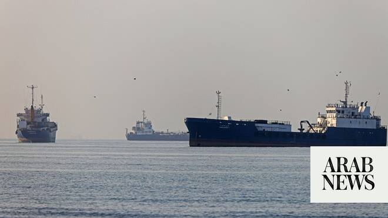

# Iran insists on right to control shipping in Strait of Hormuz after ship hit near Oman

Source: https://www.arabnews.com/node/2648664/middle-east
Captured source: https://www.arabnews.com/node/2648664/middle-east
Published: 2026-06-26T14:22:11+03:00
Modified: 2026-06-26T18:59:14+03:00
Author: Reuters

## Summary

DUBAI/LONDON: Iran reasserted its right on Friday to control shipping in the Strait of Hormuz ​and warned Gulf states against siding with the US, a day after an attack on a ship near Oman highlighted the fragility of a preliminary deal to end the Iran war. Tehran was responding to what it called an “interventionist, irresponsible and provocative” joint statement by the US and

## Image

## Video Or Embed URLs

- https://b770f9b717ca669ce113a73708ea078e.safeframe.googlesyndication.com/safeframe/1-0-45/html/container.html
- https://static.addtoany.com/menu/sm.25.html
- about:blank
- https://imasdk.googleapis.com/js/core/bridge3.773.0_en.html
- https://www.google.com/recaptcha/api2/aframe
- https://cm.g.doubleclick.net/partnerpixels?gdpr=0&us_privacy=1---&gpp_sid=-1&url=https%3A%2F%2Fwww.arabnews.com%2Fnode%2F2648664%2Fmiddle-east

## Text

https://arab.news/p5wt9

Tehran took effective control of the waterway after US-Israeli strikes on Iran ​on February 28 triggered the war, disrupting oil flows and rattling ‌global energy markets and the wider economy

DUBAI/LONDON: Iran reasserted its right on Friday to control shipping in the Strait of Hormuz ​and warned Gulf states against siding with the US, a day after an attack on a ship near Oman highlighted the fragility of a preliminary deal to end the Iran war.

Tehran was responding to what it called an “interventionist, irresponsible and provocative” joint statement by the US and six Gulf states that rejected Iran’s insistence that it could charge tolls on vessels transiting the strait.

“Safe passage through the Strait of Hormuz cannot be guaranteed under ambiguous arrangements, parallel routes or decision-making that does not take Iran’s role as a coastal state into account,” Deputy Foreign Minister Kazem Gharibabadi said on X.

Oil prices dipped further on Friday, despite conflicting interpretations of last week’s interim deal between Iran and the US and a slowdown in traffic through the strait, where a fifth of global oil and liquefied natural ‌gas supplies typically passes.

US Secretary of State Marco Rubio — wrapping up a tour of the Gulf to reassure nervous regional allies about the interim pact — told reporters on Thursday that if Iran threatened or blocked ships in the strait, “we’re going to have a problem.”

In their joint statement, Rubio and the Gulf Cooperation Council (GCC) called for “free, unconditional, and unrestricted navigation” in the Strait of Hormuz without tolls or “attempts to assert control,” and said a lasting peace must address Iran’s ballistic missiles, drones and support for proxy groups.

IRAN WARNS AGAINST ‘HOSTILE AND INTERVENTIONIST POLICIES’

Iran’s foreign ministry responded on Friday by saying the US military presence in the Gulf was the source of regional insecurity and division, and said ⁠the strait should be governed by Tehran and Oman in line with the terms of the ‌interim deal.

“We warn against the continuation of hostile and interventionist policies in the ‌region,” it said.

Tehran took effective control of the waterway after US-Israeli strikes on Iran ​on February 28 triggered the war, disrupting oil flows and rattling ‌global energy markets and the wider economy.

Taiwan’s Evergreen Marine said on Friday its Singapore-flagged ship Ever Lovely had been hit close ‌to Oman on Thursday by an “unknown object” while on a route recommended by the British navy agency UKMTO.

Nobody was hurt in the incident and the ship later resumed its journey out of the strait.

Two US officials told Reuters that Iran had fired on the ship, while Iran’s Arabian Gulf Strait Authority — established by Tehran to manage requests for ships to travel through the strait — said passage through unauthorized routes would be “the responsibility of the owner, ‌operator, and vessel commander.”

There was no immediate comment from the US government. US President Donald Trump warned earlier this month that if Iran did not honor the interim deal, including reopening ⁠the strait, the US would probably ⁠go back to bombing the country.

LEBANON, NUCLEAR INSPECTIONS, AMONG POINTS OF CONTENTION

Alongside the issue of control over the strait, disagreements persist over other elements of the framework ceasefire deal, including over financial incentives for Iran, nuclear inspections, and Israel’s parallel war in Lebanon.

The deal has set up 60 days of talks to tackle thornier issues, including Iran’s nuclear program.

In the United States, the war is weighing heavily on Trump ahead of November midterm elections that will determine control of Congress.

The International Maritime Organization, a UN agency, temporarily paused its operation to escort ships through the Strait of Hormuz after the Oman incident.

The IMO and Oman had earlier this week announced a new southern route through the strait to evacuate hundreds of ships stranded by the war, angering Tehran.

South Korea’s President Lee Jae Myung said on Friday three South Korean ships would leave the Strait of Hormuz over the weekend after the Oceans Ministry reported eight more South Korean vessels had exited.
