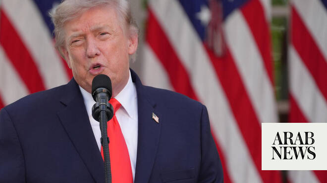

# Trump slams Iran drone attack on cargo ship as ‘foolish’ ceasefire violation

Source: https://www.arabnews.com/node/2648694/middle-east
Captured source: https://www.arabnews.com/node/2648694/middle-east
Published: 2026-06-26T19:11:46+03:00
Modified: 2026-06-26T20:09:53+03:00
Author: Agencies

## Summary

WASHINGTON: US President Donald Trump on Friday slammed Iran for carrying out a drone attack in the Strait of Hormuz, calling it a “foolish” violation of the ceasefire in the Middle East war. “One of the Drones solidly hit the upper deck of a large and very expensive Cargo Carrying Ship” while three others were shot down, Trump posted on his Truth Social platform in an

## Image

## Video Or Embed URLs

- https://truthsocial.com/@realDonaldTrump/116817203281419093/embed
- https://b148f55fa98e821be41df32535fb7870.safeframe.googlesyndication.com/safeframe/1-0-45/html/container.html
- https://static.addtoany.com/menu/sm.25.html
- about:blank
- https://imasdk.googleapis.com/js/core/bridge3.773.0_en.html
- https://www.google.com/recaptcha/api2/aframe
- https://cm.g.doubleclick.net/partnerpixels?gdpr=0&us_privacy=1---&gpp_sid=-1&url=https%3A%2F%2Fwww.arabnews.com%2Fnode%2F2648694%2Fmiddle-east

## Text

https://arab.news/4bk9t

Comes during fragile time for US and Iran as they negotiate permanent end to their war

WASHINGTON: US President Donald Trump on Friday slammed Iran for carrying out a drone attack in the Strait of Hormuz, calling it a “foolish” violation of the ceasefire in the Middle East war.

“One of the Drones solidly hit the upper deck of a large and very expensive Cargo Carrying Ship” while three others were shot down, Trump posted on his Truth Social platform in an apparent reference to an attack on a vessel the day before.

“Obviously, this is a foolish violation of our Ceasefire Agreement,” Trump added.

His post on social media did not identify the ship or the time of the strike, but on Thursday the British military said a vessel was hit by a projectile off the coast of Oman.

It comes during a fragile time for the US and Iran as they work to negotiate a permanent end to the war.

Also on Friday, Iran reasserted its right to control shipping in the Strait of Hormuz ​and warned Gulf states against siding with the US, a day after the attack on the ship.

Tehran was responding to what it called an “interventionist, irresponsible and provocative” joint statement by the US and six Gulf states that rejected Iran’s insistence that it could charge tolls on vessels transiting the strait.

“Safe passage through the Strait of Hormuz cannot be guaranteed under ambiguous arrangements, parallel routes or decision-making that does not take Iran’s role as a coastal state into account,” Deputy Foreign Minister Kazem Gharibabadi said on X.

Iranian state TV said three foreign tankers attempting what it called an “unauthorized passage” of the strait were turned back after a warning from the Islamic Revolutionary Guard Corps. It gave no further details.

Asked about the matter, a US official said: “We are aware of these reports and looking into them. President Trump has been clear that Iran cannot subvert the free flow of traffic in the strait.”
