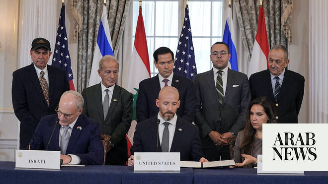

# Israel and Lebanon sign framework agreement in Washington

Source: https://www.arabnews.com/node/2648702/middle-east
Captured source: https://www.arabnews.com/node/2648702/middle-east
Published: 2026-06-26T20:32:52+03:00
Modified: 2026-06-26T23:04:02+03:00
Author: AFP

## Summary

WASHINGTON: Lebanon, Israel and the United States on Friday signed a trilateral framework agreement aimed at paving the way for a peace deal between the two long-time Middle East adversaries. The agreement — details of which were not announced in Washington — is the result of five rounds of talks in the US capital aimed at ending decades of hostilities and weeks of fighting

## Image

## Video Or Embed URLs

- blob:https://www.arabnews.com/6902bf32-2d9f-4ccf-8d5b-0a35576dd718
- https://imasdk.googleapis.com/js/core/bridge3.773.0_en.html
- https://3b2ea08c3a9da2370deb03a62f6e2c1b.safeframe.googlesyndication.com/safeframe/1-0-45/html/container.html
- about:blank
- https://static.addtoany.com/menu/sm.25.html
- https://ep2.adtrafficquality.google/sodar/sodar2/255/runner.html
- https://www.google.com/recaptcha/api2/aframe
- https://cm.g.doubleclick.net/partnerpixels?gdpr=0&us_privacy=1---&gpp_sid=-1&url=https%3A%2F%2Fwww.arabnews.com%2Fnode%2F2648702%2Fmiddle-east

## Text

https://arab.news/jr6kf

Marco Rubio says the agreement "begins to put in place a framework for lasting peace and security"

Lebanon’s ambassador says accord “is a first step on the road to restoring Lebanese sovereignty and territorial integrity"

Netanyahu confirms plan to allow Lebanese forces to take control of territory in “two pilot areas" occupied by Israel

WASHINGTON: Lebanon, Israel and the United States on Friday signed a trilateral framework agreement aimed at paving the way for a peace deal between the two long-time Middle East adversaries. The agreement — details of which were not announced in Washington — is the result of five rounds of talks in the US capital aimed at ending decades of hostilities and weeks of fighting between Israel and Hezbollah in southern Lebanon. The deal “begins to put in place a framework for lasting peace and security,” US Secretary of State Marco Rubio said at the signing ceremony, while noting: “It’s the beginning of the beginning. There’s a lot of work ahead.”

Lebanon’s ambassador to Washington, Nada Hamadeh Moawad, said the accord “is a first step on the road to restoring Lebanese sovereignty and territorial integrity, securing a permanent and final cessation of hostilities (and) enabling our people to go back to their land.” And Israel’s envoy to the United States, Yechiel Leiter, said that under the deal, “Iran is out, Hezbollah is out, and the road to peace between Israel and Lebanon is in.”

Hezbollah drew Lebanon into the broader Middle East war on March 2 with rocket fire aimed at Israel to avenge the killing of Iran’s supreme leader Ayatollah Ali Khamenei in US-Israeli strikes. Israel responded with heavy airstrikes and a ground invasion, and its troops are operating inside southern Lebanon, where they have been carrying out extensive demolition of homes and other buildings.

Despite the signing of the deal, Israel and Hezbollah — which is part of the Lebanese government but also maintains a powerful armed wing outside state control — made clear Friday that major differences remain. Hezbollah chief Naim Qassem said Israel has “no option but to withdraw completely from every inch of our Lebanese land,” and that its forces “must leave unconditionally.” Prime Minister Benjamin Netanyahu however said Israel has no plans to do so until Hezbollah gives up its weapons. “The most important thing is, first of all, that Israel remains in the security zone in southern Lebanon. This is a major achievement, and we will maintain it as long as Hezbollah has not disarmed,” Netanyahu said in a pre-recorded video shared with Israeli media. US media outlet Axios reported that the trilateral agreement inked Friday provides for Israeli forces to withdraw from small areas they occupy in Lebanon. That plan was confirmed by Netanyahu, who said his country’s military would allow the Lebanese army to take control of territory in “two pilot areas” — one south of Lebanon’s Litani River, and another north of it. The Israeli premier also said civilians displaced from the so-called “security zone” in south Lebanon will not be allowed to return home under the new agreement. Under US pressure, Lebanese and Israeli officials began direct talks in April in Washington, and a truce was announced on April 17 that ultimately failed to stop the fighting. A new — but still extremely fragile — ceasefire was declared this month as Tehran insisted that Lebanon must be included in its deal with Washington to end the broader conflict launched by the United States and Israel in February. The conflict has displaced more than one million Lebanese and left more than 4,200 dead, according to Lebanese authorities.
