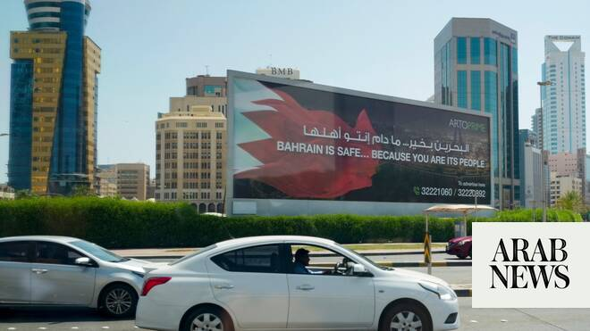

# Bahrain condemns Iranian drone attacks on its territory

Source: https://www.arabnews.com/node/2648756/middle-east
Captured source: https://www.arabnews.com/node/2648756/middle-east
Published: 2026-06-27T12:07:59+03:00
Modified: 2026-06-27T12:07:59+03:00
Author: Reuters

## Summary

Bahrain condemned what ​it said were Iranian drone attacks on its territory ‌on Saturday, ‌the ​state news ‌agency ⁠reported, ​saying it ⁠reserved the full right to defend its ⁠sovereignty and ‌security. Iran ‌said ​earlier ‌it ‌had carried out strikes against targets linked ‌to US forces in the ⁠region, ⁠without identifying the targets or saying where they were located.

## Image

## Video Or Embed URLs

- https://aa003e6adb677841e0e9b4b825827d95.safeframe.googlesyndication.com/safeframe/1-0-45/html/container.html
- https://imasdk.googleapis.com/js/core/bridge3.773.0_en.html
- about:blank
- https://static.addtoany.com/menu/sm.25.html
- https://www.google.com/recaptcha/api2/aframe
- https://sync.teads.tv/wigo-no-slot
- https://cm.g.doubleclick.net/partnerpixels?gdpr=0&us_privacy=1---&gpp_sid=-1&url=https%3A%2F%2Fwww.arabnews.com%2Fnode%2F2648756%2Fmiddle-east

## Text

https://arab.news/gtbmn

Bahrain condemned what ​it said were Iranian drone attacks on its territory ‌on Saturday, ‌the ​state news ‌agency ⁠reported, ​saying it ⁠reserved the full right to defend its ⁠sovereignty and ‌security. Iran ‌said ​earlier ‌it ‌had carried out strikes against targets linked ‌to US forces in the ⁠region, ⁠without identifying the targets or saying where they were located.
