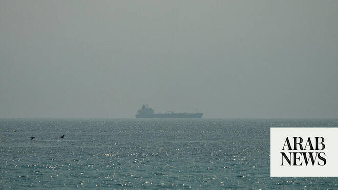

# US says will not ignore attacks on Hormuz shipping as both sides trade strikes

Source: https://www.arabnews.com/node/2648759/middle-east
Captured source: https://www.arabnews.com/node/2648759/middle-east
Published: 2026-06-27T13:02:25+03:00
Modified: 2026-06-27T19:36:50+03:00
Author: Arab News

## Summary

DUBAI: A tanker came under attack in the Strait of Hormuz on Saturday, just after Bahrain said that Iran launched an attack targeting the kingdom. The British military’s United Kingdom Maritime Trade Operations center reported the attack, saying the ship’s crew was safe and no environmental damage was reported. No one immediately claimed the attack. However, Iran attacked a

## Image

## Video Or Embed URLs

- https://static.addtoany.com/menu/sm.25.html
- about:blank
- https://imasdk.googleapis.com/js/core/bridge3.773.0_en.html
- https://www.google.com/recaptcha/api2/aframe
- https://cm.g.doubleclick.net/partnerpixels?gdpr=0&us_privacy=1---&gpp_sid=-1&url=https%3A%2F%2Fwww.arabnews.com%2Fnode%2F2648759%2Fmiddle-east

## Text

https://arab.news/jz5xe

Iranian drones attack Bahrain and a ship is struck in the strait after US airstrikes on Iran

DUBAI: A tanker came under attack in the Strait of Hormuz on Saturday, just after Bahrain said that Iran launched an attack targeting the kingdom.

The British military’s United Kingdom Maritime Trade Operations center reported the attack, saying the ship’s crew was safe and no environmental damage was reported.

No one immediately claimed the attack. However, Iran attacked a ship Thursday off Oman trying to get out of the Arabian Gulf.

The US military said its forces struck Iranian missile and drone storage sites and coastal radar locations on Friday night in response to the Thursday attack.

The US Central Command (CENTCOM) told Al Arabiya it would not ignore any future Iranian attacks on commercial shipping in the Strait of Hormuz, while stressing that freedom of navigation remains a core US objective.

A CENTCOM spokesperson told the network that US forces would continue to protect international shipping lanes and respond to any threats against commercial vessels.

“We will not ignore Iranian attacks on commercial ships,” the spokesperson said, adding that safeguarding maritime traffic is essential to regional and global security.

CENTCOM also said that the US remained committed to de-escalation but would respond when commercial shipping is targeted.

Iran on Saturday accused the US of a “blatant violation” of the peace deal reached between the two sides to end the Middle East war after the latest American strikes on the country.

“These brutal attacks, which targeted Iranian coastal surveillance facilities, are a blatant violation” of the memorandum of understanding to end the war, the Iranian foreign ministry said in a statement.

The strikes show the danger of the Iran war again spinning out of control, even after Iran and the US reached an interim deal to try and reach a final accord to end the conflict.

Bahrain said Saturday that Iran launched a drone attack on the island just after Tehran said it targeted American military installations to retaliate for overnight airstrikes.

The strikes on Bahrain show the danger of the Iran war again spinning out of control, even after Iran and the US reached an interim deal to try and reach a final accord to end the conflict.

The US had launched its airstrikes in response to an Iranian drone attack on a ship trying to get out of the Strait of Hormuz on Thursday, continuing a string of attacks that have shaken the uneasy ceasefire in the war.

Sea route near Oman is expanding

A maritime body overseen by the US Navy said Saturday that a route through the Strait of Hormuz near Oman’s shores is expanding to allow for both inbound and outbound traffic.

The announcement by the Joint Maritime Information Center serves as another warning to Iran that the US is pushing to reopen the strait.

Iran has insisted ships must obey its orders and is warning it will start charging fees for transit through the strait, through which a fifth of all oil and natural gas once passed.

The US and Gulf Arab states have rejected Iran’s demands. The strait is considered around the world as an international waterway, despite being the territorial waters of Iran and Oman.
