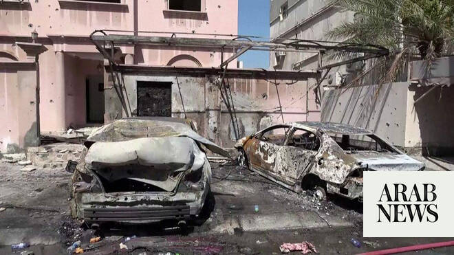

# Air raid siren sounded for a second time in Bahrain

Source: https://www.arabnews.com/node/2648843/middle-east
Captured source: https://www.arabnews.com/node/2648843/middle-east
Published: 2026-06-28T07:02:08+03:00
Modified: 2026-06-28T07:10:34+03:00
Author: AFP

## Summary

Air raid sirens sounded for a second time in Bahrain on Sunday, the country’s interior ministry said. “The siren has been sounded … Citizens and residents are urged to remain calm and head to the nearest safe place,” the Interior Ministry said on X.

## Image

## Video Or Embed URLs

- https://b9ea80eda1f4bf234fead2d4b994c872.safeframe.googlesyndication.com/safeframe/1-0-45/html/container.html
- https://static.addtoany.com/menu/sm.25.html
- about:blank
- https://imasdk.googleapis.com/js/core/bridge3.773.0_en.html
- https://www.google.com/recaptcha/api2/aframe
- https://cm.g.doubleclick.net/partnerpixels?gdpr=0&us_privacy=1---&gpp_sid=-1&url=https%3A%2F%2Fwww.arabnews.com%2Fnode%2F2648843%2Fmiddle-east

## Text

https://arab.news/2krgf

Iran announced earlier that it had launched strikes against the US Fifth Fleet base in Bahrain and another base in Kuwait

Air raid sirens sounded for a second time in Bahrain on Sunday, the country’s interior ministry said.

“The siren has been sounded … Citizens and residents are urged to remain calm and head to the nearest safe place,” the Interior Ministry said on X.

Iran’s Revolutionary Guards said on Sunday that it carried out strikes against Kuwait and Bahrain in retaliation for US attacks on Iranian territory, warning any further aggression would be met with a “crushing response.”

Iran and the United States have both accused the other of violating their fragile ceasefire, straining negotiations meant to end the Middle East war.

The Guards “destroyed eight important US military facilities at the Ali Al-Salem base in Kuwait and at the Fifth Fleet naval base in Port Salman in Bahrain,” they said in a statement.

“Any enemy aggression, whatever the pretext, even against insignificant targets... will have a crushing response,” the Guards added.

A memorandum of understanding was reached in mid-June under Pakistan’s mediation, aimed at putting a lasting end to the war.

The text signed by the United States and Iran said both countries, and their respective allies, were “not to initiate any war or any military operation against each other and to refrain from the threat or use of force against each other.”

The US military bombed Iran for a second consecutive day on Saturday, in what it said was retaliation for an Iranian attack on a tanker in the vital Strait of Hormuz.

In the memorandum of understanding Iran agreed “safe passage of commercial vessels with no charge, for 60 days only, from the Arabian Gulf to the Sea of Oman, and vice versa” in the strait.

The Guards said on Sunday measures had been taken to control traffic through the strait and that violating ships would be dealt with more firmly than before.

They had also warned on Thursday against any passage through the strait without their permission.

It came after Oman, which shares the opposite shore with Iran, flagged an alternative route.

The only passage authorized by Iran is through a corridor running along its coast at this time.
