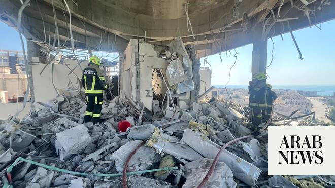

# Residential building damaged in latest Iranian attack — Bahrain interior ministry

Source: https://www.arabnews.com/node/2648843/middle-east
Captured source: https://www.arabnews.com/node/2648843/middle-east
Published: 2026-06-28T09:04:08+03:00
Modified: 2026-06-28T10:15:08+03:00
Author: Arab News

## Summary

DUBAI: A residential building was damaged in Muharraq Governorate after the latest Iranian attack on Sunday, Bahrain’s interior ministry said, adding no casualties were reported. “The relevant authorities are taking the necessary measures at the site,” the interior ministry said on its social media account.

## Image

## Video Or Embed URLs

- https://238656ca2b4261d8f6a25285a15605b3.safeframe.googlesyndication.com/safeframe/1-0-45/html/container.html
- https://static.addtoany.com/menu/sm.25.html
- about:blank
- https://www.google.com/recaptcha/api2/aframe
- https://imasdk.googleapis.com/js/core/bridge3.773.0_en.html
- https://cm.g.doubleclick.net/partnerpixels?gdpr=0&us_privacy=1---&gpp_sid=-1&url=https%3A%2F%2Fwww.arabnews.com%2Fnode%2F2648843%2Fmiddle-east

## Text

https://arab.news/2krgf

Iran launches strikes against the US Fifth Fleet base in Bahrain and another base in Kuwait

Kuwait armed forces intercepted and destroyed two ballistic missiles at dawn on Sunday,

DUBAI: A residential building was damaged in Muharraq Governorate after the latest Iranian attack on Sunday, Bahrain’s interior ministry said, adding no casualties were reported.

“The relevant authorities are taking the necessary measures at the site,” the interior ministry said on its social media account.

Air raid sirens sounded twice on Sunday as the General Command of the Bahrain Defense Force said in a statement it has intercepted and destroyed a number of Iranian missiles and drones that targeted civilians, insisting that the “deliberate use of missiles and marching aircraft to target civilians and private property is a blatant violation of International Humanitarian Law.”

Kuwait’s defense ministry meanwhile said that armed forces intercepted and destroyed two ballistic missiles at dawn on Sunday, and no damage or human injuries were reported from the interceptions.

Iran’s Revolutionary Guards said on Sunday that it carried out strikes against Kuwait and Bahrain in retaliation for US attacks on Iranian territory, warning any further aggression would be met with a “crushing response.”

Iran and the United States have both accused the other of violating their fragile ceasefire, straining negotiations meant to end the Middle East war.

The Guards “destroyed eight important US military facilities at the Ali Al-Salem base in Kuwait and at the Fifth Fleet naval base in Port Salman in Bahrain,” they said in a statement.

“Any enemy aggression, whatever the pretext, even against insignificant targets... will have a crushing response,” the Guards added.

A memorandum of understanding was reached in mid-June under Pakistan’s mediation, aimed at putting a lasting end to the war.

The text signed by the United States and Iran said both countries, and their respective allies, were “not to initiate any war or any military operation against each other and to refrain from the threat or use of force against each other.”

The US military bombed Iran for a second consecutive day on Saturday, in what it said was retaliation for an Iranian attack on a tanker in the vital Strait of Hormuz.

In the memorandum of understanding Iran agreed “safe passage of commercial vessels with no charge, for 60 days only, from the Arabian Gulf to the Sea of Oman, and vice versa” in the strait.

The Guards said on Sunday measures had been taken to control traffic through the strait and that violating ships would be dealt with more firmly than before.

They had also warned on Thursday against any passage through the strait without their permission.

It came after Oman, which shares the opposite shore with Iran, flagged an alternative route.

The only passage authorized by Iran is through a corridor running along its coast at this time.
