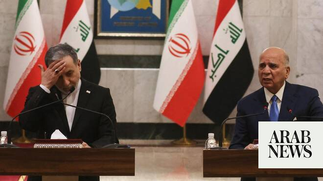

# Iran FM warns any challenge to Hormuz routes will ‘increase tensions’

Source: https://www.arabnews.com/node/2648870/middle-east
Captured source: https://www.arabnews.com/node/2648870/middle-east
Published: 2026-06-28T13:21:28+03:00
Modified: 2026-06-28T20:20:34+03:00
Author: AFP

## Summary

BAGHDAD: Iran’s top diplomat warned Sunday that any attempt to bypass the Strait of Hormuz routes agreed with the United States would “increase tensions” in the Middle East, as the countries traded attacks and accusations of violating a fragile ceasefire in the region. During a visit to Iraqi capital Baghdad, Abbas Araghchi also called for the establishment of a security

## Image

## Video Or Embed URLs

- blob:https://www.arabnews.com/7c0e03a1-7b3e-4895-ba29-24adf694788b
- https://imasdk.googleapis.com/js/core/bridge3.773.0_en.html
- https://static.addtoany.com/menu/sm.25.html
- about:blank
- https://www.google.com/recaptcha/api2/aframe
- https://cm.g.doubleclick.net/partnerpixels?gdpr=0&us_privacy=1---&gpp_sid=-1&url=https%3A%2F%2Fwww.arabnews.com%2Fnode%2F2648870%2Fmiddle-east

## Text

https://arab.news/vqxtd

Iran’s top diplomat warned Sunday that any attempt to bypass the Strait of Hormuz routes agreed with the United States would “increase tensions” in the Middle East

BAGHDAD: Iran’s top diplomat warned Sunday that any attempt to bypass the Strait of Hormuz routes agreed with the United States would “increase tensions” in the Middle East, as the countries traded attacks and accusations of violating a fragile ceasefire in the region.

During a visit to Iraqi capital Baghdad, Abbas Araghchi also called for the establishment of a security framework with Gulf countries, with Tehran and Washington accusing each other of violating the fragile truce that was meant to end the Middle East war.

“Any attempt to adopt new or separate arrangements compared to what is underway by the Islamic Republic of Iran, will only lead to more complicated situations and delays in the reopening of the Strait of Hormuz, and will increase the tensions, as we witnessed in the past two nights,” Araghchi told a press conference.

Vessels have continued to use a non-Iranian-approved passage in the strategic waterway, tracking platforms showed Friday.

The Islamic Revolutionary Guard Corps (IRGC) said a day earlier that Oman and the International Maritime Organization (IMO) announced the new corridor without consulting Tehran, and warned vessels against using it.

Araghchi’s warning came after the US military said it carried out new strikes Saturday on multiple targets in Iran, in response to a fresh attack on a ship transiting the Strait of Hormuz.

Tehran responded with launching strikes against US bases in the Gulf.

The recent clashes have tested the negotiating process meant to end a war launched by the United States and Israel against Iran on February 28.

Araghchi called on all parties to “adhere to the memorandum of understanding and not to allow this MoU to deviate from its course.”

Iran’s top diplomat said that “we should reach a new framework that includes all countries in the region and without the presence or interference of any country from outside the region.”

He welcomed Iraq’s call to hold a meeting between the Gulf States, Iran and Iraq, which was drawn into the Middle East war from the beginning.

Iraq is expected to hold on July 8 funeral processions for Iran’s late supreme leader Ayatollah Ali Khamenei, who was killed during attacks by the US and Israel on the first day of the war.
