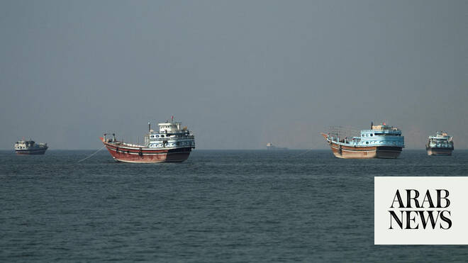

# Iran says held first meeting with Oman on managing Hormuz

Source: https://www.arabnews.com/node/2648950/middle-east
Captured source: https://www.arabnews.com/node/2648950/middle-east
Published: 2026-06-29T23:00:18+03:00
Modified: 2026-06-30T00:02:06+03:00
Author: AFP

## Summary

TEHRAN: Iran’s foreign ministry said it had held on Monday the first meeting with Oman on managing the Strait of Hormuz since Tehran and Washington signed their preliminary deal to end the Middle East war. Both Iran and Oman say they hold sovereignty over the waterway, a vital route for Gulf energy exports that Tehran blockaded during the war. “During a trip to Muscat, the

## Image

## Video Or Embed URLs

- https://9abceb328b4cd8c189300cd4798e3440.safeframe.googlesyndication.com/safeframe/1-0-45/html/container.html
- https://static.addtoany.com/menu/sm.25.html
- about:blank
- https://www.google.com/recaptcha/api2/aframe
- https://imasdk.googleapis.com/js/core/bridge3.774.0_en.html
- https://sync.teads.tv/wigo-no-slot
- https://cm.g.doubleclick.net/partnerpixels?gdpr=0&us_privacy=1---&gpp_sid=-1&url=https%3A%2F%2Fwww.arabnews.com%2Fnode%2F2648950%2Fmiddle-east

## Text

https://arab.news/94ny6

Iranian Deputy Foreign Minister Kazem Gharibabadi says the two countries reached “common understanding” on administration of the waterway

Committees will be set up to hold technical negotiations regarding shipping routes

TEHRAN: Iran’s foreign ministry said it had held on Monday the first meeting with Oman on managing the Strait of Hormuz since Tehran and Washington signed their preliminary deal to end the Middle East war. Both Iran and Oman say they hold sovereignty over the waterway, a vital route for Gulf energy exports that Tehran blockaded during the war. “During a trip to Muscat, the first meeting of the Joint Hormuz Committee was held,” said Iranian Deputy Foreign Minister Kazem Gharibabadi on X. “While reviewing the current issues related to the strait, we exchanged views on the future management,” he added. Hormuz is a narrow stretch of water separating Iran and Oman that is only about 30 kilometers (18 miles) wide. The future of the strait has been a key sticking point during talks between Tehran and Washington to end their conflict. Iran is considering imposing “services fees” that did not exist before the war, while the United States opposes any charges, arguing Hormuz is an international waterway. Gharibabadi later said in a phone interview with state television that during the meeting on Monday, Tehran and Muscat had reached “a common understanding” on the administration of the waterway. He said Oman “also supports being involved in these arrangements as a coastal state with sovereign rights, and... believes that fees should be collected in return for the services that are provided.” Gharibabadi added that they “decided that technical committees would be established between the two countries.” “Beginning in seven or eight days, our experts will start their specialized discussions, in accordance with the understanding we reached today, so that we can discuss these arrangements, prepare a text, and also hold technical negotiations regarding the shipping routes,” he continued. In recent days, Oman has indicated an ambiguous stance on the issue. Last Tuesday, following a visit by Iranian officials, Oman and Iran announced in a joint statement that they were examining the costs associated with the future management of the strait. But later in the week Oman indicated that no “passage fees” were planned and announced the opening of a “temporary maritime corridor” close to its coast that it said was coordinated with the UN. Iran responded by saying the only authorized passage was a corridor skirting its own coastline. Iranian Foreign Minister Abbas Araghchi warned on Sunday that any attempt to use alternative routes risked “escalating tensions” in the region. It followed a flare-up in hostilities in which Iran struck a commercial ship in the strait and the United States responded with strikes on Iranian coastal targets. The text says passage through the strait was to be toll-free “for 60 days only” after the signing of the deal. It remains unclear what will happen after that period. Gharibabadi on Monday said that “under Article 5 of the Islamabad Memorandum of Understanding, the Islamic Republic of Iran determines the shipping routes under these temporary conditions, and we cannot accept any other route. “It is our commitment to provide safe conditions for passage. That is why, if vessels transit through other routes, we will oppose it, we will seek to prevent it, and if any incident occurs involving those vessels, the responsibility will rest with them,” he said. “Over the past few days, the Americans have understood this message: if they seek to establish parallel routes... the Islamic Republic of Iran will use the various means at its disposal to provide an appropriate response to that violation.”
