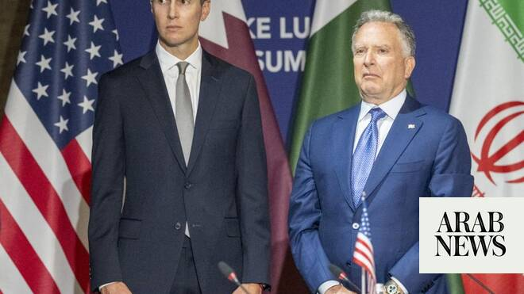

# Uncertainty over Qatar diplomacy clouds prospects for US-Iran deal

Source: https://www.arabnews.com/node/2649090/middle-east
Captured source: https://www.arabnews.com/node/2649090/middle-east
Published: 2026-06-30T14:30:21+03:00
Modified: 2026-06-30T19:11:28+03:00
Author: Reuters

## Summary

DOHA/DUBAI: Top US envoys who have arrived in Doha will not hold a high-level meeting with Iran, a Qatari official said on Tuesday, casting doubt on the progress of efforts to bring a lasting halt to the Iran war and fully reopen the Strait of Hormuz. Instead, there will be technical talks this week on issues including regional security that could later be elevated to senior

## Image

## Video Or Embed URLs

- https://c607a9c0ec86fee09da3a33b2367f968.safeframe.googlesyndication.com/safeframe/1-0-45/html/container.html
- blob:https://www.arabnews.com/933bd92f-2b35-4acf-a178-88db6b249ed0
- https://imasdk.googleapis.com/js/core/bridge3.774.0_en.html
- https://static.addtoany.com/menu/sm.25.html
- about:blank
- https://ep2.adtrafficquality.google/sodar/sodar2/255/runner.html
- https://www.google.com/recaptcha/api2/aframe
- https://cm.g.doubleclick.net/partnerpixels?gdpr=0&us_privacy=1---&gpp_sid=-1&url=https%3A%2F%2Fwww.arabnews.com%2Fnode%2F2649090%2Fmiddle-east

## Text

https://arab.news/rbfef

There will be technical talks this week on issues including regional security that could later be elevated to senior level, Qatar’s Foreign Ministry spokesperson said

DOHA/DUBAI: Top US envoys who have arrived in Doha will not hold a high-level meeting with Iran, a Qatari official said on Tuesday, casting doubt on the progress of efforts to bring a lasting halt to the Iran war and fully reopen the Strait of Hormuz. Instead, there will be technical talks this week on issues including regional security that could later be elevated to senior level, Qatar’s Foreign Ministry spokesperson Majed Al Ansari told a media briefing. The arrival of US President Donald Trump’s son-in-law Jared Kushner and envoy Steve Witkoff in Doha on Tuesday followed exchanges of fire over the weekend that tested the June 17 interim accord between the United States and Iran.

The 14-point pact allowed 60 days for the two sides to negotiate a permanent truce in the conflict, which began with ‌US and Israeli strikes ‌on Iran on February 28, and to resolve thorny issues including the future of ​Iran’s ‌nuclear ⁠program. The conflict ​disrupted ⁠global trade in oil and other goods, exposed Gulf states to Iranian drone and missile fire and killed thousands of people, mostly in Iran and Lebanon.

Uncertainty over diplomatic efforts Iranian Foreign Ministry spokesperson Esmaeil Baghaei said dialogue with mediator Qatar on the implementation of the interim deal, including on the release of frozen Iranian assets, was likely to take place in Doha on Wednesday. “No meeting at any level with the American side has been scheduled for the coming days,” he said.

The White House had said on Monday that Kushner and Witkoff would hold “high-level meetings,” with technical discussions to continue on the sidelines. The exact timing of the technical talks was not immediately clear. “We have a track on the nuclear side, you ⁠have a track on the economic and state performance issue, you have a track on security and ‌the regional security,” said Ansari.

Despite the uncertainty over diplomatic moves, oil prices have fallen ‌on the de-escalation since the weekend and are set for their biggest quarterly loss ​since the COVID-19 pandemic in 2020.

Vulnerable economies, however, could remain at ‌risk from food and fuel price increases even after energy markets feel relief, the UN trade and development agency said on ‌Tuesday.

Iran tries to exert control over the strait After the war began four months ago, maritime traffic through the strait, which previously carried about a fifth of the global trade in oil and liquefied natural gas, came to a virtual standstill.

Iran has since sought to exert control over the strait alongside Oman, which lies across the waterway, saying it plans to charge fees to ships and obstructing vessels that stray outside defined paths.

Baghaei said on Tuesday that Tehran would “do ‌whatever is necessary to safeguard its interests” over the strait. Since last Thursday, the US has accused Iran of hitting at least two commercial ships with missiles or drones, and it bombed Iranian ⁠military facilities in response. Iran in ⁠turn launched missiles and drones at US military sites in Kuwait and Bahrain on Sunday, with both sides accusing each other of breaking the ceasefire.

The war pushed up global inflation and has put Trump under political pressure before midterm elections in November that will determine control of the US Congress. Trump and Treasury Secretary Scott Bessent are both urging gasoline retailers to lower prices.

On Monday, the White House said Trump had authorized a temporary suspension of some duties on imports of phosphate fertilizer from Morocco as US farmers grapple with shortages.

Shipments of fertilizer through the Strait of Hormuz are expected to return to pre-conflict levels only gradually. “The meeting in Doha is going to be perhaps important, perhaps not,” Trump told reporters in the Oval Office. “We’re going to find out.”

In Iran, where the theocratic leadership survived the war but faces domestic anger over a battered economy, two members of the Revolutionary Guards were killed in what the elite force described as a “terrorist” shooting in a western province.

The interim deal between the US and Iran also provides for an end to the conflict between ​Israel and Iran-backed militant group Hezbollah in Lebanon.

But Lebanon’s powerful ​parliament speaker Nabih Berri, an ally of Hezbollah, cast doubt on a separate, US-brokered framework deal between Lebanon and Israel to halt that war.

Analysts said the deal risks entrenching a stalemate by tying Israel’s withdrawal from southern Lebanon to Hezbollah’s disarmament.
