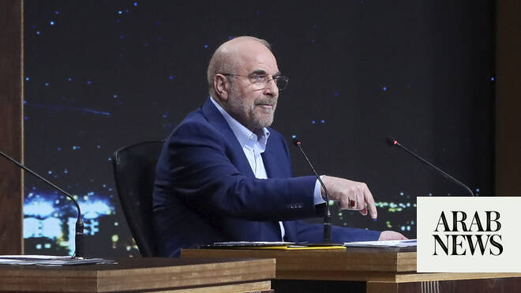

# Iran prioritizes diplomacy with US but remains ready for war: negotiator

Source: https://www.arabnews.com/node/2649186/middle-east
Captured source: https://www.arabnews.com/node/2649186/middle-east
Published: 2026-06-30T23:25:24+03:00
Modified: 2026-07-01T09:25:59+03:00
Author: Agencies

## Summary

TEHRAN: Iran’s chief negotiator Mohammad Bagher Ghalibaf on Tuesday said that Iran was prioritising diplomacy with the United States, but remained ready for war. “We are pursuing dialogue, but if the dialogue is not implemented, we are also prepared for war and will respond accordingly,” Ghalibaf said in an interview on state television, as Iranian and US delegations were due

## Image

## Video Or Embed URLs

- blob:https://www.arabnews.com/fe8aa382-a51b-4843-8c32-9a9e33e981e0
- https://imasdk.googleapis.com/js/core/bridge3.774.0_en.html
- https://8fc4dea11d050d00022bfc86b9526038.safeframe.googlesyndication.com/safeframe/1-0-45/html/container.html
- https://static.addtoany.com/menu/sm.25.html
- about:blank
- https://www.google.com/recaptcha/api2/aframe
- https://cm.g.doubleclick.net/partnerpixels?gdpr=0&us_privacy=1---&gpp_sid=-1&url=https%3A%2F%2Fwww.arabnews.com%2Fnode%2F2649186%2Fmiddle-east

## Text

https://arab.news/r3mvf

Iran’s chief negotiator Mohammad Qalibaf insists that Iran ​has ‌sovereignty over ‌the Strait of Hormuz

TEHRAN: Iran’s chief negotiator Mohammad Bagher Ghalibaf on Tuesday said that Iran was prioritising diplomacy with the United States, but remained ready for war.

“We are pursuing dialogue, but if the dialogue is not implemented, we are also prepared for war and will respond accordingly,” Ghalibaf said in an interview on state television, as Iranian and US delegations were due to hold separate discussions in Doha.

Ghalibaf said current meetings held by Iran ​are aimed at fulfilling the commitments of the memorandum of understanding and that Iran would not enter further negotiations until conditions ‌of the ‌MoU ​signed ‌between Iran ⁠and ​the United ⁠States are met.

He added that Iran ​has ‌sovereignty over ‌the Strait of Hormuz along with Oman and it will ‌never compromise on its rights in ⁠the ⁠waterway.

Passing through the strait is only toll free for a 60-day period as written in the MoU, Ghalibaf said.

Ghalibaf said Iran was unable to export any oil during the US blockade on its ports, noting that exports have since surged.

“From the day the blockade was lifted until today, we have exported more than 40 million barrels of oil,” he said in an interview on state television. “By contrast, during the previous 50 to nearly 60 days, we were genuinely unable to export even a single barrel of oil.”

* with Reuters and AFP
