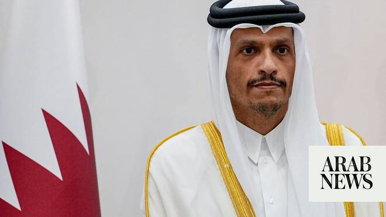

# Qatar reaffirms mediation role in US-Iran talks after meeting with Witkoff

Source: https://www.arabnews.com/node/2649195/middle-east
Captured source: https://www.arabnews.com/node/2649195/middle-east
Published: 2026-07-01T00:28:36+03:00
Modified: 2026-07-01T00:28:36+03:00
Author: Reuters

## Summary

Qatari Prime Minister Sheikh Mohammed ​bin Abdulrahman Al-Thani affirmed his country’s continued mediation efforts and its support for all ‌tracks of ‌talks ​stemming ‌from the ⁠memorandum ​of understanding ⁠between the US and Iran, Qatar’s Foreign Ministry said on ⁠Tuesday. Sheikh Mohammed’s remarks ‌came ‌in ​a ‌meeting with US ‌envoy Steve Witkoff and President Donald

## Image

## Video Or Embed URLs

- https://imasdk.googleapis.com/js/core/bridge3.774.0_en.html
- https://d0ed0b1ace58eae4899773bffe2ab922.safeframe.googlesyndication.com/safeframe/1-0-45/html/container.html
- https://static.addtoany.com/menu/sm.25.html
- about:blank
- https://www.google.com/recaptcha/api2/aframe
- https://sync.teads.tv/wigo-no-slot
- https://cm.g.doubleclick.net/partnerpixels?gdpr=0&us_privacy=1---&gpp_sid=-1&url=https%3A%2F%2Fwww.arabnews.com%2Fnode%2F2649195%2Fmiddle-east

## Text

https://arab.news/ca38q

Qatari Prime Minister Sheikh Mohammed bin Abdulrahman Al-Thani affirms continued mediation efforts between the US and Iran

Qatari Prime Minister Sheikh Mohammed ​bin Abdulrahman Al-Thani affirmed his country’s continued mediation efforts and its support for all ‌tracks of ‌talks ​stemming ‌from the ⁠memorandum ​of understanding ⁠between the US and Iran, Qatar’s Foreign Ministry said on ⁠Tuesday. Sheikh Mohammed’s remarks ‌came ‌in ​a ‌meeting with US ‌envoy Steve Witkoff and President Donald Trump’s son-in-law Jared Kushner, ‌where they discussed developments in ⁠ongoing ⁠US-Iran talks. The statement did not provide further details on the content of the discussions.
