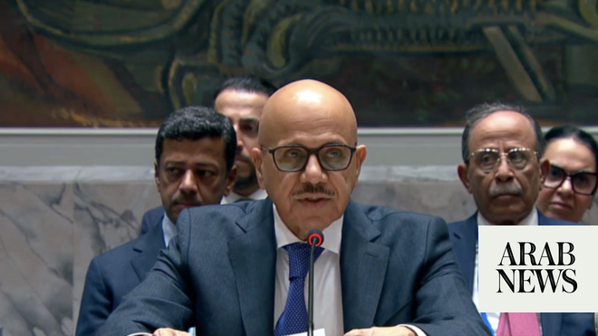

# Bahrain seeks emergency UN Security Council meeting after Iranian attacks

Source: https://www.arabnews.com/node/2649310/middle-east
Captured source: https://www.arabnews.com/node/2649310/middle-east
Published: 2026-07-01T20:10:34+03:00
Modified: 2026-07-01T20:19:52+03:00
Author: Arab News

## Summary

NEW YORK: Bahrain on Wednesday requested an emergency meeting of the UN Security Council following Iran’s recent attack on the kingdom, Arab News has learned. The meeting is expected to take place on Thursday, with Bahrain’s Foreign Minister Abdullatif Bin Rashid Al-Zayani arriving in New York on Wednesday to participate in the session. The request comes amid heightened

## Image

## Video Or Embed URLs

- https://aeeb439421f8d91f68bf70bae5aa8f68.safeframe.googlesyndication.com/safeframe/1-0-45/html/container.html
- https://static.addtoany.com/menu/sm.25.html
- about:blank
- https://www.google.com/recaptcha/api2/aframe
- https://imasdk.googleapis.com/js/core/bridge3.774.0_en.html
- https://cm.g.doubleclick.net/partnerpixels?gdpr=0&us_privacy=1---&gpp_sid=-1&url=https%3A%2F%2Fwww.arabnews.com%2Fnode%2F2649310%2Fmiddle-east

## Text

https://arab.news/nvat8

The meeting is expected to take place on Thursday, with Bahrain’s Foreign Minister arriving in New York on Wednesday to participate in the session

NEW YORK: Bahrain on Wednesday requested an emergency meeting of the UN Security Council following Iran’s recent attack on the kingdom, Arab News has learned.

The meeting is expected to take place on Thursday, with Bahrain’s Foreign Minister Abdullatif Bin Rashid Al-Zayani arriving in New York on Wednesday to participate in the session.

The request comes amid heightened tensions in the Gulf despite a US-Iran agreement signed on June 17 aimed at ending military hostilities.

Since then, Iran has targeted a commercial vessel it said had deviated from its approved route through the Strait of Hormuz, while US Central Command said it struck 10 Iranian military targets over the weekend.

Tehran subsequently launched attacks on US military bases in Kuwait and Bahrain, prompting condemnation from Gulf Cooperation Council countries.

Iran’s chief negotiator, Mohammad Bagher Ghalibaf, said on Tuesday that implementation challenges were inevitable following the end of a conflict “of this magnitude.”
