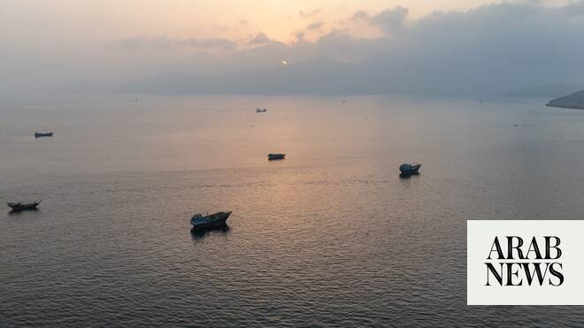

# Strait of Hormuz reopens but UN warns poorest nations will face lasting economic fallout

Source: https://www.arabnews.com/node/2649348/middle-east
Captured source: https://www.arabnews.com/node/2649348/middle-east
Published: 2026-07-02T01:56:14+03:00
Modified: 2026-07-02T01:56:14+03:00
Author: Ephrem Kossaify

## Summary

NEW YORK CITY: The reopening of the Strait of Hormuz after more than 100 days of shipping disruption will bring relief to global energy and trade flows, but the world’s most vulnerable economies face a longer, costlier and more uneven path to recovery, the UN Conference on Trade and Development said in a new report.

## Image

## Video Or Embed URLs

- https://0bd1c41bcf67c3ebb824e2dfe915f0d0.safeframe.googlesyndication.com/safeframe/1-0-45/html/container.html
- https://static.addtoany.com/menu/sm.25.html
- about:blank
- https://www.google.com/recaptcha/api2/aframe
- https://imasdk.googleapis.com/js/core/bridge3.774.0_en.html
- https://cm.g.doubleclick.net/partnerpixels?gdpr=0&us_privacy=1---&gpp_sid=-1&url=https%3A%2F%2Fwww.arabnews.com%2Fnode%2F2649348%2Fmiddle-east

## Text

https://arab.news/paj5t

A 1% change in energy prices now has larger and longer-lasting cumulative effects on consumer prices than was case in prepandemic era

Yemen, Kiribati and Lesotho top list of countries in which cereal imports consume the greatest share of gross domestic product

NEW YORK CITY: The reopening of the Strait of Hormuz after more than 100 days of shipping disruption will bring relief to global energy and trade flows, but the world’s most vulnerable economies face a longer, costlier and more uneven path to recovery, the UN Conference on Trade and Development said in a new report.

The document, “Strait of Hormuz Disruptions: Beyond Reopening — Lasting Impacts on Vulnerable Economies,” confirms that the daily transit of ships through the strait ran at a steady average during the first two months of this year but collapsed after the US-Israeli war with Iran began on Feb. 28.

Shipping began to recover when a ceasefire agreement between Washington and Tehran, which included the reopening of the waterway, was announced in mid-June, it added. UNCTAD said even just the prospect of the reopening of the strait had already begun to calm crude oil markets, with benchmark prices across Europe, North America, the Middle East and Russia easing from their high points during the escalation.

However, the agency cautioned that downward adjustments were slower in other sectors, noting that grain and oilseed freight costs remained well above preescalation levels, even when the strait reopened.

The report warned that the disruption to maritime traffic through the channel, a critical corridor for oil, gas and fertilizer shipments, had set off a chain reaction across the global economy.

Resultant higher energy prices caused transport costs to rise and fueled broader inflation, driving up agricultural production costs, squeezing food production and pushing domestic food prices higher, with vulnerable populations facing greater food insecurity as a result.

Of all the countries analyzed, the agency identified least-developed nations and small island developing states as being disproportionately exposed to such issues, with the data revealing that dozens faced dual exposure as net importers of both oil and cereal products.

UNCTAD said small island developing states were particularly reliant on oil imports, which consumed as much as a quarter of their gross domestic product in some cases.

Among the least-developed countries, cereal imports also weigh heavily on national accounts, with Yemen, Kiribati and Lesotho topping the list of countries in which net cereal imports consumed the largest share of GDP.

The agency said these types of economies are the least-equipped to absorb such shocks. Tight public finances, difficulty mobilizing domestic and external resources, heavy debt-servicing burdens, exchange-rate risks tied to high external debt, declining remittances and reductions in international aid all serve to narrow the capacity these countries for efforts to cushion price shocks, the report noted.

UNCTAD said the effects of energy-price shocks on inflation have grown more persistent since the COVID-19 pandemic, with a 1 percent change in energy prices now having a larger and longer-lasting cumulative effect on consumer prices than it did in the prepandemic era.

The agency also highlighted a broader pattern in which food-price inflation in developing countries had continued to climb even after the shocks driving increases in the prices of oil and grain had eased, a dynamic that was observed once again when the conflict between the US and Iran began in February.

The human cost of even short-term spikes in food prices can be long-lasting, according to the report. It cited a study of 1.27 million preschool children in 44 developing countries that found a 5 percent real-terms increase in food prices was associated with an 11 percent rise in the risk of child wasting, a measure of acute malnutrition linked to early childhood mortality, among children under the age of 5.

This risk increased to 15 percent for children under a year old, 26 percent for poor children, and was 9 percent among children in rural, landless, poor households, the study found.

The agency said normalization of trade would take time, since international energy prices can adjust quickly but shipping routes and value chains take longer to recalibrate.

It warned that food-production risks remain elevated, with price hikes compounding concerns arising from what is expected to be a strong El Nino weather pattern this year.

The agency called for increased international support for affected countries, warning that declining levels of development assistance, combined with mounting debt-servicing burdens, threatened to slow recovery in the most-exposed economies. It also urged investment in resilience measures, including diversification of trade sources, that are tailored to the specific financial constraints nations face.

UN Secretary-General Antonio Guterres, quoted in the report, said the shocks stemming from the most recent disruptions “will be felt for many months, with developing countries bearing the heaviest impacts.”

He called on all parties to honor the ceasefire agreement and redouble their efforts to sustain it.
