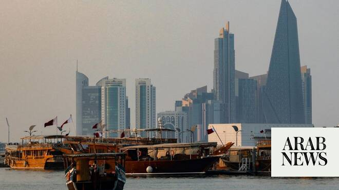

# ‘Positive progress’ in US-Iran indirect talks in Doha: Qatar spokesman

Source: https://www.arabnews.com/node/2649361/middle-east
Captured source: https://www.arabnews.com/node/2649361/middle-east
Published: 2026-07-02T07:29:52+03:00
Modified: 2026-07-02T13:58:36+03:00
Author: AFP

## Summary

DOHA: US and Iran negotiators made “positive progress” during indirect talks in Doha, with the next round expected after the late Iranian supreme leader’s funeral, Qatar’s foreign ministry spokesman said. “Qatar & Pakistan mediators concluded separate meetings with the US & Iranian negotiators in Doha today, with positive progress made on issues related to the Islamabad

## Image

## Video Or Embed URLs

- https://imasdk.googleapis.com/js/core/bridge3.774.0_en.html
- https://46eec4fcaf149622c52e70b7426068e3.safeframe.googlesyndication.com/safeframe/1-0-45/html/container.html
- https://static.addtoany.com/menu/sm.25.html
- about:blank
- https://www.google.com/recaptcha/api2/aframe
- https://sync.teads.tv/wigo-no-slot
- https://cm.g.doubleclick.net/partnerpixels?gdpr=0&us_privacy=1---&gpp_sid=-1&url=https%3A%2F%2Fwww.arabnews.com%2Fnode%2F2649361%2Fmiddle-east

## Text

https://arab.news/jhbrg

Qatari official: ‘The parties agreed to continue discussions over the coming period’

Next meeting to be scheduled at the earliest possible time following the funeral processions of the former Iranian Supreme Leader

DOHA: US and Iran negotiators made “positive progress” during indirect talks in Doha, with the next round expected after the late Iranian supreme leader’s funeral, Qatar’s foreign ministry spokesman said. “Qatar & Pakistan mediators concluded separate meetings with the US & Iranian negotiators in Doha today, with positive progress made on issues related to the Islamabad Memorandum of Understanding, building on the outcomes of the Lake Lucerne Summit,” foreign ministry spokesman Majed Al-Ansari said Wednesday on X. “The parties agreed to continue discussions over the coming period, with the next meeting to be scheduled at the earliest possible time following the funeral processions of the former Iranian Supreme Leader.”

US President Donald Trump hailed the progress of indirect talks between the United States and Iran in Qatar, as the sides aimed to push forward negotiations and quell tensions following exchanges of fire. Iran’s Deputy Foreign Minister Kazem Gharibabadi, who led Tehran’s delegation, later said the talks had concluded and that the sides had agreed to establish a communication channel by Thursday to report and record violations of their initial memorandum of understanding. Iran had insisted there would be no direct negotiations in Doha on the deal, which aims to end the war that began with US-Israeli strikes on Iran in late February. The memorandum of understanding, mediated by Qatar and Pakistan and sealed at a summit last month in Lucerne, Switzerland, includes a 60-day ceasefire, the reopening of the blockaded Strait of Hormuz and a timetable for a final deal on the war and Iran’s nuclear program. The Qatar discussions, held at a lower level and focused on implementing the memorandum, were meant to “build on the progress made at the Lake Lucerne Summit,” a diplomat told AFP on condition of anonymity. The discussions also covered frozen Iranian assets, whose release Tehran has demanded as part of any settlement.
