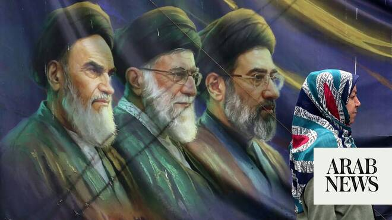

# Iran warns US, Israel against attacks ahead of funeral processions for Khamenei

Source: https://www.arabnews.com/node/2649382/middle-east
Captured source: https://www.arabnews.com/node/2649382/middle-east
Published: 2026-07-02T13:42:23+03:00
Modified: 2026-07-02T21:04:17+03:00
Author: Reuters

## Summary

DUBAI: An ‌Iranian military commander warned the United States and Israel on Thursday against any attack on Iran as it prepares for the state funeral of Supreme Leader Ayatollah Ali Khamenei, who was killed in airstrikes on the first day of the war. “We warn the enemies of Iran, especially the US ‌and the Zionist ‌regime (Israel), to avoid any ‌miscalculation ⁠and to think

## Image

## Video Or Embed URLs

- blob:https://www.arabnews.com/6178224b-78db-43e8-9a77-4e8a084a57e7
- https://imasdk.googleapis.com/js/core/bridge3.774.0_en.html
- https://a271e575bf31d1238948118e8800c284.safeframe.googlesyndication.com/safeframe/1-0-45/html/container.html
- https://static.addtoany.com/menu/sm.25.html
- about:blank
- https://ep2.adtrafficquality.google/sodar/sodar2/255/runner.html
- https://www.google.com/recaptcha/api2/aframe
- https://cm.g.doubleclick.net/partnerpixels?gdpr=0&us_privacy=1---&gpp_sid=-1&url=https%3A%2F%2Fwww.arabnews.com%2Fnode%2F2649382%2Fmiddle-east

## Text

https://arab.news/m7x3d

Prime Minister Shehbaz Sharif will attend the state funeral of the former supreme leader

Funeral processions for Khamenei ‌will begin on ‌July 4 in Tehran and conclude on ‌July 9 with his burial

DUBAI: An ‌Iranian military commander warned the United States and Israel on Thursday against any attack on Iran as it prepares for the state funeral of Supreme Leader Ayatollah Ali Khamenei, who was killed in airstrikes on the first day of the war.

“We warn the enemies of Iran, especially the US ‌and the Zionist ‌regime (Israel), to avoid any ‌miscalculation ⁠and to think about ⁠the harsh retaliation our armed forces would make to any threat and aggression against our country,” Ali Abdollahi, commander of Khatam Al-Anbiya Central Headquarters, said in a statement carried by state ⁠media.

Prime Minister Shehbaz Sharif will attend the state funeral of the former supreme leader, Pakistan’s foreign ‌ministry said ‌on Thursday.

Senior Chinese lawmaker He Wei will also attend the funeral, the Chinese foreign ‌ministry announced on ‌Thursday. He is the vice chairman ⁠of China's top ‌lawmaking ‌body, the Standing Committee of ‌the National People's ‌Congress.

India said on Thursday that its deputy foreign minister ​and a state governor would represent the country at the state funeral of Khamenei.

Governor of Bihar, Syed Ata ‌Hasnain, and deputy ‌foreign minister ​Pabitra ‌Margherita will ⁠visit ​Iran on ⁠July 3, the Indian foreign ministry said in a statement.

“The high-level representation in the ceremony underscores the importance of civilizational ⁠ties, including people-to-people connection, between ‌the ‌two countries, providing a ​robust foundation ‌to political and economic engagements,” ‌it said.

Funeral processions for Khamenei ‌will begin on ‌July 4 in Tehran and conclude on ‌July 9 with his burial in ‌his hometown of Mashhad, with additional ceremonies planned in Qom and Iraq in-between these dates.

On Wednesday, Iranian Foreign Minister Abbas Araghchi ‌gave a similar warning that Tehran would deliver an immediate ⁠and powerful ⁠response to any threat against its people or leadership after comments by Israeli Defense Minister Israel Katz that Iran’s current Supreme Leader Mojtaba Khamenei was “marked for death.”

Iranian media reported heightened security measures during the funeral period, while the head of Iran’s Civil Aviation Organization said on Wednesday that temporary airspace restrictions would be implemented over several cities including Tehran and Mashhad.
